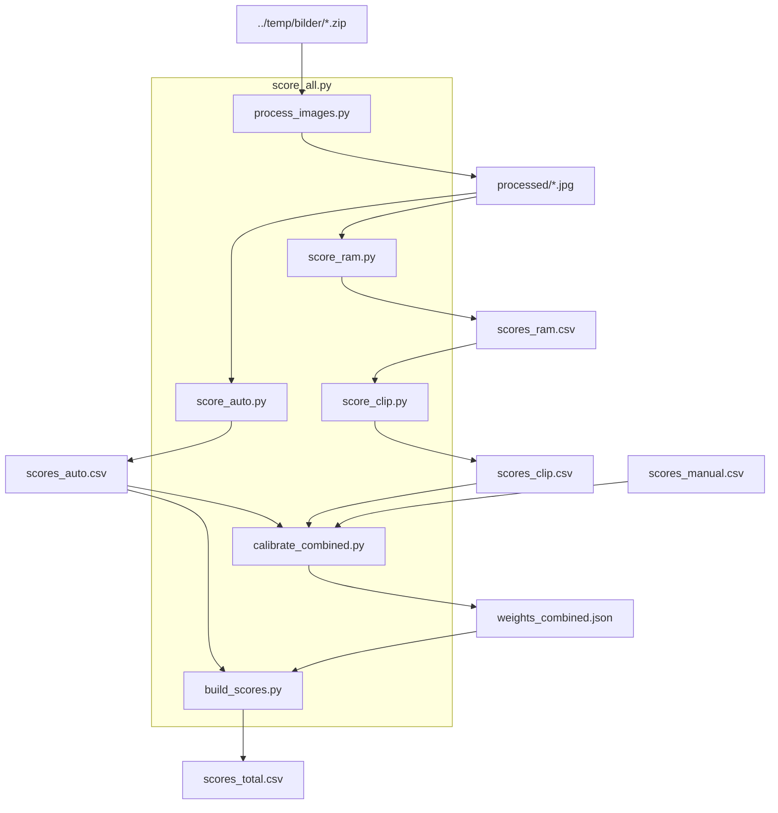

# Fjordgata 30

## Forutsetninger

```
Python >= 3.10
ImageMagick              (systemverktøy – ikke pip)
Pillow                   (EXIF-lesing i process_images.py)
opencv-contrib-python    (sharpness + exposure – ikke installer opencv-python i samme venv, de kolliderer)
pyiqa                    (BRISQUE + MUSIQ – laster ned modellvekter ved første kjøring)
torch                    (kreves av pyiqa, RAM og CLIP)
scikit-learn             (kalibrering)
numpy                    (normalisering)
recognize-anything       (RAM – installeres fra GitHub)
open-clip-torch          (CLIP)
requests                 (nedlasting av store modellvekter på Windows)
python-docx              (post-prosessering av docx – tabellrammer og kolonnebredder)
```

Installer ImageMagick:

```bash
# Windows – last ned installer fra https://imagemagick.org/script/download.php#windows
# Ubuntu/Debian
sudo apt install imagemagick
```

Installer først `uv` med pipx (Ubuntu 24.04+/Debian markerer system-Python som «externally-managed», så `pip install uv` direkte fungerer ikke):

```bash
sudo apt install pipx        # hvis pipx ikke er installert
pipx install uv
pipx ensurepath              # legger ~/.local/bin på PATH
```

Restart shellet etter `pipx ensurepath` første gang.

Installer Python-avhengigheter i et virtuelt miljø med `uv`. **Bruk Python 3.11** – `pyiqa` trekker inn `numba`/`llvmlite` som pinner seg til Python 3.6–3.9 transitive, så uv kan ikke løse avhengighetstreet på nyere Python (3.12+). uv laster automatisk ned Python 3.11 hvis det ikke er installert:

```bash
uv venv .venv --python 3.11
uv pip install Pillow opencv-contrib-python pyiqa torch scikit-learn numpy requests open-clip-torch
uv pip install "transformers<4.41" fairscale
uv pip install git+https://github.com/xinyu1205/recognize-anything.git
```

**NB:** Ikke installer `opencv-python` eller `opencv-python-headless` i samme venv –
de kolliderer med `opencv-contrib-python` og bryter `cv2`-importen.

**NB Windows – MUSIQ-modellvekter (104 MB):** `pyiqa` sin interne nedlasting feiler på store filer via `urllib` på Windows. Last ned manuelt med `requests` første gang:

```bash
.venv/Scripts/python -c "
import requests, pathlib
url = 'https://huggingface.co/chaofengc/IQA-PyTorch-Weights/resolve/main/musiq_spaq_ckpt-358bb6af.pth'
dest = pathlib.Path.home() / '.cache/torch/hub/pyiqa/musiq_spaq_ckpt-358bb6af.pth'
dest.parent.mkdir(parents=True, exist_ok=True)
r = requests.get(url, stream=True, timeout=120)
r.raise_for_status()
open(dest, 'wb').write(b''.join(r.iter_content(8192)))
print('OK')
"
```

**NB Windows – RAM+-modellvekter (~2 GB):** `score_ram.py` laster ned vekter automatisk til `~/.cache/ram/` ved første kjøring via `requests`.

Aktiver miljøet før du kjører scripts:

```bash
# Windows (Git Bash / PowerShell)
source .venv/Scripts/activate
# Linux/macOS
source .venv/bin/activate
```

---

## Dataflyt



---

## Scripts

### 0. Kjør hele pipelinen

```bash
.venv/bin/python scripts/score_all.py
```

Kjører alle steg i sekvens. Stopper ved feil. Bruker samme Python-executable som
scriptet ble startet med, slik at riktig venv alltid er aktiv.

Stegene er: `process_images.py` → `score_auto.py` → `score_ram.py` → `score_clip.py`
→ `calibrate_combined.py` → `build_scores.py`

---

### 1. Prosessere bilder

```bash
.venv/Scripts/python scripts/process_images.py
```

Pakker ut `.zip`-arkiver fra `../temp/bilder/` og konverterer til prosesserte JPEG (~500 kB).
Utpakkede originaler: `../temp/bilder/extracted/`. Prosesserte bilder: `../temp/bilder/processed/`.
Idempotent – hopper over bilder som allerede er prosessert.

### 2. Råscore bilder – sharpness, exposure, BRISQUE, MUSIQ

```bash
.venv/Scripts/python scripts/score_auto.py
.venv/Scripts/python scripts/score_auto.py --limit 10  # test
```

Skriver råscorer til `scores_auto.csv`. Append-only og idempotent. MUSIQ tar 1–3 sek/bilde.

### 3. Tag bilder med RAM

```bash
.venv/Scripts/python scripts/score_ram.py
.venv/Scripts/python scripts/score_ram.py --limit 10  # test
```

Kjører RAM+ på hvert bilde og skriver tags til `scores_ram.csv`.
Første kjøring laster ned modellvekter (~2 GB) til `~/.cache/ram/`. Idempotent.

### 4. Score tags med CLIP

```bash
.venv/Scripts/python scripts/score_clip.py
.venv/Scripts/python scripts/score_clip.py --limit 10  # test
```

Leser alle unike tags fra `scores_ram.csv`, scorer hvert bilde mot alle tags med CLIP.
Skriver til `scores_clip.csv`. Idempotent.

### 5. Kalibrer kombinert modell (anbefalt)

```bash
.venv/Scripts/python scripts/calibrate_combined.py --dry-run  # se R² uten å skrive
.venv/Scripts/python scripts/calibrate_combined.py             # skriv weights_combined.json
.venv/Scripts/python scripts/build_scores.py                   # oppdater scores_total.csv
```

Ridge-regresjon på alle 723 features (4 auto-metrikker + 719 CLIP-tags) mot manuelle ratings.
Krever `scores_manual.csv`. Skriver `weights_combined.json`. R²≈0.68 (alpha=100).

### 6. Kalibrer separate vekter (alternativ)

```bash
# Auto-metrikker
.venv/Scripts/python scripts/calibrate_auto.py --dry-run
.venv/Scripts/python scripts/calibrate_auto.py

# Tags
.venv/Scripts/python scripts/calibrate_tags.py --dry-run
.venv/Scripts/python scripts/calibrate_tags.py

# Oppdater total
.venv/Scripts/python scripts/build_scores.py
```

Brukes hvis `weights_combined.json` ikke finnes. `build_scores.py` faller tilbake på
50/50-snitt av `auto_score` og `tag_score`.

### 7. Bygg scores_total.csv

```bash
.venv/Scripts/python scripts/build_scores.py
```

Leser alle kildefiler, normaliserer råscorer til 1–10, beregner `total`.
Hvis `weights_combined.json` finnes brukes den. Ellers 50/50-snitt av auto og tag.
Eneste fil som regenereres fullt – alle kildefiler røres ikke.

### 8. Velg beste bilder for en periode

```bash
.venv/bin/python scripts/select_images.py --from 2026-01-01 --to 2026-06-30
.venv/bin/python scripts/select_images.py --from 2026-01-01 --to 2026-06-30 --count 20
.venv/bin/python scripts/select_images.py --from 2026-01-01 --to 2026-06-30 --output /tmp/utvalg
```

Henter de N beste bildene innenfor en dato-periode basert på `scores_total.csv`.
Manuell rating (`manual`-kolonnen) overstyrer alltid modellscoren (`total`).
`--output` kopierer de valgte bildene til angitt mappe.

---

### Enkeltbilde-debug

```bash
.venv/Scripts/python scripts/scoring/sharpness.py <bildefil>
.venv/Scripts/python scripts/scoring/exposure.py <bildefil>
.venv/Scripts/python scripts/scoring/brisque.py <bildefil>
.venv/Scripts/python scripts/scoring/musiq.py <bildefil>
```

Viser råscore og normalisert score (fra `scores_total.csv`) for ett bilde.

---

## Datafiler

Alle datafiler ligger i `data/`.

### `team.json` — autoritativt register over ressurspersoner og organisasjoner

Strukturert JSON med fire seksjoner:

- `personer` – ressurspersoner med rolle, organisasjon, kontaktinfo og hvor de er nevnt
- `organisasjoner` – samarbeidende firma og deres rolle i FG30
- `myndigheter_og_tilskuddsorgan` – tilskuddsgivere, kommunale/statlige etater
- `forhandsinteressenter` – aktører som har meldt interesse for utleieflate

Dokumenter som omtaler personer eller organisasjoner skal henvise til denne filen som autoritativ kilde for navn, roller og kontaktinfo. Eventuelle uoverensstemmelser rettes her først, deretter i kildedokumentet.

### `scores_auto.csv` — append-only, skrives av `score_auto.py`

| Kolonne | Beskrivelse |
|---|---|
| `filnavn` | Bildefilnavn, f.eks. `20260620_080001.jpg` |
| `sharpness_raw` | Laplacian-varians (0–∞, høyere = skarpere) |
| `exposure_raw` | Clipping-andel (0.0–1.0, lavere = bedre eksponering) |
| `brisque_raw` | BRISQUE-score (0–100, lavere = bedre teknisk kvalitet) |
| `musiq_raw` | MUSIQ-SPAQ-score (0–100, høyere = bedre estetisk kvalitet) |

### `scores_manual.csv` — fylles ut manuelt

| Kolonne | Beskrivelse |
|---|---|
| `filnavn` | Bildefilnavn |
| `score` | Manuell rating 1–10 (tom = ikke ratet ennå) |

### `scores_ram.csv` — long format, append-only, skrives av `score_ram.py`

| Kolonne | Beskrivelse |
|---|---|
| `filnavn` | Bildefilnavn |
| `tag` | Ord RAM+ har gjenkjent i bildet, f.eks. `beam`, `debris`, `pipe` |

Én rad per bilde per tag. Et bilde kan ha 5–20 rader.

### `scores_clip.csv` — long format, append-only, skrives av `score_clip.py`

| Kolonne | Beskrivelse |
|---|---|
| `filnavn` | Bildefilnavn |
| `tag` | Tag fra vokabularet (alle unike tags fra `scores_ram.csv`) |
| `clip_score` | Cosine-similaritet mellom bilde og tag (ca. 0.1–0.4) |

Hvert bilde har én rad per tag i hele vokabularet (719 tags × 1258 bilder = 904 502 rader).

### `scores_total.csv` — regenereres fullt av `build_scores.py`

| Kolonne | Beskrivelse |
|---|---|
| `filnavn` | Bildefilnavn |
| `sharpness` | Normalisert sharpness 1–10 (p5/p95) |
| `exposure` | Normalisert exposure 1–10 (p5/p95, invertert) |
| `brisque` | Normalisert BRISQUE 1–10 (p5/p95, invertert) |
| `musiq` | Normalisert MUSIQ 1–10 (p5/p95) |
| `tag_score` | Score fra `weights_tags.json` (referanse, brukes ikke i total hvis combined finnes) |
| `total` | Endelig score 1–10 – fra combined-modell hvis `weights_combined.json` finnes, ellers 50/50 auto+tag |
| `manual` | Manuell rating 1–10 (tom hvis ikke ratet) – for kvalitetskontroll mot modellscoren |

### `weights_auto.json` — skrives av `calibrate_auto.py`

Lineære regresjonskoeffisienter for de 4 auto-metrikk-scorene + intercept.

### `weights_tags.json` — skrives av `calibrate_tags.py`

Ridge-regresjonskoeffisienter for alle 719 CLIP-tags + intercept.

### `weights_combined.json` — skrives av `calibrate_combined.py`

Ridge-regresjonskoeffisienter for alle 723 features (4 auto + 719 tags).
Inneholder scaler-parametrene (`mean`, `std`) per feature siden features StandardScales
før regresjon. Format:

```json
{
  "intercept": 5.42,
  "features": {
    "sharpness": {"mean": 5.1, "std": 2.3, "coef": 0.18},
    "debris":    {"mean": 0.21, "std": 0.04, "coef": 0.12}
  }
}
```

---

## Arealoversikt

```bash
uv run python scripts/arealoversikt.py
```

Leser `forretningsplan/fg30_arealoversikt.csv` og beregner sum kvm per etasje, antall lager-enheter, krypkjeller- og kontorareal, totalt utleibart areal, samt fordeling per størrelseskategori (Micro <2,0 / Standard 2,0–2,4 / Medium+ ≥2,5). Brukes som autoritativ kilde for areal-tall i forretningsplan, finansieringsplan og bankhenvendelse – sørger for at samme tall brukes konsekvent på tvers av dokumenter.

CSV-formatet: Hver etasje starter med en label-rad ("Kjeller", "1. etg" osv.). Numeriske rader lister kvm per lager-enhet. Spesialarealer (krypkjeller, kontor) er ett enkelt tall med tekst-annotasjon i nabocellen.

---

## Konkurranseanalyse

```bash
uv run python scripts/analyse_konkurrentpriser.py
```

Leser prisdata fra `data/konkurrent_priser.csv` og beregner vektet gjennomsnittspris (kr/kvm/mnd) per konkurrent, normert til FG30s typiske bodstørrelse (2,1 m²). Vektingen er Gaussisk – enheter nær 2,1 m² teller mest. Volumkorreksjoner anvendes for skrå tak og høy takhøyde. Skriver rapport til `data/konkurrent_analyse.md`.

Parametere (Gaussisk bredde, volum-korreksjonsfaktorer) justeres i `data/comp_weights.conf`.

---

## Generere forretningsplan som docx

```bash
cd forretningsplan
pandoc forretningsplan.md -o fg30_forretningsplan.docx
uv run --with python-docx python ../scripts/format_docx.py fg30_forretningsplan.docx
```

`format_docx.py` legger til tynn grå ramme (0,5pt, #BFBFBF) på alle tabellceller og setter faste kolonnebredder per tabell.

## Bankpakke

Bankpakka (9 dokumenter) ligger i `bank/`. Markdown → docx-mappingen og regenereringskommandoer er dokumentert i [`bank/MANIFEST.md`](bank/MANIFEST.md). Pandoc er valgt konverteringsverktøy for docx/pptx/pdf. PDF konverteres fra docx i Word/Office (ingen PDF-engine konfigurert på prosjektnivå).

---

## Transkribering av lydopptak (WhisperX)

WhisperX kombinerer OpenAI Whisper med automatisk taler-separasjon (pyannote). Kjøres i **WSL2/Linux** – ikke Windows direkte.

### Forutsetninger

**1. Installer WhisperX** (én gang, i WSL2):

```bash
python3.12 -m venv whisper-env
source whisper-env/bin/activate
python -m pip install whisperx
```

WhisperX krever Python 3.12. Aktiver `whisper-env` før hvert bruk (`source whisper-env/bin/activate`).

**2. HuggingFace-konto og token**

- Opprett konto på [huggingface.co](https://huggingface.co)
- Gå til [huggingface.co/settings/tokens](https://huggingface.co/settings/tokens) og generer et **read**-token
- Legg tokenet i miljøvariabelen:

```bash
export HF_TOKEN=hf_xxxxxxxxxxxxxxxxxxxx
# Legg gjerne i ~/.bashrc for å slippe å sette det hver gang
```

**3. Godta brukervilkår for tre pyannote-modeller**

Logg inn på HuggingFace og klikk **"Agree and access repository"** på disse tre sidene:

| Modell | URL |
|---|---|
| `pyannote/segmentation-3.0` | https://huggingface.co/pyannote/segmentation-3.0 |
| `pyannote/speaker-diarization-3.1` | https://huggingface.co/pyannote/speaker-diarization-3.1 |
| `pyannote/embedding` | https://huggingface.co/pyannote/embedding |

Uten disse tillatelsene feiler diariseringssteget med en autentiseringsfeil.

### Plasser lydfil

Legg lydfilen her (opprett mappen om den ikke finnes):

```
referat/nye/ref.m4a
```

### Kjør transkripsjon

```bash
whisperx referat/nye/ref.m4a \
  --model large-v2 \
  --language no \
  --compute_type float32 \
  --diarize \
  --hf_token $HF_TOKEN \
  --batch_size 4 \
  --output_dir referat/nye/ \
  --output_format srt
```

`--batch_size 4` er trygt på de fleste maskiner; øk til 8 eller 16 hvis du har mye GPU-minne.

### Utdata

Skriver `referat/nye/ref.srt` – undertekster med tidskoder og taler-ID per segment.

### Fra transkripsjon til referat

Talerne i utdata er merket `SPEAKER_00`, `SPEAKER_01` osv. Identifiser hvem som er hvem ut fra sammenhengen og skriv referatet i `referat/YYYY-MM-DD_statusmote_XX.md` etter det etablerte formatet.

---

## Ekstrahere bilder fra tegnings-PDFer

```bash
uv run --with pymupdf python scripts/extract_tegninger.py
```

Renderer hver side i PDF-ene i `tegninger/` til PNG (200 DPI) og navngir filene etter mønsteret `YYYY-MM-DD_E-XX_<beskrivelse>.png`. E-nummeret og tittelteksten leses direkte fra PDF-en. Side 1 i hver PDF behandles som omslag og navngis med E-rekkevidde (`E-01-E-04_omslag_<kategori>`). Datoprefix er rammesøknadsdato (12.05.2026).

PyMuPDF hentes som engangs-avhengighet av `uv run --with pymupdf` – ingen installasjon nødvendig på forhånd. Skriptet er idempotent: re-kjøring overskriver eksisterende PNG-er.

---

## Mappestruktur

```
fjordgata30/
├── CLAUDE.md                  – prosjektkontekst for AI
├── TASKS.md                   – oppgaveliste med status
├── README.md                  – dette dokumentet
├── config.json                – konfigurasjon (bl.a. bilder_dir)
├── scripts/
│   ├── score_all.py        – kjør hele pipelinen i sekvens
│   ├── process_images.py      – bildeprosessering (zip → JPEG)
│   ├── score_auto.py          – råscoring, skriver scores_auto.csv
│   ├── score_ram.py           – RAM-tagging, skriver scores_ram.csv
│   ├── score_clip.py          – CLIP-scoring, skriver scores_clip.csv
│   ├── calibrate_auto.py      – kalibrering auto-metrikker, skriver weights_auto.json
│   ├── calibrate_tags.py      – kalibrering tags, skriver weights_tags.json
│   ├── calibrate_combined.py  – kombinert kalibrering, skriver weights_combined.json
│   ├── build_scores.py        – beregner scores_total.csv
│   ├── select_images.py       – velg beste bilder for en tidsperiode
│   ├── analyse_konkurrentpriser.py – vektet konkurranseanalyse, skriver konkurrent_analyse.md
│   ├── arealoversikt.py            – summerer arealer fra fg30_arealoversikt.csv (autoritativ kilde)
│   ├── extract_tegninger.py        – rasteriserer PDF-tegninger til PNG i tegninger/
│   ├── config.py              – leser config.json, eksponerer BILDER_DIR/PROCESSED_DIR/EXTRACTED_DIR
│   └── scoring/               – moduler per metrikk (sharpness, exposure, brisque, musiq)
├── data/                      – alle datafiler (scores + weights + konkurranseanalyse)
│   ├── scores_auto.csv
│   ├── scores_manual.csv
│   ├── scores_ram.csv
│   ├── scores_clip.csv
│   ├── scores_total.csv
│   ├── weights_auto.json
│   ├── weights_tags.json
│   ├── weights_combined.json
│   ├── konkurrent_priser.csv        – prisdata per konkurrent (kilde + proveniensmetadata)
│   ├── konkurrent_analyse.md        – generert rapport (analyse_konkurrentpriser.py)
│   └── comp_weights.conf            – parametere for konkurranseanalysen (Gaussisk bredde, etc.)
├── bakgrunn/                  – søknader, lovverk, bakgrunnsdokumenter
├── brann/                     – branndokumentasjon og TBRT-korrespondanse
├── forretningsplan/           – forretningsplan, MVA-vurderinger og markedsdata
│   ├── forretningsplan.md          – fullstendig forretningsplan (bankpresentasjon)
│   ├── mva_strategi.md          – MVA-strategi og alternativer
│   ├── fg30_selskapsstruktur_mva.md     – bygge-AS vs. drifts-AS: MVA-konsekvenser (T76)
│   ├── fg30_konkurrentanalyse_valet.md  – detaljert analyse av Vinden, Box2Box, Stash (T79)
│   ├── konkurrentanalyse_og_markedsdata.md             – konkurrentanalyse og markedsdata Trondheim
│   ├── kilde_mva_regelverk.md           – lovhenvisninger og prinsipputtalelser
│   └── lover/                           – nedlastede lovtekster og prinsipputtalelser (verbatim)
│       ├── mval_2-1_registreringsplikt.md
│       ├── mval_2-3_frivillig_registrering.md
│       ├── mval_3-11_fast_eiendom.md
│       ├── mval_8-1_fradragsrett.md
│       ├── mval_8-2_forholdsvis_fradrag.md
│       ├── mval_8-6_tilbakegaende_avgiftsoppgjor.md
│       ├── mval_9-1_kapitalvarer.md
│       ├── mval_9-4_justeringsperiode.md
│       ├── prinsipputtalelse_2014_minilager.md
│       └── skatteklagenemnda_datasenter_2020.md
├── tegninger/                 – arkitekttegninger (PDF + PNG per side)
│   ├── *.pdf                              – kilde-PDFer fra SAHAA (rammesøknadsvedlegg, IG-vedlegg osv.)
│   └── 2026-05-12_E-XX_*.png              – rasteriserte enkelttegninger (ekstrahert med extract_tegninger.py)
├── stotte/                    – tilskuddsdata og støttesøknader
│   ├── project_cards.json               – strukturerte tilskuddsdata (alle ordninger)
│   ├── fg30_skattefunn_vurdering.md     – SkatteFunn vurdering og søknadsskisse (T70)
│   └── fg30_innovasjon_norge_vurdering.md – Innovasjon Norge virkemidler og søknadsskisse (T71)
└── referat/                   – møtereferater
```

Bildemapper (utenfor prosjektet):

```
../temp/bilder/
├── *.zip                  – nedlastede arkiver fra Google Drive (input)
├── extracted/             – utpakkede originaler
└── processed/             – prosesserte bilder (output fra process_images.py)
```
