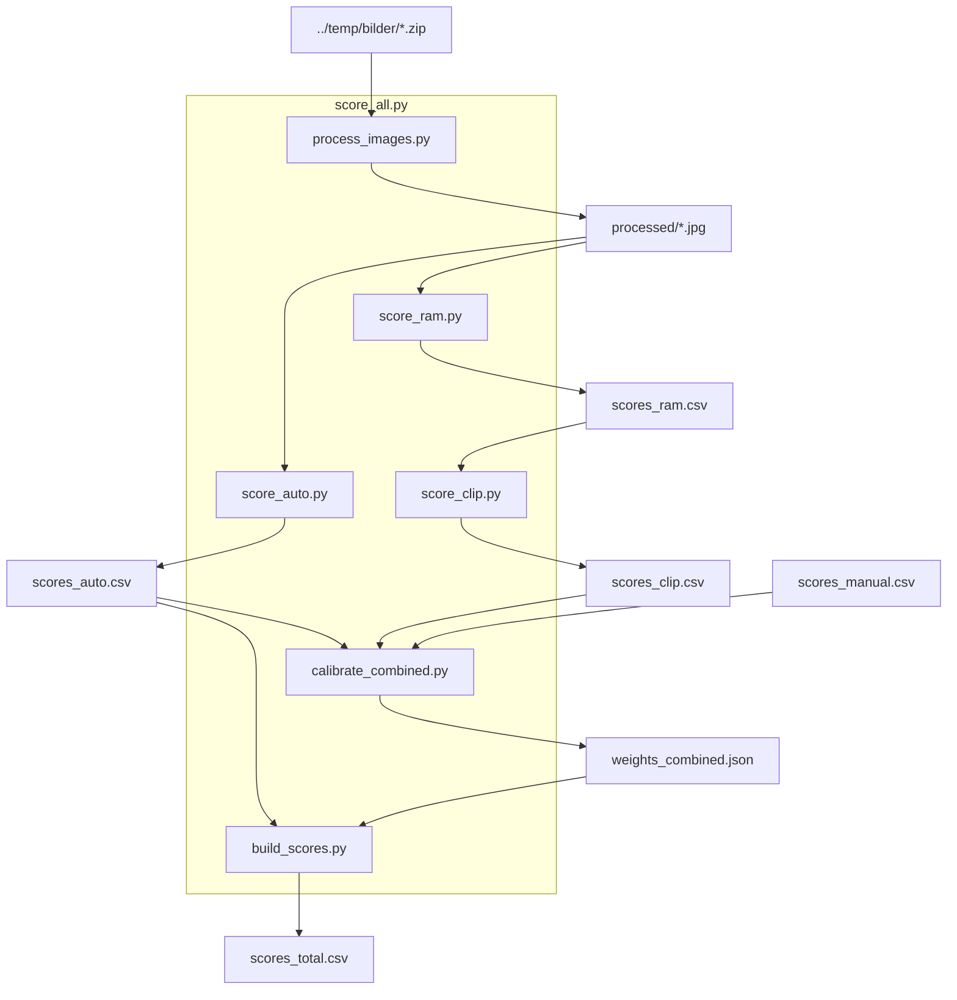

# Fjordgata 30

Prosjektrepo for rehabilitering av Fjordgata 30 til minilager. Se `CLAUDE.md` for prosjektkontekst og `TASKS.md` for oppgaveliste.

**NB om venvs:** Prosjektet bruker to separate Python-venvs for bildescoring: `.venv-win` (opprettet på Windows i Git Bash/PowerShell) og `.venv-linux` (opprettet i WSL2 eller native Linux). Grunnen er at Python-venvs ikke er portable mellom OS – Windows-binærer og Linux-binærer kan ikke deles. Bruk kun én av dem hvis du kun jobber på én plattform. Se [1.2 b](#12-bildescoring). WhisperX bruker sin egen venv `whisper-env` (kun WSL2/Linux).

Denne README-en dekker tre arbeidsverktøy og noen mindre analysescript:

| Verktøy | Formål | Miljø |
|---|---|---|
| Bildescoring | Automatisk kvalitetsscoring av arbeidsbilder | Windows (Git Bash / PowerShell) eller Linux |
| Dokumentkonvertering | Markdown → docx/pdf med mermaid-diagrammer | Windows (Git Bash anbefalt) eller Linux |
| Transkribering | Lydopptak → tidsstemplet undertekst med taler-ID | **WSL2/Linux** (ikke Windows direkte) |
| Analyseverktøy | Arealoversikt, konkurransepriser, PDF-tegninger | Windows eller Linux (`uv run`) |

## Miljøer og valg av skall

Prosjektet må fungere på tvers av flere miljøer. Standardvalg per verktøy:

| Verktøy | Anbefalt skall | Alternativ | Begrensning |
|---|---|---|---|
| Bildescoring | Git Bash på Windows | PowerShell, Linux bash | – |
| Pandoc + mermaid-filter | **Git Bash på Windows** (må ha `.cmd`-endelse på filter) | PowerShell/CMD (uten `.cmd`), Linux bash | – |
| WhisperX | WSL2 med Ubuntu | Native Linux | **Fungerer ikke i Windows-native shell** (Git Bash/PowerShell/CMD) |
| Analyseverktøy | Vilkårlig – kjøres via `uv run python` | – | – |

Cygwin frarådes – stier som `/cygdrive/c/...` er inkompatible med resten av oppsettet. Bruk Git Bash for Windows-arbeid.

### Skall-markører brukt i README-en

Hver kodeblokk under er merket med **hvilket skall den skal kjøres i** på linjen rett over. Betydningen:

| Markør | Skall |
|---|---|
| `Kjør i: PowerShell (Windows, som administrator)` | PowerShell startet med «Kjør som administrator» |
| `Kjør i: PowerShell / CMD (Windows)` | Vanlig PowerShell- eller CMD-vindu på Windows |
| `Kjør i: Git Bash (Windows)` | MINGW64-terminal fra Git for Windows |
| `Kjør i: WSL2 Ubuntu (eller native Linux)` | Linux-shell – enten WSL2 på Windows eller native Linux |
| `Kjør i: Git Bash (Windows) eller bash (Linux/WSL2)` | Cross-platform bash-kommando – begge fungerer |
| `Kjør i: Vilkårlig skall` | Kjører uendret i alle skall på begge plattformer (typisk `uv run …`) |

---

## 1. Førstegangsoppsett (per maskin)

Stegene under gjøres én gang per ny maskin. Hopp over blokker for verktøy du ikke trenger.

### 1.1 Felles: `uv` og `pipx`

`uv` brukes til å styre Python-versjoner og virtuelle miljøer.

**Linux / WSL2:** På Ubuntu 24.04+ / Debian er system-Python «externally-managed», så `pip install uv` direkte fungerer ikke – bruk `pipx`:

> **Kjør i:** WSL2 Ubuntu (eller native Linux)

```bash
sudo apt install pipx        # hvis pipx ikke er installert
pipx install uv
pipx ensurepath              # legger ~/.local/bin på PATH
```

Restart shellet etter `pipx ensurepath` første gang.

**Windows:**

> **Kjør i:** PowerShell / CMD (Windows)

```powershell
winget install --id=astral-sh.uv
```

Alternativt: last ned fra <https://docs.astral.sh/uv/getting-started/installation/>.

**Oppgradering av `uv`:** `pipx install uv` og `winget install` er idempotente på "finnes/finnes ikke" – de oppgraderer *ikke* en eksisterende installasjon (`pipx install uv` melder `'uv' already seems to be installed. Not modifying...`). Bruk en av:

> **Kjør i:** Vilkårlig skall – forutsetter at `uv` finnes på PATH

```bash
uv self update                       # anbefalt – uv sin egen updater, plattform-agnostisk
```

Alternativt, hvis `uv self update` av en eller annen grunn feiler:

```bash
pipx upgrade uv                      # Linux/WSL2 (pipx-installasjon)
pipx install uv --force              # Linux/WSL2 (full reinstall)
winget upgrade --id=astral-sh.uv     # Windows (winget-installasjon)
```

### 1.2 Bildescoring

**a) ImageMagick (systemverktøy):**

- **Windows:** Last ned installer fra <https://imagemagick.org/script/download.php#windows>
- **Linux / WSL2:**

> **Kjør i:** WSL2 Ubuntu (eller native Linux)

```bash
sudo apt install imagemagick
```

**b) Python 3.11-venv med bildescoring-avhengigheter:**

Bruk Python 3.11 – `pyiqa` trekker inn `numba`/`llvmlite` som pinner seg til Python 3.6–3.9 transitive, så uv kan ikke løse avhengighetstreet på nyere Python (3.12+). uv laster automatisk ned Python 3.11 hvis det ikke er installert.

**Prosjektkonvensjon:** Venven heter `.venv-win` på Windows og `.venv-linux` i WSL2/Linux. Navnet gjør det tydelig når man kommer tilbake til prosjektet hvilken plattform venven tilhører, og gjør sameksistens mulig (mange utviklere veksler mellom Git Bash og WSL2 på samme maskin). Kommandoene er identiske – bare navnet skiller.

**Windows-venv:**

> **Kjør i:** Git Bash (Windows) eller PowerShell (Windows) – fra prosjektroten

```bash
uv venv .venv-win --python 3.11
uv pip install --python .venv-win Pillow opencv-contrib-python pyiqa torch scikit-learn numpy requests open-clip-torch
uv pip install --python .venv-win "transformers<4.41" fairscale
uv pip install --python .venv-win git+https://github.com/xinyu1205/recognize-anything.git
```

**Linux/WSL2-venv:**

> **Kjør i:** WSL2 Ubuntu (eller native Linux) – fra prosjektroten

```bash
uv venv .venv-linux --python 3.11
uv pip install --python .venv-linux Pillow opencv-contrib-python pyiqa torch scikit-learn numpy requests open-clip-torch
uv pip install --python .venv-linux "transformers<4.41" fairscale
uv pip install --python .venv-linux git+https://github.com/xinyu1205/recognize-anything.git
```

Trenger du bare én plattform, kjør bare den ene blokken. Trenger du begge, kjør begge – de forstyrrer ikke hverandre siden mappenavnene er ulike.

**NB:** Ikke installer `opencv-python` eller `opencv-python-headless` i samme venv – de kolliderer med `opencv-contrib-python` og bryter `cv2`-importen.

Fullstendig avhengighetsliste:

```
Python >= 3.10
ImageMagick              (systemverktøy – ikke pip)
Pillow                   (EXIF-lesing i process_images.py)
opencv-contrib-python    (sharpness + exposure – ikke installer opencv-python i samme venv, de kolliderer)
pyiqa                    (BRISQUE + MUSIQ – laster ned modellvekter ved første kjøring)
torch                    (kreves av pyiqa, RAM og CLIP)
scikit-learn             (kalibrering)
numpy                    (normalisering)
recognize-anything       (RAM – installeres fra GitHub)
open-clip-torch          (CLIP)
requests                 (nedlasting av store modellvekter på Windows)
python-docx              (post-prosessering av docx – tabellrammer og kolonnebredder)
```

**c) Modellvekter (lastes ned ved første kjøring):**

- **RAM+ (~2 GB):** `score_ram.py` laster ned automatisk til `~/.cache/ram/` ved første kjøring via `requests`.
- **MUSIQ (104 MB):** På Windows må denne lastes ned manuelt første gang – se [Kjente feil og fallbacks](#kjente-feil-og-fallbacks).

### 1.3 Dokumentkonvertering

Pandoc er valgt konverteringsverktøy for docx/pptx/pdf. Alle PDF-konverteringer må støtte mermaid-diagrammer inline i Markdown; DOCX bør. Det krever tre systempakker: `pandoc`, **Node via nvm** + `mermaid-filter`, og TeX Live med xelatex (bare for PDF).

Node installeres via `nvm` (Node Version Manager) slik at Node-versjonen er eksplisitt versjonsstyrt og user-lokal – ikke bundet til systemets pakkebehandler.

**Windows (Chocolatey):**

> **Kjør i:** PowerShell (Windows, som administrator) – kjør `choco`-kommandoene her

```powershell
choco install pandoc
choco install nvm
```

Åpne deretter et **nytt** PowerShell- eller CMD-vindu (ikke admin) for at nvm skal være på PATH:

> **Kjør i:** PowerShell / CMD (Windows) – nytt vindu, uten admin

```powershell
nvm install lts
nvm use lts
npm install -g mermaid-filter
```

**For PDF-generering:** Installer TeX Live 2026 fra <https://tug.org/texlive/> (egen installer, ikke via choco).

**Linux / WSL2 (Ubuntu/Debian):**

> **Kjør i:** WSL2 Ubuntu (eller native Linux)

```bash
sudo apt install pandoc
sudo apt install texlive-xetex texlive-fonts-extra   # for PDF
```

Installer nvm ved å følge kommandoen fra README-en på <https://github.com/nvm-sh/nvm> (installskript-URL-en har versjonsnummer som endres – bruk den offisielle). Etter nvm-install, start nytt shell eller kjør `source ~/.bashrc`, deretter:

> **Kjør i:** WSL2 Ubuntu (eller native Linux) – nytt shell etter nvm-install

```bash
nvm install --lts
nvm use --lts
npm install -g mermaid-filter    # NB: ingen sudo – nvm er user-lokal
```

**NB nvm og `npm -g`:** Med nvm installeres alt user-lokalt under `~/.nvm/versions/node/<versjon>/`. Bruk aldri `sudo npm install -g` – det bryter PATH og lager skrive-tilgang-rot. `nvm use <versjon>` skifter aktiv Node globalt for terminalen.

**Chromium for mermaid-filter (kritisk på Node 24+):** `mermaid-filter` drar inn puppeteer 19, og install-hooken som skulle lastet ned Chromium hopper stille over på moderne Node. Uten Chromium feiler filteret med `spawn … chrome.exe ENOENT`. Se [Kjente feil og fallbacks](#kjente-feil-og-fallbacks) for manuell nedlasting eller fallback til systeminstallert Chrome/Edge.

### 1.4 Transkribering (WSL2/Linux)

WhisperX kombinerer OpenAI Whisper med automatisk taler-separasjon (pyannote). Kjøres i **WSL2/Linux** – ikke Windows direkte. Alle kommandoer i denne seksjonen kjøres i WSL2-terminalen (eller native Linux).

**a) Installer WhisperX i en Python 3.12-venv:**

> **Kjør i:** WSL2 Ubuntu (eller native Linux)

```bash
python3.12 -m venv whisper-env
source whisper-env/bin/activate
python -m pip install whisperx
```

WhisperX krever Python 3.12.

**b) HuggingFace-konto og token:**

- Opprett konto på [huggingface.co](https://huggingface.co)
- Gå til [huggingface.co/settings/tokens](https://huggingface.co/settings/tokens) og generer et **read**-token
- Legg tokenet i miljøvariabelen (helst i `~/.bashrc` for permanent effekt):

> **Kjør i:** WSL2 Ubuntu (eller native Linux)

```bash
export HF_TOKEN=hf_xxxxxxxxxxxxxxxxxxxx
```

**c) Godta brukervilkår for tre pyannote-modeller:**

Logg inn på HuggingFace og klikk **"Agree and access repository"** på disse tre sidene:

| Modell | URL |
|---|---|
| `pyannote/segmentation-3.0` | <https://huggingface.co/pyannote/segmentation-3.0> |
| `pyannote/speaker-diarization-3.1` | <https://huggingface.co/pyannote/speaker-diarization-3.1> |
| `pyannote/embedding` | <https://huggingface.co/pyannote/embedding> |

Uten disse tillatelsene feiler diariseringssteget med en autentiseringsfeil.

---

## 2. Aktivering (per nytt terminalvindu)

Aktiver miljøet før du kjører scripts. Dette gjøres i hvert nytt terminalvindu.

### 2.1 Bildescoring

Aktiver **`.venv-win`** hvis du er på Windows, **`.venv-linux`** hvis du er i WSL2/Linux. Se [1.2 b](#12-bildescoring) for opprettelse.

**Windows-venv (`.venv-win`):**

> **Kjør i:** Git Bash (Windows)

```bash
source .venv-win/Scripts/activate
```

> **Kjør i:** PowerShell (Windows) – alternativ til Git Bash

```powershell
.\.venv-win\Scripts\Activate.ps1
```

**Linux-venv (`.venv-linux`):**

> **Kjør i:** WSL2 Ubuntu (eller native Linux)

```bash
source .venv-linux/bin/activate
```

### 2.2 Transkribering

> **Kjør i:** WSL2 Ubuntu (eller native Linux)

```bash
source whisper-env/bin/activate
export HF_TOKEN=hf_xxxxxxxxxxxxxxxxxxxx   # kun hvis ikke i ~/.bashrc
```

### 2.3 Dokumentkonvertering

Pandoc trenger ikke aktivering – kommandoene er systeminstallert. Ved behov for spesifikk Node-versjon:

> **Kjør i:** Vilkårlig skall (Windows PowerShell/Git Bash eller Linux bash) – syntaks varierer

```bash
# nvm-sh (Linux/WSL2 og Git Bash med nvm-sh):
nvm use --lts

# nvm-windows (choco-installasjonen på Windows):
nvm use lts
```

### 2.4 Analyseverktøy

Ingen aktivering nødvendig – scriptene kjøres via `uv run python`, som henter riktige avhengigheter ad hoc.

---

## 3. Bruk

### 3.1 Bildescoring

Pipelinen tar .zip-arkiver fra `../temp/bilder/`, prosesserer bildene, scorer dem med flere modeller, kalibrerer mot manuelle ratings, og produserer en samlet score per bilde. Se [Dataflyt](#dataflyt) for oversikt.

**Manuelt steg:** Legg .zip-arkiver fra Google Drive i `../temp/bilder/` før du kjører pipelinen.

Alle scriptene i denne seksjonen forutsetter at riktig venv er **aktivert** (se [2.1](#21-bildescoring)): `.venv-win` på Windows, `.venv-linux` i WSL2/Linux. Etter aktivering er `python`-kommandoen den samme uansett plattform.

#### Kjør hele pipelinen

> **Kjør i:** Samme skall som venv-aktiveringen (Git Bash / PowerShell med `.venv-win`, eller WSL2/Linux bash med `.venv-linux`)

```bash
python scripts/score_all.py
```

Kjører alle steg i sekvens. Stopper ved feil. Bruker samme Python-executable som scriptet ble startet med, slik at riktig venv alltid er aktiv.

Stegene er: `process_images.py` → `score_auto.py` → `score_ram.py` → `score_clip.py` → `calibrate_combined.py` → `build_scores.py`.

#### Enkeltsteg

Alle enkeltsteg-kommandoer forutsetter aktivert venv (`.venv-win` eller `.venv-linux`) og kjøres i samme skall som pipeline-kommandoen over.

**1. Prosessere bilder**

```bash
python scripts/process_images.py
```

Pakker ut `.zip`-arkiver fra `../temp/bilder/` og konverterer til prosesserte JPEG (~500 kB). Utpakkede originaler: `../temp/bilder/extracted/`. Prosesserte bilder: `../temp/bilder/processed/`. Idempotent – hopper over bilder som allerede er prosessert.

**2. Råscore bilder – sharpness, exposure, BRISQUE, MUSIQ**

```bash
python scripts/score_auto.py
python scripts/score_auto.py --limit 10  # test
```

Skriver råscorer til `scores_auto.csv`. Append-only og idempotent. MUSIQ tar 1–3 sek/bilde.

**3. Tag bilder med RAM**

```bash
python scripts/score_ram.py
python scripts/score_ram.py --limit 10  # test
```

Kjører RAM+ på hvert bilde og skriver tags til `scores_ram.csv`. Første kjøring laster ned modellvekter (~2 GB) til `~/.cache/ram/`. Idempotent.

**4. Score tags med CLIP**

```bash
python scripts/score_clip.py
python scripts/score_clip.py --limit 10  # test
python scripts/score_clip.py --force     # slett og re-score alt (sjeldent)
```

Leser alle unike tags fra `scores_ram.csv`, scorer hvert bilde mot alle tags med CLIP. Skriver til `scores_clip.csv`. Inkrementell og idempotent: nye bilder scores mot hele vokabularet, eksisterende bilder backfilles automatisk mot tags de mangler (typisk pga. nye tags som dukker opp når nye bilder tags-es av RAM). Ingen manuell inngripen kreves når vokabularet vokser – `--force` trengs bare hvis du vil scrap-e alt (f.eks. bytte CLIP-modell).

**5. Kalibrer kombinert modell (anbefalt)**

```bash
python scripts/calibrate_combined.py --dry-run  # se R² uten å skrive
python scripts/calibrate_combined.py             # skriv weights_combined.json
python scripts/build_scores.py                   # oppdater scores_total.csv
```

Ridge-regresjon på alle 723 features (4 auto-metrikker + 719 CLIP-tags) mot manuelle ratings. Krever `scores_manual.csv`. Skriver `weights_combined.json`. R²≈0.68 (alpha=100).

**6. Kalibrer separate vekter (alternativ)**

```bash
# Auto-metrikker
python scripts/calibrate_auto.py --dry-run
python scripts/calibrate_auto.py

# Tags
python scripts/calibrate_tags.py --dry-run
python scripts/calibrate_tags.py

# Oppdater total
python scripts/build_scores.py
```

Brukes hvis `weights_combined.json` ikke finnes. `build_scores.py` faller tilbake på 50/50-snitt av `auto_score` og `tag_score`.

**7. Bygg `scores_total.csv`**

```bash
python scripts/build_scores.py
```

Leser alle kildefiler, normaliserer råscorer til 1–10, beregner `total`. Hvis `weights_combined.json` finnes brukes den. Ellers 50/50-snitt av auto og tag. Eneste fil som regenereres fullt – alle kildefiler røres ikke.

#### Velg beste bilder for en periode

> **Kjør i:** Samme skall som venv-aktiveringen (Git Bash / PowerShell med `.venv-win`, eller WSL2/Linux bash med `.venv-linux`)

```bash
python scripts/select_images.py --from 2026-01-01 --to 2026-06-30
python scripts/select_images.py --from 2026-01-01 --to 2026-06-30 --count 20
python scripts/select_images.py --from 2026-01-01 --to 2026-06-30 --output /tmp/utvalg
```

Henter de N beste bildene innenfor en dato-periode basert på `scores_total.csv`. Manuell rating (`manual`-kolonnen) overstyrer alltid modellscoren (`total`). `--output` kopierer de valgte bildene til angitt mappe.

#### Enkeltbilde-debug

> **Kjør i:** Samme skall som venv-aktiveringen (Git Bash / PowerShell med `.venv-win`, eller WSL2/Linux bash med `.venv-linux`)

```bash
python scripts/scoring/sharpness.py <bildefil>
python scripts/scoring/exposure.py <bildefil>
python scripts/scoring/brisque.py <bildefil>
python scripts/scoring/musiq.py <bildefil>
```

Viser råscore og normalisert score (fra `scores_total.csv`) for ett bilde.

### 3.2 Transkribering av lydopptak

**Manuelt steg:** Legg én eller flere lydfiler i `referat/nye/` (formater: `.m4a`, `.mp3`, `.wav`, `.mp4`). Filnavn er fritt – f.eks. `2026-08-25_statusmote.m4a`. Filene kan legges dit fra hvilken som helst plattform (også Windows Explorer / File Explorer i WSL2 via `\\wsl$\Ubuntu\...`).

**Kjør transkripsjon:**

> **Kjør i:** WSL2 Ubuntu (eller native Linux) – med `whisper-env` aktivert og `HF_TOKEN` satt (se [2.2](#22-transkribering))

```bash
python scripts/transcribe_audio.py
```

Scriptet iterer alle lydfiler i `referat/nye/`, hopper over de som allerede har `<stem>.srt` ved siden av, og kjører WhisperX på resten med prosjektets standardflagg (`--model large-v2 --language no --compute_type float32 --diarize --batch_size 4`).

`--batch_size 4` er trygt på de fleste maskiner. Endre i `scripts/transcribe_audio.py` (`WHISPERX_ARGS`) hvis du har mer GPU-minne.

**Utdata:** For hver lydfil `<stem>.m4a` skrives `<stem>.srt` i samme mappe – undertekster med tidskoder og taler-ID per segment.

**Fra transkripsjon til referat:** Talerne i utdata er merket `SPEAKER_00`, `SPEAKER_01` osv. Identifiser hvem som er hvem ut fra sammenhengen og skriv referatet i `referat/YYYY-MM-DD_statusmote_XX.md` etter det etablerte formatet.

### 3.3 Dokumentkonvertering

Kjøremiljø: **Git Bash på Windows** (MINGW64) er standard. På Linux/macOS erstatt `mermaid-filter.cmd` med `mermaid-filter` – se [Plattform-note – filternavnet](#plattform-note--filternavnet) under.

#### DOCX

> **Kjør i:** Git Bash (Windows) – bruker `mermaid-filter.cmd`

```bash
pandoc input.md -o output.docx -F mermaid-filter.cmd
```

#### PDF (brukes for bankpakka og andre eksterne leveranser)

> **Kjør i:** Git Bash (Windows) – bruker `mermaid-filter.cmd` og Windows-fonter

```bash
pandoc input.md -o output.pdf \
  -F mermaid-filter.cmd \
  --pdf-engine=xelatex \
  -V documentclass=scrartcl \
  -V geometry:margin=1in \
  -V mainfont="Times New Roman" \
  -V monofont="Consolas"
```

Forklaring av flaggene:

| Flagg | Effekt |
|---|---|
| `-F mermaid-filter.cmd` | Pandoc-filter som pre-prosesserer AST og erstatter mermaid-blokker med rendrede PNG-bilder. Fungerer både på inline mermaid i .md-en og på blokker som er importert via `include`. Ingen effekt hvis .md-en ikke har mermaid – trygt å ha som standardflagg. |
| `--pdf-engine=xelatex` | Bruker xelatex fra TeX Live (nødvendig for unicode-tegn – «≥», «–», «€» – og for TrueType-fonter). |
| `-V documentclass=scrartcl` | KOMA-Script artikkel-klasse – renere typografi og bedre marg-håndtering enn standard `article`. |
| `-V geometry:margin=1in` | 1 tomme marg på alle sider. |
| `-V mainfont="Times New Roman"` | Hovedfont for brødtekst. Systemfont på Windows. På Linux: enten installer Microsoft core fonts (`sudo apt install ttf-mscorefonts-installer` — krever EULA-godkjenning), eller bytt til metric-kompatibel `Liberation Serif` (samme tegnbredder, identisk sideoppsett; kommer med `fonts-liberation` og er standard på Ubuntu/Debian). |
| `-V monofont="Consolas"` | Mono-font for kodeblokker. Standard-fonten (Latin Modern Mono) mangler Unicode box-drawing-tegn (├, ─, └, │) og gir «Missing character»-warnings på ASCII-tre-strukturer. Consolas følger *ikke* med `ttf-mscorefonts-installer` på Linux — bruk `DejaVu Sans Mono` som Linux-alternativ (kommer med `fonts-dejavu` og er standard på Ubuntu/Debian). |

**Autonummerering av overskrifter:** Pandoc autonummererer *ikke* overskrifter som standard, så vi trenger ingen flagg for å slå det av. Kildene i dette prosjektet har egen nummerering («01.01», «Post 03» osv.) som beholdes uendret. Hvis autonummerering skulle ønskes for et enkeltdokument, legg til `--number-sections` (eller `-N`).

**Plattform-note – filternavnet:** På Windows lager npm tre filer per bin (`mermaid-filter`, `mermaid-filter.cmd`, `mermaid-filter.ps1`). Pandoc slår opp *eksakt filnavn* og respekterer ikke Windows' `PATHEXT`-mekanisme, så fra **Git Bash / MINGW64** må endelsen `.cmd` med. Fra **PowerShell/CMD** virker `-F mermaid-filter` også. Fra **Linux/macOS** finnes bare `mermaid-filter` (ingen `.cmd`) – bruk det.

**Plattform-note – fonter på Linux:** Kommandoen over er skrevet for Windows/Git Bash. På Linux, bruk metric-/funksjonsalternativer:

> **Kjør i:** WSL2 Ubuntu (eller native Linux) – bruker `mermaid-filter` (uten `.cmd`) og Linux-native fonter

```bash
pandoc input.md -o output.pdf \
  -F mermaid-filter \
  --pdf-engine=xelatex \
  -V documentclass=scrartcl \
  -V geometry:margin=1in \
  -V mainfont="Liberation Serif" \
  -V monofont="DejaVu Sans Mono"
```

`Liberation Serif` er metric-kompatibel med Times New Roman, så sideoppsett og linjebrudd blir identiske. `DejaVu Sans Mono` støtter samme Unicode-omfang som Consolas (inkludert box-drawing).

#### Generere forretningsplan som docx

> **Kjør i:** Git Bash (Windows) – bruker `mermaid-filter.cmd`

```bash
cd forretningsplan
pandoc forretningsplan.md -o fg30_forretningsplan.docx -F mermaid-filter.cmd
uv run --with python-docx python ../scripts/format_docx.py fg30_forretningsplan.docx
```

`format_docx.py` legger til tynn grå ramme (0,5pt, #BFBFBF) på alle tabellceller og setter faste kolonnebredder per tabell.

#### Bankpakke

Bankpakka (9 dokumenter) ligger i `bank/`. Markdown → docx-mappingen og regenereringskommandoer er dokumentert i [`bank/MANIFEST.md`](bank/MANIFEST.md). Standard-flaggene for DOCX og PDF er de samme som over – både `-F mermaid-filter` og xelatex-flaggene brukes i bankpakke-regenereringen.

### 3.4 Analyseverktøy

Alle scriptene i denne seksjonen kjøres via `uv run` og trenger **ingen aktivert venv** – uv styrer avhengighetene ad hoc.

#### Arealoversikt

> **Kjør i:** Vilkårlig skall (Windows PowerShell/Git Bash eller Linux/WSL2 bash)

```bash
uv run python scripts/arealoversikt.py
```

Leser `forretningsplan/fg30_arealoversikt.csv` og beregner sum kvm per etasje, antall lager-enheter, krypkjeller- og kontorareal, totalt utleibart areal, samt fordeling per størrelseskategori (Micro <2,0 / Standard 2,0–2,4 / Medium+ ≥2,5). Brukes som autoritativ kilde for areal-tall i forretningsplan, finansieringsplan og bankhenvendelse – sørger for at samme tall brukes konsekvent på tvers av dokumenter.

CSV-formatet: Hver etasje starter med en label-rad ("Kjeller", "1. etg" osv.). Numeriske rader lister kvm per lager-enhet. Spesialarealer (krypkjeller, kontor) er ett enkelt tall med tekst-annotasjon i nabocellen.

#### Konkurranseanalyse

> **Kjør i:** Vilkårlig skall (Windows PowerShell/Git Bash eller Linux/WSL2 bash)

```bash
uv run python scripts/analyse_konkurrentpriser.py
```

Leser prisdata fra `data/konkurrent_priser.csv` og beregner vektet gjennomsnittspris (kr/kvm/mnd) per konkurrent, normert til FG30s typiske bodstørrelse (2,1 m²). Vektingen er Gaussisk – enheter nær 2,1 m² teller mest. Volumkorreksjoner anvendes for skrå tak og høy takhøyde. Skriver rapport til `data/konkurrent_analyse.md`.

Parametere (Gaussisk bredde, volum-korreksjonsfaktorer) justeres i `data/comp_weights.conf`.

#### Ekstrahere bilder fra tegnings-PDFer

> **Kjør i:** Vilkårlig skall (Windows PowerShell/Git Bash eller Linux/WSL2 bash)

```bash
uv run --with pymupdf python scripts/extract_tegninger.py
```

Renderer hver side i PDF-ene i `tegninger/` til PNG (200 DPI) og navngir filene etter mønsteret `YYYY-MM-DD_E-XX_<beskrivelse>.png`. E-nummeret og tittelteksten leses direkte fra PDF-en. Side 1 i hver PDF behandles som omslag og navngis med E-rekkevidde (`E-01-E-04_omslag_<kategori>`). Datoprefix er rammesøknadsdato (12.05.2026).

PyMuPDF hentes som engangs-avhengighet av `uv run --with pymupdf` – ingen installasjon nødvendig på forhånd. Skriptet er idempotent: re-kjøring overskriver eksisterende PNG-er.

---

## Referanse

### Dataflyt

Bildescoring-pipelinen:


```mermaid
flowchart TD
    ZIP["../temp/bilder/*.zip"]
    PI["process_images.py"]
    IMGS["processed/*.jpg"]
    SA["score_auto.py"]
    SR["score_ram.py"]
    SC["score_clip.py"]
    AUTO["scores_auto.csv"]
    RAM["scores_ram.csv"]
    CLIP["scores_clip.csv"]
    MAN["scores_manual.csv"]
    CAL["calibrate_combined.py"]
    W["weights_combined.json"]
    BS["build_scores.py"]
    TOT["scores_total.csv"]

    ZIP --> PI --> IMGS
    IMGS --> SA --> AUTO
    IMGS --> SR --> RAM --> SC --> CLIP
    AUTO & CLIP & MAN --> CAL --> W
    AUTO & W --> BS --> TOT

    subgraph score_all.py
        PI; SA; SR; SC; CAL; BS
    end
```

### Datafiler

Alle datafiler ligger i `data/`.

#### `team.json` — autoritativt register over ressurspersoner og organisasjoner

Strukturert JSON med fire seksjoner:

- `personer` – ressurspersoner med rolle, organisasjon, kontaktinfo og hvor de er nevnt
- `organisasjoner` – samarbeidende firma og deres rolle i FG30
- `myndigheter_og_tilskuddsorgan` – tilskuddsgivere, kommunale/statlige etater
- `forhandsinteressenter` – aktører som har meldt interesse for utleieflate

Dokumenter som omtaler personer eller organisasjoner skal henvise til denne filen som autoritativ kilde for navn, roller og kontaktinfo. Eventuelle uoverensstemmelser rettes her først, deretter i kildedokumentet.

#### `scores_auto.csv` — append-only, skrives av `score_auto.py`

| Kolonne | Beskrivelse |
|---|---|
| `filnavn` | Bildefilnavn, f.eks. `20260620_080001.jpg` |
| `sharpness_raw` | Laplacian-varians (0–∞, høyere = skarpere) |
| `exposure_raw` | Clipping-andel (0.0–1.0, lavere = bedre eksponering) |
| `brisque_raw` | BRISQUE-score (0–100, lavere = bedre teknisk kvalitet) |
| `musiq_raw` | MUSIQ-SPAQ-score (0–100, høyere = bedre estetisk kvalitet) |

#### `scores_manual.csv` — fylles ut manuelt

| Kolonne | Beskrivelse |
|---|---|
| `filnavn` | Bildefilnavn |
| `score` | Manuell rating 1–10 (tom = ikke ratet ennå) |

#### `scores_ram.csv` — long format, append-only, skrives av `score_ram.py`

| Kolonne | Beskrivelse |
|---|---|
| `filnavn` | Bildefilnavn |
| `tag` | Ord RAM+ har gjenkjent i bildet, f.eks. `beam`, `debris`, `pipe` |

Én rad per bilde per tag. Et bilde kan ha 5–20 rader.

#### `scores_clip.csv` — long format, append-only, skrives av `score_clip.py`

| Kolonne | Beskrivelse |
|---|---|
| `filnavn` | Bildefilnavn |
| `tag` | Tag fra vokabularet (alle unike tags fra `scores_ram.csv`) |
| `clip_score` | Cosine-similaritet mellom bilde og tag (ca. 0.1–0.4) |

Hvert bilde har én rad per tag i hele vokabularet (719 tags × 1258 bilder = 904 502 rader).

#### `scores_total.csv` — regenereres fullt av `build_scores.py`

| Kolonne | Beskrivelse |
|---|---|
| `filnavn` | Bildefilnavn |
| `sharpness` | Normalisert sharpness 1–10 (p5/p95) |
| `exposure` | Normalisert exposure 1–10 (p5/p95, invertert) |
| `brisque` | Normalisert BRISQUE 1–10 (p5/p95, invertert) |
| `musiq` | Normalisert MUSIQ 1–10 (p5/p95) |
| `tag_score` | Score fra `weights_tags.json` (referanse, brukes ikke i total hvis combined finnes) |
| `total` | Endelig score 1–10 – fra combined-modell hvis `weights_combined.json` finnes, ellers 50/50 auto+tag |
| `manual` | Manuell rating 1–10 (tom hvis ikke ratet) – for kvalitetskontroll mot modellscoren |

#### `weights_auto.json` — skrives av `calibrate_auto.py`

Lineære regresjonskoeffisienter for de 4 auto-metrikk-scorene + intercept.

#### `weights_tags.json` — skrives av `calibrate_tags.py`

Ridge-regresjonskoeffisienter for alle 719 CLIP-tags + intercept.

#### `weights_combined.json` — skrives av `calibrate_combined.py`

Ridge-regresjonskoeffisienter for alle 723 features (4 auto + 719 tags). Inneholder scaler-parametrene (`mean`, `std`) per feature siden features StandardScales før regresjon. Format:

```json
{
  "intercept": 5.42,
  "features": {
    "sharpness": {"mean": 5.1, "std": 2.3, "coef": 0.18},
    "debris":    {"mean": 0.21, "std": 0.04, "coef": 0.12}
  }
}
```

### Mappestruktur

```
fjordgata30/
├── CLAUDE.md                  – prosjektkontekst for AI
├── TASKS.md                   – oppgaveliste med status
├── README.md                  – dette dokumentet
├── config.json                – konfigurasjon (bl.a. bilder_dir)
├── scripts/
│   ├── score_all.py        – kjør hele pipelinen i sekvens
│   ├── process_images.py      – bildeprosessering (zip → JPEG)
│   ├── score_auto.py          – råscoring, skriver scores_auto.csv
│   ├── score_ram.py           – RAM-tagging, skriver scores_ram.csv
│   ├── score_clip.py          – CLIP-scoring, skriver scores_clip.csv
│   ├── calibrate_auto.py      – kalibrering auto-metrikker, skriver weights_auto.json
│   ├── calibrate_tags.py      – kalibrering tags, skriver weights_tags.json
│   ├── calibrate_combined.py  – kombinert kalibrering, skriver weights_combined.json
│   ├── build_scores.py        – beregner scores_total.csv
│   ├── select_images.py       – velg beste bilder for en tidsperiode
│   ├── transcribe_audio.py    – WhisperX-transkribering av lydfiler i referat/nye/
│   ├── analyse_konkurrentpriser.py – vektet konkurranseanalyse, skriver konkurrent_analyse.md
│   ├── arealoversikt.py            – summerer arealer fra fg30_arealoversikt.csv (autoritativ kilde)
│   ├── extract_tegninger.py        – rasteriserer PDF-tegninger til PNG i tegninger/
│   ├── config.py              – leser config.json, eksponerer BILDER_DIR/PROCESSED_DIR/EXTRACTED_DIR
│   └── scoring/               – moduler per metrikk (sharpness, exposure, brisque, musiq)
├── data/                      – alle datafiler (scores + weights + konkurranseanalyse)
│   ├── scores_auto.csv
│   ├── scores_manual.csv
│   ├── scores_ram.csv
│   ├── scores_clip.csv
│   ├── scores_total.csv
│   ├── weights_auto.json
│   ├── weights_tags.json
│   ├── weights_combined.json
│   ├── konkurrent_priser.csv        – prisdata per konkurrent (kilde + proveniensmetadata)
│   ├── konkurrent_analyse.md        – generert rapport (analyse_konkurrentpriser.py)
│   └── comp_weights.conf            – parametere for konkurranseanalysen (Gaussisk bredde, etc.)
├── bakgrunn/                  – søknader, lovverk, bakgrunnsdokumenter
├── brann/                     – branndokumentasjon og TBRT-korrespondanse
├── forretningsplan/           – forretningsplan, MVA-vurderinger og markedsdata
│   ├── forretningsplan.md          – fullstendig forretningsplan (bankpresentasjon)
│   ├── mva_strategi.md          – MVA-strategi og alternativer
│   ├── fg30_selskapsstruktur_mva.md     – bygge-AS vs. drifts-AS: MVA-konsekvenser (T76)
│   ├── fg30_konkurrentanalyse_valet.md  – detaljert analyse av Vinden, Box2Box, Stash (T79)
│   ├── konkurrentanalyse_og_markedsdata.md             – konkurrentanalyse og markedsdata Trondheim
│   ├── kilde_mva_regelverk.md           – lovhenvisninger og prinsipputtalelser
│   └── lover/                           – nedlastede lovtekster og prinsipputtalelser (verbatim)
│       ├── mval_2-1_registreringsplikt.md
│       ├── mval_2-3_frivillig_registrering.md
│       ├── mval_3-11_fast_eiendom.md
│       ├── mval_8-1_fradragsrett.md
│       ├── mval_8-2_forholdsvis_fradrag.md
│       ├── mval_8-6_tilbakegaende_avgiftsoppgjor.md
│       ├── mval_9-1_kapitalvarer.md
│       ├── mval_9-4_justeringsperiode.md
│       ├── prinsipputtalelse_2014_minilager.md
│       └── skatteklagenemnda_datasenter_2020.md
├── tegninger/                 – arkitekttegninger (PDF + PNG per side)
│   ├── *.pdf                              – kilde-PDFer fra SAHAA (rammesøknadsvedlegg, IG-vedlegg osv.)
│   └── 2026-05-12_E-XX_*.png              – rasteriserte enkelttegninger (ekstrahert med extract_tegninger.py)
├── stotte/                    – tilskuddsdata og støttesøknader
│   ├── project_cards.json               – strukturerte tilskuddsdata (alle ordninger)
│   ├── fg30_skattefunn_vurdering.md     – SkatteFunn vurdering og søknadsskisse (T70)
│   └── fg30_innovasjon_norge_vurdering.md – Innovasjon Norge virkemidler og søknadsskisse (T71)
└── referat/                   – møtereferater
```

Bildemapper (utenfor prosjektet):

```
../temp/bilder/
├── *.zip                  – nedlastede arkiver fra Google Drive (input)
├── extracted/             – utpakkede originaler
└── processed/             – prosesserte bilder (output fra process_images.py)
```

### Kjente feil og fallbacks

#### MUSIQ-modellvekter feiler på Windows (104 MB)

`pyiqa` sin interne nedlasting via `urllib` feiler på store filer på Windows. Last ned manuelt med `requests` første gang:

> **Kjør i:** Git Bash (Windows) – fra prosjektroten, med `.venv-win` aktivert

```bash
python -c "
import requests, pathlib
url = 'https://huggingface.co/chaofengc/IQA-PyTorch-Weights/resolve/main/musiq_spaq_ckpt-358bb6af.pth'
dest = pathlib.Path.home() / '.cache/torch/hub/pyiqa/musiq_spaq_ckpt-358bb6af.pth'
dest.parent.mkdir(parents=True, exist_ok=True)
r = requests.get(url, stream=True, timeout=120)
r.raise_for_status()
open(dest, 'wb').write(b''.join(r.iter_content(8192)))
print('OK')
"
```

#### `opencv-python` vs `opencv-contrib-python` kollisjon

Ikke installer `opencv-python` eller `opencv-python-headless` i samme venv som `opencv-contrib-python` – de kolliderer og bryter `cv2`-importen. Kun `opencv-contrib-python` skal være installert.

#### Chromium mangler for mermaid-filter (Node 24+)

`mermaid-filter` drar inn puppeteer 19 (utdatert), og install-hooken som skulle lastet ned Chromium hopper stille over på moderne Node. Uten Chromium feiler filteret med `spawn … chrome.exe ENOENT`. Kjør nedlastingen manuelt etter `npm install -g mermaid-filter`:

> **Kjør i:** Git Bash (Windows) – juster Node-versjonen i pathen om nødvendig

```bash
cd /c/ProgramData/nvm/v<versjon>/node_modules/mermaid-filter/node_modules/puppeteer
node install.js
```

> **Kjør i:** WSL2 Ubuntu (eller native Linux) – nvm-installert Node

```bash
cd ~/.nvm/versions/node/v<versjon>/lib/node_modules/mermaid-filter/node_modules/puppeteer
node install.js
```

Sluttresultat: Chromium (~150 MB) lastet ned til `~/.cache/puppeteer/chrome/win64-<revisjon>/` (Windows) eller `~/.cache/puppeteer/chrome/linux-<revisjon>/` (Linux). Kun én gang per maskin.

**Fallback – pek til allerede installert Chrome/Edge:** Hvis manuell nedlasting feiler, kan du peke puppeteer til en systeminstallert Chromium-basert browser. Legg linjen i `~/.bashrc` for permanent effekt.

> **Kjør i:** Git Bash (Windows)

```bash
# Chrome:
export PUPPETEER_EXECUTABLE_PATH="/c/Program Files/Google/Chrome/Application/chrome.exe"
# Edge (også Chromium):
export PUPPETEER_EXECUTABLE_PATH="/c/Program Files (x86)/Microsoft/Edge/Application/msedge.exe"
```

> **Kjør i:** WSL2 Ubuntu (eller native Linux)

```bash
export PUPPETEER_EXECUTABLE_PATH=/usr/bin/google-chrome
```

#### Puppeteer-Chromium mangler shared libraries (Ubuntu <22.04 / minimalinstallasjoner)

Puppeteer-Chromium trenger et sett shared libraries som normalt følger med desktop-installasjoner. Hvis mermaid-filter feiler med «missing library»:

> **Kjør i:** WSL2 Ubuntu (eller native Linux)

```bash
sudo apt install libnss3 libatk-bridge2.0-0 libxkbcommon0 libgbm1 libasound2
```

#### Lange kodelinjer i PDF blir kuttet

Standard pandoc-oppsett bryter *ikke* lange linjer i kodeblokker automatisk – linjer som er bredere enn sidebredden kuttes visuelt (teksten er fortsatt intakt i output-en, men vises ikke). Dette er akseptert for dette prosjektet. Automatisk linjebryting via `fvextra`-pakken (`-V header-includes='\usepackage{fvextra}' -V header-includes='\fvset{breaklines=true,breakanywhere=true}'`) er testet, men ga uheldige brudd midt i identifikatorer (f.eks. filstier og kommandonavn). Ved behov: hold kodelinjer korte i kilden, eller aktivér fvextra ad hoc for det aktuelle dokumentet.
