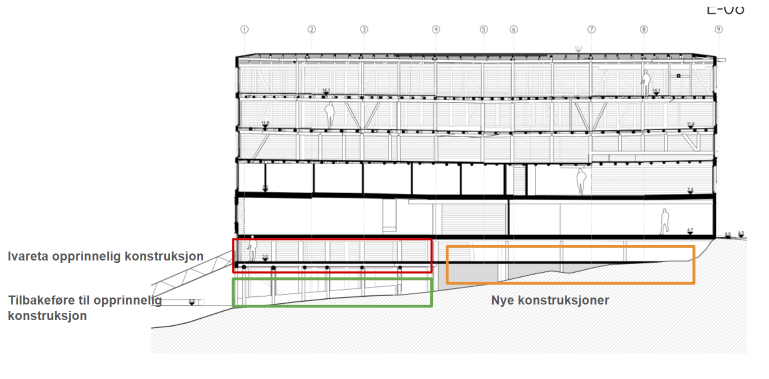

# Fjordgata 30 – håndtering av hovedkonstruksjoner i underetasje og kjeller – uttalelse fra Byantikvaren

Vi viser til tidligere korrespondanse, herunder vår behandling i forbindelse med rammesøknaden.

Byantikvaren har gjennom prosessen anbefalt at dere tidlig avklarer handlingsrommet med Riksantikvaren, med tanke på arkeologi. Før dere prosjekterer videre på en mulig utsjakting av masser i kjelleren, er det avgjørende at dere tar opp dialogen med Sissel Ramstad Skoglund. Vi setter derfor henne på kopi. Dersom man lander på å ikke grave ut kjelleren, vil også reparasjoner av eksisterende betongfundamenter kreve graving og godkjenning av Riksantikvaren.

Da vi behandlet rammesøknaden var vi i den tro at konstruksjonene under underetasjen var skiftet ut i forbindelse med en omfattende ombygging på 1980-tallet, som også da var synlig i underetasje og førsteetasje. Vi trodde også at det hadde blitt gjort mer omfattende utsjakting av masser under de nye konstruksjonene.

Når man nå har begynt å demontere gulvet i underetasjen ser vi at svært mye av den opprinnelige bærekonstruksjonen er bevart, men det er tydelig at det ble gjort store og inngripende kappinger for å etablere nye fundamenter. Vi ser at denne konstruksjonen hadde store skader også før 1980-tallet (herunder brann- og råteskader), og dette var trolig årsaken til den omfattende ombyggingen av bæresystemet.

Slik vi forstår det er hovedkonstruksjonen, i form av søyler, gulvåser og kavlgulv bevart mot kanalen, i underetasjen foran landkaret. Dette er planlagt bevart og istandsatt, også i det nye konseptet med minilager.

Bæresystemet under brygga, foran landkaret, ble også endret på 1980-tallet, med nye "stripefundamenter" i betong, hvor pælene står. Her er det stolper både i betong og tømmer, med til dels store skader i tømmerstolpene. Vi kjenner ikke til skadeomfanget og holdbarheten til betongkonstruksjonene.

## Byantikvarens vurdering

Underetasjen og kjelleren i Fjordgata 30 består av en blanding av opprinnelige tømmerkonstruksjoner og nyere betong-, stål- og trekonstruksjoner fra 1980-tallet. Selv om vi primært skulle sett at bærekonstruksjonene i alle bryggene ble tilbakeført til opprinnelig konstruksjon, ser vi at dette er omfattende og utfordrende. Fra Byantikvarens side er det likevel viktig at vesentlige deler av hovedkonstruksjonene fremdeles er i tømmer og lesbare elementer i bryggebebyggelsen.

I dette tilfellet, der mye av de opprinnelige konstruksjonene er endret, anbefaler vi at inngangen til istandsetting/utbedring er ulik, i de ulike delene av brygga. Byantikvaren vurderer underetasje og kjeller som en helhet, og gjør en samlet vurdering av inngrep og handlingsrom i ulike delene av brygga.

Med dette som utgangspunkt så vurderer vi at de delene av hovedkonstruksjonen som ligger innenfor landkaret er såpass skadet og uten bærefunksjon at det her kan jobbes videre med et bærekonsept som tar utgangspunkt i 1980-tallets grep. Det er uansett viktig at brukbare tømmerelementer som tilhører den opprinnelige hovedkonstruksjonen gjenbrukes i øvrige deler av brygga.

Vi har laget enkle illustrasjoner som viser vår helhetlige vurdering.

## Primær anbefaling

*Primær anbefaling – snitt L-06.*

Vår klare anbefaling er at hele hovedkonstruksjonen mellom kanalen og landkaret reetableres som opprinnelig. Dette vil også gjøre fremtidig vedlikehold/istandsetting mer forutsigbart og enklere. Vi ser at kombinasjonen med betong og treverk i flomålet ikke gir en god og varig løsning. Dette vises også tydelig i Fjordgata 30.

## Sekundær anbefaling

*Sekundær anbefaling – snitt L-06.*

Det er avgjørende at ytre del av stolpekonstruksjonen tilbakeføres, slik det har vært forutsatt gjennom hele prosessen. Selv om vi klart anbefaler en helhetlig tilbakeføring, kan det også aksepteres å reparere betongkonstruksjonene i de indre delene, mot landkaret.

---

Byantikvaren den 4.9.26

Silje T. Petersen og Roy Åge Håpnes
