Energikartlegging                                                                              HRP AS
                                                       Dronning Eufemias gate 16, 0191 Oslo
Energikartlegging
Fjordgata 30                                                     Org.nr.: 988 889 245, hrpas.no

Oppdragsgiver:  Kodeworks Eiendom AS  Prosjektnummer:  2612200
Dato:           06.07.2026            Versjonsnummer:  2
Utarbeidet av:  Anne Kristine Amble   Kontrollert av:  OML, MOS

Side 1 av 32                                                     Energi, Miljø
                                                                    & Bærekraft
Energikartlegging

Sammendrag

HRP AS har gjennomført en energikartlegging av Fjordgata 30 i Trondheim på oppdrag fra
Kodeworks Eiendom AS. Bygningen er et verneverdig bryggebygg fra ca. 1850, påbygd i
1904, med deler av arealet i dag ubenyttet. Det planlegges ombygging med ny kjeller og
etablering av minilager i 3.–5. etasje, i 1. og 2.etg vil det fortsatt være forretning/kontor/lager.

Energiberegningene er utført i Simien Pro i henhold til NS 3031:2025, med lokale klimadata
for Trondheim. Nåværende beregnet energibruk tilsvarer energikarakter F.

Kartleggingen viser at bygget har betydelige varmetap gjennom uisolert tak, yttervegger i laftet
tømmer, gamle vinduer og porter, samt høy luftlekkasje. Det er elektrisk oppvarming med
panelovner, ingen varmegjenvinning og begrenset ventilasjon. Samtidig er potensialet for
energieffektivisering stort.

Flere tiltak er vurdert, blant annet etterisolering av tak, yttervegger og etasjeskillere, bytte av
vinduer og utbedring av porter, balansert ventilasjon med varmegjenvinning,
varmepumpeløsninger (vann–vann fra kanal, luft–vann og luft–luft), fjernvarme, samt
belysnings- og styringstiltak. En helhetlig tiltakspakke med bygningsmessige tiltak, ny
ventilasjon og kan redusere energibruken betydelig, og forbedre energikarakter med to nivå
til D og oppnå godt over 30% energibesparelser (både levert energi og primærenergi) som er
vilkårene for grønne lån i DNB. Ny varmeløsning og solceller kan gi ytterligere forbedring.

Konklusjonen er at Fjordgata 30 har et stort potensial for energieffektivisering i forbindelse
med planlagt ombygging. De mest effektive tiltakene er knyttet til tetting, isolering, ventilasjon
med varmegjenvinning og overgang til mer energieffektiv varmeforsyning. Valg av endelig
løsning bør gjøres samlet, med hensyn til vernekrav, investeringskostnader, lønnsomhet og
mulighet for Enova-støtte og grønne lån.

Revisjon Kommentar                                                Dato  Sign. KS

1             For kommentar                                       05.05.26 AKA OML

2             Supplering iht DNBs rammeverk for grønne lån V.5.1  06.07.26 AKA MOS

Side 2 av 32
Energikartlegging

Innholdsfortegnelse

Sammendrag......................................................................................................................................... 2
Innholdsfortegnelse .............................................................................................................................. 3
1 Innledning ...................................................................................................................................... 5

   1.1 Om prosjektet........................................................................................................................ 5
   1.2 Metode og forutsetninger .................................................................................................... 5
   1.3 Energirådgiverstatus ............................................................................................................ 7
2 Energiteknisk tilstand ................................................................................................................... 8
   2.1 Om bygningen ...................................................................................................................... 8
   2.2 Byggeteknisk.........................................................................................................................9

      2.2.1 Gulv og etasjeskillere .....................................................................................................9
      2.2.2 Yttervegger......................................................................................................................9
      2.2.3 Tak ..................................................................................................................................10
      2.2.4 Vinduer, dører og porter ..............................................................................................10
   2.3 VVS- anlegg ........................................................................................................................11
      2.3.1 Sanitær...........................................................................................................................11
      2.3.2 Varme .............................................................................................................................11
      2.3.3 Ventilasjon/klimatisering ..............................................................................................11
   2.4 Elektrisk anlegg...................................................................................................................12
      2.4.1 Tavler og energimålere ................................................................................................12
      2.4.2 Belysning........................................................................................................................12
      2.4.3 Automatikk .....................................................................................................................12
      2.4.4 Utomhus .........................................................................................................................12
      2.4.5 Energioppfølging...........................................................................................................13
   2.5 Planlagt ombygging............................................................................................................13
3 Energibruk før tiltak ....................................................................................................................14
   3.1 Målt energibruk...................................................................................................................14
   3.2 Beregnet energibruk ..........................................................................................................14
4 Vurderte tiltak..............................................................................................................................17
   4.1 Utbedring av luftlekkasjer og kuldebroer ........................................................................17
   4.2 Etterisolering av tak............................................................................................................17
   4.3 Etterisolering av langvegger/yttervegger mot øst og vest ............................................17
   4.4 Etterisolering av gavlvegger (nord/sør) ...........................................................................18
   4.5 Bytte av vinduer og utbedring av porter .........................................................................18
   4.6 Etterisolering av etasjeskiller mellom kontor og lager...................................................20
   4.7 Etterisolering av innervegger mellom oppvarmet og delvis oppvarmet .....................20
   4.8 Ventilasjon med varmegjenvinning ..................................................................................20
   4.9 Varmepumpeløsninger ......................................................................................................20
      4.9.1 Varmepumpe alternativ A – Vann-vann: varmeopptak fra kanalen, vannbåren
      varme 22
      4.9.2 Varmepumpe alternativ B – Luft-vann: varmeopptak fra uteluft, vannbåren varme

                23
      4.9.3 Varmepumpe alternativ C – Luft-luft: varmeopptak fra uteluft, direkte
      varmeavgivelse ...........................................................................................................................24
   4.10 Fjernvarme og vannbåren varme .....................................................................................24
   4.11 Ny belysning i kontor/næring 1. etg.................................................................................25

Side 3 av 32
Energikartlegging

   4.12 Lysstyring minilager ...........................................................................................................25
   4.13 Solceller på tak ...................................................................................................................25
   4.14 Øvrige vurderte energiløsninger ......................................................................................27
   4.15 Strakstiltak ...........................................................................................................................27
   4.16 Effekttiltak ............................................................................................................................27
5 Konklusjon og anbefaling ..........................................................................................................28
   5.1 Sammendrag av tiltak ........................................................................................................28
   5.2 Tiltakspakker og påvirkning på Energimerket ................................................................29
   5.3 Finansiering og støtte.........................................................................................................30

      5.3.1 Grønne lån .....................................................................................................................30
      5.3.2 Støtte fra Enova.............................................................................................................31
6 Kilder ............................................................................................................................................32

Side 4 av 32
Energikartlegging

1 Innledning

1.1 Om prosjektet
HRP AS er engasjert av Kodeworks Eiendom AS for å utføre en energikartlegging av Fjordgata
30 i Trondheim.

Store deler av bygget står i dag ubrukt, men har en sentral og god beliggenhet. Det er et
verneverdig bygg, verneklasse B, så alle ombygginger må godkjennes av Byantikvaren. HRP
AS har sammen med arkitektkontoret Saaha utført en tilstandsvurdering og mulighetsstudie
og holder på med et forprosjekt med formål å få etablert et konkurransegrunnlag til en
entreprenør. Det er utredet ulike bruksområder, og minilager ser ut til å være bruken som best
lar seg kombinere med øvrige hensyn.

Denne energikartleggingen har som formål å kartlegge energi- og effekttiltak samt
energiforsyning som bør vurderes innarbeidet i prosjektet. Den skal gi byggeier en oversikt
over energitilstand og lønnsomheten ved ulike tiltak.

1.2 Metode og forutsetninger
Kodeworks Eiendom har fått støtte fra Enova til å gjennomføre energikartleggingen og
metoden følger Generelle regler for tilskudd fra Energi- og klimafondet. Energiberegninger er
utført i Simien pro v. 8.0.34.08 og 8.1.01.05 årssimulering som følger NS3031:2025 og skal
beregnes som Levert energi ved lokalt klima (Trondheim) (Beregningspunkt D iht NS3031) og
redusert netto energibehov (beregningspunkt A iht NS3031). For å søke videre Enovastøtte til
gjennomføring eller kvalifisere til grønne lån må også Energimerket beregnes.
Bygningskategori er vanskelig å fastsette da det er blandet bruk, men det brukes kontorbygg
i beregningene. Den andre nærliggende kategorien, Lett industri/verksted (lagerbygg) passer
ikke noe bedre mtp standardverdiene for bl.a driftstid, internlaster og luftmengder som må
benyttes i energimerking.

Bygget vil få et økt oppvarmet og delvis oppvarmet bruksareal etter ombygging og vil således
øke energibruken.

     • Enova har gitt følgende føringer per e-post 16.04.2026 «For dette prosjektet må
          løsningen bli at man lager energiattest for hele bygningsmassen som om det var
          oppvarmet og i bruk før tiltak». Førtilstanden vil beregnes som et Referansebygg hvor
          hele bygget tas i bruk, og ny kjeller inkluderes, uten energitiltak.

     Man må også vurdere spesifikk energibruk per bruksareal: kWh/m2 når man sammenligner
     før og etter.

     • DNBs rammeverk V.5.1 krever at reduksjonen er beregnet «sammenliknet med
          byggets opprinnelige energiytelse før rehabiliteringen, målt i kWh per oppvarmet
          kvadratmeter per år» kWh/m2. Derfor utføres også energimerkeberegning med dagens
          tilstand hvor kun to av etasjene har oppvarmet areal, kalt Nåtilstand.

Beregningspunkter i NS3031:2025 / Energimerkeforskriften:

     A. Netto energibehov, termisk og elektrisk. (F.eks Energirammekrav TEK17 og
          Passivhusstandarden.)

     B. Brutto energibehov (netto + akkumuleringstap og distribusjonstap)

Side 5 av 32
Energikartlegging

    C. Tilført energi til bygningen (både egenprodusert og kjøpt).
    D. Netto levert energi = Tilført (C) fratrukket egenprodusert og eksportert energi. Levert

         (kjøpt) energi til bygningen, fratrukket eksportert energi fra bygningen -> resulterende
         netto levert energi. Benyttes for lønnsomhetsberegninger i denne rapporten da dette
         gir merrealistiske resultater.
    E. Levert primærenergi (Tilsvarer Primary energy demand, PED i EU taksonomi), vektet
         levert energi. Som D, men ganget med primærenergifaktorer som er 1 for elektrisitet,
         0,45 for bioenergi og fjernvarme/-kjøling og 0 for eksportert energi. For bygg med kun
         elektrisitet fra nett vil D og E være lik, men ikke ved fjernvarme eller solcelleproduksjon
         med eksport.
    Energimerking: Energikarakteren skal baseres på beregnet vektet levert energi
    (beregningspunkt E etter NS 3031:2025), inkludert systemtap. Det skal beregnes med
    Osloklima og multipliseres med en klimakorrigeringsfaktor. Videre vil
    energimerkeberegningen beregne alle sonene i bygget som fullt oppvarmet til 21°C. For
    Fjordgt 30 vil derfor Energimerkeberegningen ikke være lik beregningspunkt E
    primærenergi som benytter Trondheimsklima og reelle setpunkttemperaturer for
    oppvarming.

Figur 1 Utklipp fra Simien pro som viser definisjonen av energiberegningspunkt i NS3031
 Kommentar til EU taksonomi og primærenergi (Primary energy demand, PED):
 Det står ikke eksplisitt noe sted at vektingsfaktorene i NS3031/energimerkeforskriften =
 primærenergifaktorer iht EU taksonomi, men det er to argument som skulle tilsi at dette er iht krav:
       1. DNB sine kriterier (versjon 5.1, kap 1.3) sier bare "levert energi" for oppfyllelse krav.
       2. Høringsbrevet fra Energidepartementet beskriver at oppfyllelse av bygningsenergidirektivet
            og primærenergifaktorene er en av hensiktene med den nye energimerkeforskriften.

Side 6 av 32
Energikartlegging

Økonomiske forutsetninger:

• Strømpris1:               1,2 kr/kWh ekskl. mva

• Strømpris eksport (spotpris): 0,80 kr/kWh ekskl. mva

• Fjernvarmepris2:          0,70 kr/kWh ekskl. mva

• Effektpris strøm3:        37 - 81 kr/kW/mnd avh av effekttrinn og årstid

• Effektpris fjernvarme:    39 - 86 kr/kW/mnd avh av effekttrinn og årstid

• Kalkulasjonsrente:        4% ved beregning av inntjeningstid

Energiprisene inkluderer spotpris med påslag, forbruksavgift, elsertifikatpåslag, nettleiens
energiledd. Alle kostnader i rapporten er beregnet ekskl mva da det er dette Enova baserer
seg på ved utmåling av støtte.

Simien har ikke innebygget funksjonalitet for beregning av besparelser i nettleiens effektledd
for næringsbygg. Dette beregnes manuelt.

1.3 Energirådgiverstatus
HRP’s Energirådgivere som har jobbet med denne energikartleggingen og
energisimuleringene, Anne Kristine Amble og Marie Ofstad Skeie, oppfyller kompetansekravet
i energimerkeforskriften: ingeniørkompetanse på bachelornivå med hovedvekt på
bygningsteknikk- og energifag og minimum to års praksis fra energiberegninger for bygninger
med tekniske anlegg. Enova hadde tidligere et energirådgiverregister hvor Amble har vært
registrert, men dette ble nedlagt i 2025: Rådgiverregister | Enova.

1 Elektrisitetspriser – SSB
2 Historiske fjernvarmepriser - Statkraft varme og trondheim-bedrift-med-volumledd-bt1v.pdf
3 Nettleiepriser forbruk over 100 000 kWh - Tensio

Side 7 av 32
Energikartlegging

2 Energiteknisk tilstand

2.1 Om bygningen
Bygningen er en del av bryggerekka som vender mot kanalen ved Fjordgata i Trondheim.
Bygget stammer fra ca 1850, men er gjenoppbygget etter brann og 4.og 5.etg er bygd på i
1904. Kjeller er i dag en kald råkjeller som til dels brukes som lager av en båtforening. 1. og 2.
etasje inneholder kontorer, butikklokaler, selskapslokaler (spillforening) og boder.
3. til 5.etg står i dag tomme og er uoppvarmede.
Bruksarealet før ombygging er 2 626 m2, hvorav 986 m2 er oppvarmet og i bruk.

Figur 2 Bilder tatt fra undersiden av bygget, fasaden mot Fjordgata og i kontorlandskap i 1.etg

Figur 3 Bilde fra femte og øverste etasje – verneverdig drivverk for oppheising av varer
Side 8 av 32
Energikartlegging

2.2 Byggeteknisk
2.2.1 Gulv og etasjeskillere
Bygget ligger i vannkanten ved kanalen som er forbundet med Nidelva og Trondheimsfjorden
og er fundamentert på trepåler som på 80-tallet ble erstattet med betong- og stålsøyler som
er gjennomgående opp til 2.etg. Grunnforholdene er leire og grus/steiner.
Oppvarmede arealer i 1.etasje vender mot kald kjeller og er isolert med ca 15cm mineralull.

Figur 4 Gulv i 1.t er åpnet for å vurdere oppbygning, isolert med ca 15cm.

Etasjeskiller mellom oppvarmet 2.etg og kald 3.etg er kledt med akustiske himlingsplater og
sponplater og er relativt lufttett, men antas å være uisolerte treplanker.
2.2.2 Yttervegger
Bygget er oppført i laftet tømmer. Østveggen har utvendig murpuss lagt på 70-tallet, mens
vestveggen er kledt med metallplater. Disse er bærende yttervegger i laftet tømmer. Fasadene
mot Fjordgata og kanalen (gavlvegger) har tømmermannskledning.
I lokalene i 1.og 2.etasje er det noe utforing og innvendig panel. Det antas maksimalt ca 5cm
innvendig isolasjon.

Side 9 av 32
Energikartlegging

Figur 5 Tv. Tømmervegg bak platekledning, bærende sidevegg vestfasade. T.h tømmermannskledd gavlvegg, sørfasae

2.2.3 Tak
Yttertaket er fra 1904 og er oppbygd som et valmtak i trekonstruksjon, med takvinkel på 6-7
grader. Konstruksjonen består av takåser, med overliggende taksperrer i tre og er uisolert.
Taket er tekket med takduk fra 70-80-tallet som har nådd teknisk levealder. Det er anbefalt å
etterisolere taket.

Figur 6 Underside av uisolert takkonstruksjon i tre med takvindu fra 70-tallet(?).

2.2.4 Vinduer, dører og porter
Vinduene er av svært varierende alder og tilstand og spenner fra 1-lags glass fra 1904 til
moderne vinduer fra 2010.

Side 10 av 32
Energikartlegging

Figur 7 Nytt vindu fra 2010 vs et av de eldste vinduene og portene

Inngangspartiet i 1.etg har dører og vinduer fra anslagsvis 50-tallet frem til dagens standard.
                             2.3 VVS- anlegg

2.3.1 Sanitær
Det er ingen dusjanlegg, kun kjøkken og toalett. Varmtvannsbruken er dermed relativt lav. Det
er elektriske varmtvannsberedere. Et par av dem er små innunder kjøkkenbenk, den største
var en OSO bereder på anslagsvis 3kW. Disse virker å være i god stand.
2.3.2 Varme
Lokalene har elektriske panelovner, de fleste sannsynligvis fra 80-tallet og nyere, som har
lokalt styrt termostat. På befaringen sto flere av disse ganske høyt (ca 25°C).
2.3.3 Ventilasjon/klimatisering
Det er kun avtrekksventilasjon i kontorlokalene og vinduslufting. Det ble også observert noen
kanaler som gikk ned til minilagerne i 2.etg hvor det ikke var adkomst ved befaring.
Luftmengder er ukjente og i beregningene er det benyttet minimumsluftmengder for
energimerking.

Figur 8 Kanaler for avtrekksventilasjon 1.etg

Side 11 av 32
Energikartlegging

Figur 9 Kanaler for avtrekksventilasjon 3.etg

2.4 Elektrisk anlegg
2.4.1 Tavler og energimålere
Det ble funnet tre tavleskap med målere på befaringen:

     • Målernr.6970631408129431
              o Måleplombe nr. 316294 / 316295
              o MPID 707057500068566945
              o Plassert i Kodeworks lokaler, inneholder en del eldre skrusikringer
              o Dekker «talje i 5.etg», kjøkken, oppholdsrom, lys og stikk i flere lokaler bl.a
                   kjeller. Kursfortegnelse er datert 2019, men det er stort sett eldre skrusikringer.

     • Målernr. 6970631408259640
              o Målerplombe nr. 316300 / 316299
              o MPID 707057500068566952
              o Plassert i Gang 1.etg
              o Dekker Hovedsikringer «BA butikk» 1.etg og kontorer «B+BB» 2.etg., stikk og
                   varme i gang +callinganlegg.

     • Målernr. 6970631408386117
              o Målerplombe nr. 316296 / 316 298
              o MPID 707057500068566969
              o Plassert i Gang 1.etg
              o Dekker bl.a butikklokaler og utelys

Strøm som dekker butikklokalet i 1.etg mot gaten som nå brukes som lager/riggområde skal
være koblet fra.
2.4.2 Belysning
Belysningen er av varierende alder og type: glødelamper, halogen-spot, lysrør og LED. Den
nyeste er trolig fra ca 2010 og den eldste fra 70-80-tallet. Det er rester av elektriske ledninger
og belysning i 3.-5.etasje, men de var ikke i funksjon ved befaring.
2.4.3 Automatikk
Det er ingen SD-anlegg i bygget. Det er uvisst hvordan avtrekksventilasjonen styres.
2.4.4 Utomhus
Fasaden mot Fjordgata har fasadebelysning og skilt. Det ble ikke funnet varmekabler i
inngangsparti eller taknedløp.
Det var tre flytende solcellepaneler ved bryggen utenfor. Disse ligger på nordsiden av bygget
og har dårlige solforhold. Den ene hadde veltet.

Side 12 av 32
Energikartlegging

2.4.5 Energioppfølging
Kodeworks benytter Enersky for energioppfølging.
2.5 Planlagt ombygging
I 3.-5.etg skal det etableres minilager. Det blir mest sannsynlig endringer i planløsning også i
1. og 2.etg, hvor deler av 1.etg blir minilager og hele 2.etg blir rent minilager. Endelig
planløsning kommer an på forhandlinger med potensielle leietagere. Men det er i
beregningene antatt at 2.etg dermed går fra å være hovedsakelig fullt oppvarmet til å bli delvis
oppvarmet. Dette forstås ikke som en bruksendring, da bygget allerede er regulert som lager-
og næringsbygg med blandet bruk.
Det er planlagt å bygge en kjeller i betong hvor det i dag er en uoppvarmet råkjeller. Denne er
tenkt utført som et «omvendt basseng» da det må kunne motstå vanninntrengning fra en
springflo. Det er sendt inn en søknad til BYA, som er under behandling. Endelig areal er derfor
ikke fastlåst på nåværende tidspunkt. Dersom det ikke godkjennes, må man begrense
kjellerarealet til plassering av opprinnelig steinmur.

Figur 10 Plassering av nåværende steinmur i uoppvarmet kjeller (t.v) og Omsøkt utvidelse av kjeller (t.h.)

Før: U-verdi gulv første etasje mot fri/mot kald råkjeller, tømmer +parkett og 15cm isolasjon =
0,26 W/m2K
Etter: U-verdi etasjeskiller mellom 1.etg og kjeller forblir noe tilsvarende, men i stedet for at
det vender mot kald kjeller og friluft, vender mesteparten mot den nye kjelleren (ca10°C). Det
antas at ny kjeller vil følge minstekravene i TEK17.
En utvidelse av bruksareal vil ikke gi en energi- og effektbesparelse som sådan, og godkjennes
ikke av Enova som et energitiltak, men spesifikk energibruk, kWh/m2, vil gå ned og
energikarakteren forbedres.
Bruksarealet etter ombygging er 3113 m2 hvorav det i videre beregninger er antatt at 310 m2
er fullt oppvarmet næring/kontor til 21°C, og resten er minilager delvis oppvarmet til ca. 10°C.

Side 13 av 32
Energikartlegging

3 Energibruk før tiltak

3.1 Målt energibruk
Energiforbruket for de tre målerne viser at energiforbruket har sunket med 20% fra 2023 til
2025. Vinteren 2023 var generelt kald og dette kan være en forklaring, at utleielokalene ikke
har vært i bruk deler av tiden. Det er ikke foretatt en graddagskorrigering
(temperaturkorrigering) da de siste års forbruk ikke vil være særlig relevant for den
forestående ombyggingen og de videre analysene.

Spesifikk energibruk er svært lav sammenlignet med andre kontorbygg/næringsbygg. Dette
skyldes nok i stor grad at komfortnivået (ventilasjon, klimatisering) er lavere enn i moderne
kontorer og dels at lokalene har lav/moderat bruk.

Tabell 1 Målt energibruk siste tre år

År                       Energiforbruk       kWh/m2
                         (kWh)

                   2023      103 669         127

                   2024              81 329  99

                   2025              82 773  101

Snitt                                89 257  109

Figuren under som viser forbruk per døgn, viser at det er veldig stor forskjell på
energiforbruket sommer og vinter. Dette betyr at en veldig stor andel, ca 50%, av energibruken
går til oppvarming.

       800

       700

       600

       500

kWh    400

       300
       200 Oppvarmingsandel

       100 Grunnlast

         0               01.01.2024          01.01.2025                                  01.01.2026
       01.01.2023

Figur 11 Energiforbruk per døgn samlet for de tre målerne fra januar 2023 til mars 2026

3.2 Beregnet energibruk
Byggets oppvarmede/delvis oppvarmede bruksareal skal utvides, derfor medtas både
beregnet energibruk for bygget slik det er i dag, men også utvidet med ny kjeller og minilager
3.-5.etg. Dette utgjør referansen i beregning av besparelser.

Nå-tilstand er bygget slik det er i dag, hvor kun 1. og 2.etasje er i bruk.

Side 14 av 32
Energikartlegging

Referansebygget omfatter ny kjeller til og med 5.etg. Det er beregnet med direkte elektrisk
oppvarming, avtrekksventilasjon og naturlig ventilasjon og byggets ytterskall er ikke etterisolert
eller tettet, vinduer er ikke skiftet. Dette vil tilsvare å ta de ubrukte lokalene i bruk uten
energitiltak. Kjeller antas utbygd iht minstekrav i TEK17. Arealene med minilager antas å være
oppvarmet til ca. 10°C, kontor/næring til 21°C. Det benyttes minste tillatte luftmengder for
energimerking.

Tabell 2 Beregnet energibruk, Netto levert energi, beregningspunkt D, før tiltak for hhv Nåtilstand/dagens bruk og Referansebygg

Beregnet Levert energi (D)                     Energibruk,  Spesifikk        Energikarakter
                                               kWh          energibruk,              F
Nåtilstand: Energibruk 1. & 2.etg før tiltak                kWh/m2
Referanse: Energibruk hele bygget kjeller til      252 101
5.etg, før tiltak                                                       256

                                               427 074      141              F

Tabellen under viser beregnet netto energibehov(A) for Referansebygget uten tiltak. Netto
energibehovet er uavhengig av energiforsyning og oppvarmingsløsning. Enova krever at også
netto energibehov skal reduseres for at man skal kunne få støtte til å gjennomføre tiltak.

Tabell 3 Beregnet netto energibehov for Referansebygget (hele bygget kjeller – 5.etg)

Referansebygg:                  Energibehov, kWh           Spesifikk energibruk, kWh/m2
Beregnet netto energibehov (A)

Romoppvarming                                  268 374                        86,2

Varmebatterier                                          0                          0
Frostsikring gjenvinner                                 0                          0
Varmtvann                                       15 275                          4,9
Vifter                                          29 725                          9,5
Pumper                                                  0                          0
Belysning                                       42 465                        13,6
Teknisk utstyr                                  59 140                        19,0
Romkjøling                                              0                          0
Kjølebatterier                                          0                          0
Total                                          414 978                       133,3

Kommentar til beregningene:

Når beregnet spesifikk energibruk er høyere enn målt, er dette fordi i de normerte
beregningene iht NS3031:2025 og energimerkeforskriften ligger til grunn en standardisert
bruk og minste tillatte luftmengder for ventilasjon. Det er altså en høyere komfort, mer energi
til teknisk utstyr og varmtvann og lengre driftstid til grunn i beregningene enn i virkeligheten.
Intern varmelast fra personer og utstyr vil også være høyere enn reelt, noe som påvirker
andelen energi som går til romoppvarming.

Side 15 av 32
Energikartlegging

Referansebygget vil også få et lavere spesifikk energibruk enn Nåtilstand, kWh/m2, fordi det er
lavere innetemperatur i en større andel av bygget, men også fordi bruksarealet øker og
varmetapet fra gulv og tak fordeles på hele bygget.
I begge tilfeller oppnår bygget energimerke F (235 -285 kWh/m²). Merk at energimerket regnes
som fullt oppvarmet og har dermed høyere spesifikk energibruk enn delvis oppvarmet.

Side 16 av 32
Energikartlegging

4 Vurderte tiltak

I de følgende delkapitlene presenteres tiltakene beregnet én og én. I kapittel 5 er det satt
sammen tiltakspakker, da flere tiltak har påvirkning på hverandre som f.eks varmepumpe og
isoleringstiltak. De enkeltstående tiltakene kan ikke bare summeres.

4.1 Utbedring av luftlekkasjer og kuldebroer
Ettersom konstruksjonen er ganske uniformt «dårlig» antas det liten/ingen forbedring av
kuldebroverdi som er satt til 0,07 W/m2K.

Bygningen er svært utett, og det anbefales å utbedre luftlekkasjer. Besparelsene ved dette vil
inngå i tiltakene beskrevet for etterisolering og vindusbytte. Det antas at lekkasjetallet kan
reduseres fra dagens lekkasjetall på 16 luftskifter/time v/50pa i 3.-5.etg og ca.4 luftskifter i 1.-
og 2.etg til ca. 2,5 luftskifter per time dersom alle fasader, gulv, tak og vinduer utbedres.

For enkelttiltakene er forbedringene i lekkasjetall fordelt slik:

Tabell 4 Estimert forbedring av luftlekkasjer for ulike tiltak på bygningskroppen

Lekkasjetall                               1. og  3.-5.etg Kjeller
                                           2.etg
Før tiltak                                        16   -
                                             4
Etterisolering tak (kun 5.etg forbedres):         14   1,5
Etterisolering gavlvegger:                   4
Etterisolering langvegger:                   4    14   1,5
Nye vinduer:                                 3
Utbedring porter:                           3,5   14   1,5
Ny kjeller (nytt gulv):                     3,5
SUM/snitt:                                  3,5   14   1,5
                                            2,5
                                                  8    1,5

                                                  16   1,5

                                                  2,5  1,5

Det er stor usikkerhet knyttet til lekkasjetall.

4.2 Etterisolering av tak
Taket er i dag uisolert med kledning som har nådd teknisk levealder. Det anbefales å legge ny
taktekking med isolasjon og lufting. Kostnaden inkluderer derfor mer enn selve isoleringen.
Vi har vurdert energibesparelsen med å etterisolere taket med 25 cm. Det er lagt til grunn en
forbedret U-verdi fra 2,26 til 0,18 W/m2K. I tillegg forbedres luftlekkasjer som beskrevet i kap
4.1.

              Energibesparelse: 40 470 kWh/år
              Kostnadsbesparelse: 48 570 kr/år
              Estimerte investeringskostnader: 1 500 000 kr eks mva
              Antatt levetid: 30 år og Inntjeningstid: >100år (enkel inntjeningstid 31 år)

4.3 Etterisolering av langvegger/yttervegger mot øst og vest
Vi har vurdert energibesparelsen med å etterisolere sideveggene/langveggene utvendig med
10 cm, da det trolig ikke er plass til mer grunnet nærhet til nabobygg og veggens skjevheter.
Det er lagt til grunn en laftet tømmervegg med forbedret U-verdi fra 0,84 W/m2K til 0,34 W/m2K.

Side 17 av 32
Energikartlegging

I tillegg forbedres luftlekkasjer som beskrevet i kap 4.1. Kostnader er estimert basert på
tilstandsrapporten(KPI-justert) og inkluderer mer enn kun isolasjonskosten.

              Energibesparelse: 22 640 kWh/år
              Kostnadsbesparelse: 27 169 kr/år
              Estimerte investeringskostnader: vest ca 1 775 000, øst: ca 1 090 000,00 kr
              Antatt levetid: 30 år og Inntjeningstid: >100år

4.4 Etterisolering av gavlvegger (nord/sør)
Gavlveggene er fredet og det kan derfor kun isoleres innvendig. Det antas at 1.og 2.etg
allerede har en innvendig påforing med opptil 5cm og innvendig trekledning/gipsplater
tilsvarende en U-verdi på ca. 0,5 W/m2K som forblir uendret.

I 3.-5.etg er det antatt en forbedring fra en U-verdi fra ca. fra 0,84 W/m2K, basert på uisolert,
laftet tømmervegg til en U-verdi på ca. 0,46 W/m2K med 5cm isolasjon + innvendig trepanel. I
tillegg forbedres luftlekkasjer som beskrevet i kap 4.1.

Kostnader er estimert basert på tilstandsrapporten(KPI-justert) og inkluderer mer enn kun
isolasjonskosten.

              Energibesparelse: 7 340 kWh/år

              Kostnadsbesparelse: 8 810 kr/år

              Estimerte investeringskostnader: 2 138 400 kr eks mva

              Antatt levetid: 30 år og Inntjeningstid: >100år

 4.5 Bytte av vinduer og utbedring av porter
Det er lagt til grunn en forbedret U-verdi fra 5 og 2,6 til 1,2 W/m2K. I tillegg forbedres
luftlekkasjer som beskrevet i kap 4.1. Det er gjort to beregninger med hva hhv to-lags glass
(U-verdi 1,2) og tre-lags glass (U-verdi 0,8) gir av besparelser og lønnsomhet.

Tabell 5 Estimerte inndata for tak, vegger, gulv, vinduer, porter og dører før og etter tiltak

Element                    Eksisterende bygg Etter oppgradering Etter oppgradering

                           før tiltak               Alt A                 Alt B

Sidedører hvit 1.etg       Fra 2016, antar U-       Uendret U-verdi       Ny U-verdi 0,8
mot fjordgt                verdi 1,2                                      Ny U-verdi 0,8
Inngangsparti,             Antar ca. 1980 U-verdi   Ny U-verdi 1,2        Ny U-verdi 0,8
dobbeldør                  2,6                                            Ny U-verdi 0,8
Utstillingsvinduer(store)  Ett-lags glass. U-verdi  Anbefaler å bytte da
1.etg mot fjordgt sør      ca. 4,0                  ett av dem er knust.  Ny U-verdi 0,8
                                                    Ny U-verdi 1,2        Ny U-verdi 0,8
Vinduer 2.etg mot fjorgt   To-lags Fra 2010 U-      Uendret U-verdi
sør                        verdi 1,2
                           G-verdi 0,52,
                           innvendige persienner

Vinduer 3.-5.etg mot       Sprosser, To-lags Fra    Ny U-verdi 1,2
fjordgt sør                1970? U-verdi ca 2,6     Ny U-verdi 1,2
Vinduer mot kanalen        Fra 1977 og 1986 2-
1.etg (nord)               lags, både fast karm

Side 18 av 32
Energikartlegging

Sprossevinduer mot      og koblet, antar U-      Ny U-verdi 1,2   Ny U-verdi 0,8
kanalen 2.etg (nord)    verdi i snitt ca 2,6     Uendret U-verdi  Ny U-verdi 0,8
minilager               1904 ettlags
Sprossevinduer mot                               Ny U-verdi 1,2   Ny U-verdi 0,8
kanalen 2.etg (nord)    Nye fra 2010             Ny U-verdi 1,2   Ny U-verdi 0,8
pokerklubben
                        U-verdi glass 1,04,
Sprossevinduer mot      antar U-tot ca 1,2
kanalen 3-5.etg (nord)
                        G-verdi 0,51 (0,38
Takvindu/overlys        med persienner)
                        Ca. 1904 ett-lags,
                        veldig slitt U-verdi ca
                        5,0.
                        Antar 70-talls, U-verdi
                        2,6

Solskjerming øvrig      Antar solfaktor (g-      Uendret. Dette er en forenkling, men det blir lite
                        verdi) = 0,6             komfortkjøling i bygget.

Portene består av svært utette planker, men de er verneverdige. Tilsvarende brygger har
innkassing disse slik at portene er bevart, men endelig løsninger er ikke prosjektert. Det antas
at ekvivalent U-verdi forbedres fra fra 2,9 til 0,5 W/m2K. Unntaket er portene i 2.etg nord (i
spillklubben) som allerede er kledd inn. I tillegg forbedres luftlekkasjer som beskrevet i kap 4.1
noe som utgjør en stor del av energibesparelsen og gjør tiltaket lønnsomt innenfor levetiden.
Kostnadsestimatet varierer fra over 2 millioner i tilstandsrapporten til ca 815 000 -830 000 i
grovkalkyle og Norsk prisbok. Kostnaden kommer an på hvor mye som må gjøres av manuelt
arbeid mhp å ivareta verneverdige elementer.
Alternativ A – to-lagsglass, U-verdi 1,2 W/m2 K

              Energibesparelse: 63 200 kWh/år
              Kostnadsbesparelse: 75 800 kr/år
              Estimerte investeringskostnader: 850 000 kr eks mva
              Antatt levetid: 30 år og Inntjeningstid: 15 år

Alternativ B – tre-lagsglass, U-verdi 0,8 W/m2 K
              Energibesparelse: 64 850 kWh/år
              Kostnadsbesparelse: 77 825 kr/år
              Estimerte investeringskostnader: 950 300 kr eks mva
              Antatt levetid: 30 år og Inntjeningstid: 17 år

Alternativ A er det mest lønnsomme og er valgt i videre beregninger.

Side 19 av 32
Energikartlegging

4.6 Etterisolering av etasjeskiller mellom kontor og lager
Det er lagt til grunn en forbedret U-verdi fra ca 1,3 W/m2K(uisolert tregulv med akustiske
himlingsplater) til 0,4 W/m2K (isolert med ca 10cm). Her kan det komme begrensninger pga
høyde, men også krav til brannskille/brannisolering etc. så endelig tykkelse er ikke bestemt.
Kostnaden gjelder isolering og er hentet fra Norsk prisbok.

              Energibesparelse: 16 700 kWh/år
              Kostnadsbesparelse: 20 000 kr/år
              Estimerte investeringskostnader: 55 000 kr eks mva
              Antatt levetid: 30 år og Inntjeningstid: 3 år

4.7 Etterisolering av innervegger mellom oppvarmet og delvis oppvarmet
I 1.etg vil det være en innervegg mellom fullt oppvarmet kontor/næring og delvis oppvarmet
lager som kan isoleres opptil 20cm. Antatt U-verdi uten isolasjon er ca 0,8 W/m2K som kan
forbedres til 0,22 W/m2K. Kostnaden gjelder isolering og er hentet fra Norsk prisbok.

              Energibesparelse: 1820 kWh/år og
              Kostnadsbesparelse: 2190 kr/år
              Estimerte investeringskostnader: 15 000 kr eks mva
              Antatt levetid: 30 år og Inntjeningstid: 8 år

4.8 Ventilasjon med varmegjenvinning
Et nytt ventilasjonsanlegg i et bygg som utvider bruksarealet vil ikke redusere
energikostnadene som sådan. Det er derfor gjort en beregning for å sammenligne balansert
ventilasjon med varmegjenvinning med dagens løsning med avtrekksventilasjon og naturlig
ventilasjon og legger til grunn at minste tillatte luftmengder på 7 m3/h/m2 ved energimerking
for kontorbygg legges til grunn i beregningen både før og etter tiltak. I realiteten vil nok
næringslokaler ha høyere andel og minilager lavere, men tidlig estimerte luftmengder av RIV
er ca. 6-8 m3/h/m2 totalt for bygget.

Det er antatt balansert mekanisk ventilasjon med varmegjenvinning 85% og SFP-faktor på 1,5
W/m2i snitt. Det anbefales at det er behovsstyrt ventilasjon etter f.eks tilstedeværelse,
temperatur og CO2-nivå ettersom bruken i kontor, næringslokaler og minilager varierer mye,
men det er i beregningene lagt til grunn normert driftstid iht NS3031.

              Energibesparelse: 113 700 kWh/år
              Kostnadsbesparelse: 136 500 kr/år
              Estimerte investeringskostnader: 1 716 000 kr eks mva
              Antatt levetid: 25 år og Inntjeningstid: 18 år

4.9 Varmepumpeløsninger
En varmepumpe henter varme fra omgivelsene ved hjelp av en kompressor og fordamper som
utnytter energien som frigjøres i faseforandringen i et kuldemedium. En tommelfingerregel er
at for hver kWh kjøpt elektrisitet får du ca 3 kWh tilført gratisvarme, såkalt COP-faktor, men
denne faktoren kan varier fra ca 2 til over 10 for de mest høyeffektive varmepumpeanleggene
med avansert styring.

Side 20 av 32
Energikartlegging

Varmeopptak kan være fra:
    • Vann (Kanalen)
    • Uteluft
    • Bergvarme
              o Dette anses som lite aktuelt, da det er leirejord og mudder som vanskeliggjør
                   boring Se Figur 10. Beregnes ikke nærmere.

Varmepumper kan levere varme til:
     • Luft:
               o innedelen blåser da varmluft direkte til lokalet. Dette er en veldig rimelig
                    løsning, men med begrenset dekningsgrad.
     • Vannbårent varmeanlegg:
               o Vannbåren varme vil kreve at det installeres et røranlegg for
                    radiatorer/gulvvarme, ventilasjonsvarmebatterier og evt. forvarming av varmt
                    tappevann. Det anbefales en lavtemperatur løsning med akkumulatortanker for
                    best mulig driftsforhold for varmepumpen og jevnt effektuttak. Dette er en stor
                    investering, men kan også søkes støtte om hos Enova i programmet
                    Varmesentraler.

Figur 12 Kart over boring av brønner for energi og vann Granada. Mest løsmasse i sentrum, ingen energibrønner i nærheten.

Dimensjonerende varmebehov til romoppvarming og ventilasjonsvarme vil variere veldig med
i hvilken grad det lykkes å tette luftlekkasjer.
For å unngå alt for mange variabler, har beregningene tatt utgangspunkt i at prosjektet lykkes
med de fleste tiltakene på bygningskroppen og luftlekkasje-tetting. Den vil i så måte være
underdimensjonert dersom man ikke gjør noen tiltak, og overdimensjonert dersom man

Side 21 av 32
Energikartlegging

gjennomfører alle tiltak på bygningskroppen og oppnår et veldig lavt lekkasjetall. Mange av
kostnadene er likevel de samme (rigg, arbeider, frakt, montasje etc.).
Estimert effektbehov til oppvarming for referansebygget uten tiltak er over 200kW, mens det
med isolering, lufttetting og ny ventilasjon er ca 40 kW. Internlastene vil være mindre i
virkeligheten og det vil i så fall gi enda større besparelser på tilført romoppvarming, da ikke all
den internlasten blir nyttiggjort varme.

Figur 13 Varighetskurve for oppvarmingsbehov for referansebygget uten tiltak

Figur 14 Varighetskurve for oppvarmingsbehov for referansebygget med tiltak på bygnignskroppen og ny ventilasjon

4.9.1 Varmepumpe alternativ A – Vann-vann: varmeopptak fra kanalen, vannbåren varme
Kanalen utenfor kan være en mulig varmeopptakskilde. Her er det brakkvann fra Nidelven og
Trondheimsfjorden, og den fryser sjelden. Det antas likevel at temperaturen kommer nær 0°C.
Det kan legges rør som bruker selve kanalvannet, eller som lukket sløyfe hvor det sirkulerer

Side 22 av 32
Energikartlegging

vann med frostvæske i. Fordelen med en lukket sløyfe er at man fjerner problem med evt
tilfrysing av vannet, gjengroing av rør etc. som krever en del vedlikehold på anlegget. Royal
garden hotell som har et slikt anlegg. For et relativt lite anlegg som dette er det en stor
investering som også vil kreve tillatelse fra havnemyndigheter m.fl. pga forbud mot ankring,
sjøkabler o.l. Fordelen er at det er en lite synlig løsning.
Det er antatt at det vil være mulig å legge en kollektorslange (lukket system) i kanalen på
frostfri dybde. Det er gjort overslagsberegninger av nødvendig rørlengde på rør som må
legges i kanalen. Varmeopptaket fra vann er avhengig av flere faktorer som temperatur og
strømningsforhold i kanalen, andel frostmengde i sirkulasjonsvæsken, dimensjon,
strømningshastighet, produktvalg mm. Rørdimensjon er typisk 50mm og oppover. En
tommelfingerregel er omtrent 14–16 meter sjøkollektor per kW varmeeffekt bygget trenger,
dette gir ca. 800 m som kan legges i f.eks 6 parallelle sløyer á 130m. Men dersom det er
stillestående vann kan det være så mye som 40-60 m/kW, nesten 2000m.

Figur 15 Nedsenking av trommelkollektorer i Narvik Havn. Plastslangene er lagt inne i trekkerørene i betongplaten. For å hindre oppdrift er slangene
fra betongplaten til sjøkollektorene festet med vektlodd. Foto: Nordisk Energikontroll Sjøvarme på Narvik Havn | Nordisk Energikontroll AS

Det er i beregningene antatt en årsvarmefaktor, sCOP på 3,5 og en varmepumpe på 50 kW
hvor spisslast/reservelast dekkes av en el-kjel. Det er antatt at denne vil dekke romoppvarming
og ventilasjonsvarme. Forvarming av tappevann kan være aktuelt, men siden
varmtvannsforbruket i minilager er lavt er det ikke medregnet.
Det antas lavtemperatur vannbårent varmeanlegg med radiatorer og evt gulvvarme.
Kvadratmeterkostnadene for vannbåren varme i minilager er mye lavere enn for kontor.
Det er medregnet kostnader for varmepumpen, et vannbårent varmeanlegg, kollektorsløyfe i
kanalen, betongstøping av vanntett føringsvei for kollektorslangene inn i bygget, komponenter
i teknisk rom og alt nødvendig for å få et fungerende anlegg. Priser er hentet fra norsk prisbok
og erfaringstall.

              Energibesparelse: 115 350 kWh/år
              Kostnadsbesparelse: 138 500 kr/år
              Estimerte investeringskostnader: 2 671 000 kr
              Antatt levetid: 25 år og Inntjeningstid: 38 år

4.9.2 Varmepumpe alternativ B – Luft-vann: varmeopptak fra uteluft, vannbåren varme
Det er antatt at det kan være mulig å finne en plassering av utedel som ikke er i strid med
vernehensyn eller høydebegrensninger på bygget. Det er i beregningene antatt en
årsvarmefaktor, sCOP på 3 og ca 50 kW varmeytelse fra varmepumpen hvor

Side 23 av 32
Energikartlegging

spisslast/reservelast dekkes av en el-kjel. Det er antatt at denne vil dekke romoppvarming og
ventilasjonsvarme. Forvarming av tappevann kan være aktuelt, men siden
varmtvannsforbruket er lavt er det ikke medregnet.

Dette er rimeligere enn vann-vannvarmeåumpe, men vil kreve en utedel som kan være
utfordrende for dette verneverdige bygget. Ved plassering på tak kan det komme i strid med
høydebestemmelser og vektbegrensning, nede ved bakken vil det være høy luftfuktighet og
hyppig avriming må til (mindre effektiv drift).

Det er medregnet kostnader for vannbårent varmeanlegg.

              Energibesparelse: 94 000 kWh/år
              Kostnadsbesparelse: 112 700 kr/år
              Estimerte investeringskostnader: 2 170 000 kr
              Antatt levetid: 25 år og Inntjeningstid: 38 år

4.9.3 Varmepumpe alternativ C – Luft-luft: varmeopptak fra uteluft, direkte varmeavgivelse
Små luft-lufte-varmepumper er en rimelig investering som gir store besparelser sammenlignet
med elektriske panelovner, men som er mindre driftssikker enn vann-vann varmepumpe, og
ofte dårlig ytelse under -10°C. Det er ikke avklart om det er mulig å finne en plassering av
utedel som ikke er i strid med vernehensyn. Det er i beregningene antatt en årsvarmefaktor,
sCOP på 2 og avgitt varmeytelse ca 30 kW fordelt på ca 8 enheter som dekker grunnlasten til
romoppvarming. Spisslast/reservelast dekkes panelovner.

              Energibesparelse: 68 620 kWh/år
              Kostnadsbesparelse: 82 340 kr/år
              Estimerte investeringskostnader: 301 500 kr
              Antatt levetid: 15 år og Inntjeningstid: 4 år

 4.10 Fjernvarme og vannbåren varme
Lunera Energi (tidl. Statkraft varme) er fjernvarmeleverandøren i Trondheim. Fjernvarme er
regulert til å ligge lavere i pris enn elektrisitet, men med lavere virkningsgrad og andre påslag
blir resulterende energipris i praksis ofte nesten lik. Energibehovet til oppvarming blir faktisk
litt høyere enn ved ren elektrisk oppvarming pga dårligere systemvirknigngrad (varmetap
mm.). Effektleddet er ganske likt priset. Fjernvarme krever etablering av et vannbårent
varmeanlegg, men er et driftssikkert alternativ som krever lite oppfølging vedlikehold. I ny
energimerkeordning fra 1.1.2026 premieres fjernvarme og det gir en bedre energikarakter enn
ren elektrisk oppvarming. En annen fordel er at fjernvarme kan ha høytemperatur vannbåren
varme, slik at rørdimensjoner og radiatorer tar mindre plass og kostnaden til vannbåren
oppvarming blir lavere. Kostnader er hentet fra Norsk prisbok og inkluderer vannbårent
varmeanlegg, kundesentral og tilknytningskostnader for fjernvarme.

              Konvertert energi (romoppvarming og varmtvann) fra el.: 295 744 kWh
              Kostnadsbesparelse: 133 100 kr/år:
              Estimerte investeringskostnader: 2 700 000kr
              Antatt levetid: 25 år og Inntjeningstid: 43 år

Side 24 av 32
Energikartlegging

 4.11 Ny belysning i kontor/næring 1. etg
I 1.etg er det gjort en vurdering av energibesparelsen ved å bytte til LED-belysning. Det antas
en gjennomsnittlig effekt på 6 W/m2 før tiltak og 3,7 W/m2 etter tiltak.

              Energibesparelse: 1 320 kWh/år
              Kostnadsbesparelse: 1 580 kr/år
              Estimerte investeringskostnader: 400 000 kr
              Antatt levetid: 15 år og Inntjeningstid:>100 år

4.12 Lysstyring minilager
3.-5. etasje har i dag ingen belysning og dette må uansett etableres, og LED er blitt standard.
Det er gjort en vurdering av energibesparelsen ved lysstyring ettersom det er kort oppholdstid
for personer som benytter minilagerne. Med lysstyring antas en halvering av standard driftstid
i Simien.

              Energibesparelse: 3 260 kWh/år
              Kostnadsbesparelse: 3 900 kr/år
              Estimerte investeringskostnader: 9000 kr
              Antatt levetid: 15 år og Inntjeningstid: 2 år

4.13 Solceller på tak
Det har allerede vært en dialog med riksantikvaren ang. solceller og det er gitt føringer om at
de må ligge flatt på taket for å ikke være synlig, men det er ikke gitt noen begrensinger i
fargevalg. Det er derfor antatt konvensjonelle solcellepanel med ca. 60% arealutnyttelse av
taket, 328 m2. Energiytelsen er beregnet i Simien pro som tar hensyn til snødekning om
vinteren, takvinkel, beliggenhet, skygging etc. Plasseringen nært fjorden er positivt, da det ofte
er langt mindre snø i Trondheim sentrum enn lenger inn i landet. Trondheim ligger også langt
nord, og solen har lavere høyde enn 30’ halve året, så ideelt burde panelene hatt en brattere
vinkel. Det som imidlertid er positivt er at ytelsen er bedre i kaldt klima. Følgende parametre
er justert på sammenlignet med standardverdiene i Simien pro:

     • Takvinkel 6° helning mot øst og vest
     • Virknignsgrad 23% (24% og høyere koster vesentlig mer)
     • Temperaturkoeffisient: 0,35 (Antatt gunstig pga kjølig klima. temperaturkoeffisienten

          ligger i området -0,35 % per °C til -0,55 % per °C)
     • Tau*alpha =0,91 (Standard moderne moduler 0,88–0,91. Premium moduler med AR-

          glass 0,91–0,94.
     • Degradering 0,45%. Degraderingstap for solcellepanelet per år, i %/år settes vanligvis

          til 0,5%. Antar noe saktere degradering enn lenger sør (mindre sterk UV, lavere temp.)
     • Soilingfaktor – Snø, smuss etc. Antatt mildere ved havna enn ellers i kommunen og at

          de spyles rene for støv. Benyttet langt lavere snødekning tilsvarende Ålesund.
     • Skygging – Det er antatt lite/ingen skygging da alle byggene rundt er samme høyde.

          Ca 5 grader skygge mot øst og vest fra åsene rundt. Skygge og soilingfaktoren har stor
          betydning for ytelsen.

Side 25 av 32
Energikartlegging

Beregningene er sammenlignet og kvalitetssikret mot leverandørberegning (Otovo og
Solcellekraft.no samt JRC Photovoltaic Geographical Information System (PVGIS) - European
Commission.
Det antas liten besparelse knyttet til nettleiens effektledd, da maks effekt er knyttet til
oppvarming som høyst sannsynlig ikke inntreffer på tidspunkt hvor det er solenergiproduksjon.
Figuren under viser månedlig energibalanse for bygget med solceller, men uten andre tiltak.
Blå viser solcelleproduksjonen, grønn viser eksportert energi akkumulert for tidspunkt hvor
produksjonen er høyere enn eget forbruk. Figuren viser at produksjonen er lav i
vintermånedene når solen er lav. Ved eksport får man kun betalt spotpris, mens når man
bruker egenprodusert strøm selv sparer man også avgifter og nettleiens energiledd, og det vil
derfor lønne seg å bruke mest mulig selv.

Figur 16 Månedlig solcelleproduksjon simulert uten andre tiltak. Blå er solcelleproduksjon brukt i bygget og grønn er overskudd solgt til nett.

              Energibesparelse: 48 291 kWh/år (hvorav 6728 kWh eksportert til nett)
              Kostnadsbesparelse: 56 758 kr/år (hvorav 1500 kr nettleie effektledd)
              Estimerte investeringskostnader: 825 000 kr
              Antatt levetid: 25 år og Inntjeningstid: 22 år
Vurdering av batteriløsning: Med 6728 kWh eksportert til nett, hvor man bare får betalt
spotpris, vil dette utgjøre et tap på 6728 kWh x (1,2 – 0,8 kr/kWh) = 2691 kr per år. Dette kunne
man i teorien lagret i et batteri og i stedet brukt på et senere tidspunkt, men det er minst 10%
tap i batteriet, dvs at man maks vil spare ca 2400 kr. Et batteri koster fort 40 000 kr og oppover,
så det blir mindre lønnsomt i disse beregningene. Dersom det viser seg at bygget står mye
ubrukt i juli (sommerferien) og strømprisene fortsetter å øke, kan man likevel vurdere en
batteriløsning. Dette detaljeres ikke videre på nåværende tidspunkt.
              Energibesparelse m/batteri: 48 291 kWh/år (hvorav 6728 kWh lagret i batteri)
              Kostnadsbesparelse: 57 949 kr/år (hvorav 1500 kr nettleie effektledd)
              Estimerte investeringskostnader: 865 000 kr
              Antatt levetid: 25 år og Inntjeningstid: 23 år

Side 26 av 32
Energikartlegging

Solceller kan finansieres som en engangssum hvor man får fullt eierskap til solcelleanlegget.
Flere tilbydere tilbyr løsninger hvor man kjøper det på avbetaling eller som et abonnement. Da
tar leverandøren hele installasjonskostnaden, men får til gjengjeld inntektene fra
energiproduksjonen inntil den er nedbetalt. Det vil si at de eier og har ansvar for at solcellene
fungerer i f.eks 20 år.

   4.14 Øvrige vurderte energiløsninger
     • Bioenergianlegg, kraft-varmeanlegg e.l. anses ikke som praktisk gjennomførbare og er

          ikke utredet videre.
     • Det fins løsninger for småskala, bygningsintegrert vindenergi, men det er både dyrt og

          lite aktuelt på et verneverdig bygg.
     • Fleksibilitetsmarked, batteriløsning o.l. er heller ikke vurdert som aktuelt for et såpass

          lite bygg uten energikrevende prosesser.
     • Smartberedere for varmtvann er ikke beregnet da bygget har så lavt tappevannsbehov.

4.15 Strakstiltak
Basert på observasjoner på befaring anbefales følgende strakstiltak som kan gjennomføres
uavhengig av totalrehabilitering:

     • Det anbefales å jevnlig sjekke temperaturinnstilling på panelovner, særlig i forbindelse
          med helg og ferier. Ved å følge med på energioppfølgingssystemet, kan man oppdage
          ut fra energi-temperaturkurven om noe varme står på unødvendig høyt.

     • Noen av portene i 3.-5.etasje kan lett blåse opp og bør sikres.
     • Det var uklart hvor og hvordan avtrekksventilasjonen blir styrt, og ved neste service

          kan man etterspørre en brukerveiledning slik at driftstidene kan tilpasses.
     • Rette opp veltet solcellepanel.
     • Smart-styring av panelovner:

              o Det fins flere løsninger for smartere styring av panelovner for å hindre at de står
                   på unødvendig høyt. Et lavterskel tiltak kan derfor være å installere smart-
                   kontakter som kan styre panelovner iht driftstid og strømpriser ekesmpelvis:
                   Mill Smart WiFi Plug termostat for panelovn | Clas Ohlson

4.16 Effekttiltak
Flere av tiltakene gir en effektbesparelse. Oppvarming vil være drivende for maksimalt
effektuttak. Effektbehovet for referansebygget uten tiltak er på ca. 220 kW, mens det med
oppgradering av bygningskroppen og luftlekkasjer kan reduseres til ca. 40 kW, en differanse
på 180 kW. Dersom maks effekt per måned kan reduseres i de tre vintermånedene, utgjør
dette i størrelsesorden 3 x 40 kW x 81 kr/kW = 43 700 kr. For solceller er det sammenlignet
maks effekt per måned. Kostnadsbesparelsene for nettleiens effektledd er innbakt i tiltakene
over.

Side 27 av 32
Energikartlegging

5 Konklusjon og anbefaling

5.1 Sammendrag av tiltak
Tabellen under viser et sammendrag av tiltakene beregnet én og én uten påvirkningen av
andre tiltak, og kan ikke uten videre summeres. I kap 5.2 er tiltakene samlet i tiltakspakker.
Besparelsene er beregnet basert på referansebygget, altså etter ombygging med ny kjeller og
3.-5.etasje tatt i bruk.

Tabell 6 Sammenstilling av tiltakene enkeltvis, uten avhengigheter til andre tiltak

Tiltak                                      Årlig besparelse  Investerings-  Inntjeningstid,
Nr. Beskrivelse                      Energi,kWh Økonomi. kr     kostnad,            år
                                                               ekskl. mva

1 Etterisolering av tak               40 473    48 568        1 500 000      >100
                                      22 641    27 169        3 000 000      >100
2   Etterisolering av langvegger                              2 150 000      >100
    (fasade øst og vest)                7 342     8 810
                                      63 193    75 832          850 000         15
3   Etterisolering av gavlvegger      16 668    20 002            55 000          3
    (fasade nord/sør)                                             15 000          8
                                        1 822     2 186
4   Bytte av vinduer og utbedring    113 731   136 477        1 716 000         18
    porter                           115 342   138 410        2 544 000         34
                                               112 702        2 171 000         38
5   Etterisolering av etasjeskiller   93 918
    mellom kontor og lager            68 618    82 342          301 500           4
                                     -21 107   133 097        2 700 000         43
6   Isolering av vegg mellom kontor                                          >100
    og lager                            1 318     1 582         400 000
                                        3 263     3 916            9 000          2
7 Ventilasjon med varmegjenvinning    48 291    56 758                          22
                                      48 291    57 949          825 000         23
8a  Varmepumpe -kanalen, vannbåren                              865 000
    varme

8b  Varmepumpe -luft-vann,
    vannbåren varme

8c Varmepumpe-luft-luft

9 Fjernvarme

10 Ny belysning 1.etg

11 Lysstyring

12 Solceller

13 Solceller m/ batteri

OBS. Simuleringsprogrammet Simien gjennomgikk en veldig stor oppdatering ifm med ny
standard NS3031:2025 og endring i energimerkeforskriften 1.1.2026. Det er for tiltakene med
vannbåren varme, fjernvarme og varmepumpe, simulert ganske store systemtap og mindre
besparelse enn forventet. Om dette er reelt, eller en feilkilde i programmet, er vanskelig å si,
men basert på erfaring burde besparelsen ved fjernvarme eller varmepumpe vært noe større.

Side 28 av 32
Energikartlegging

5.2 Tiltakspakker og påvirkning på Energimerket
Noen tiltak påvirker hverandre, slik som f.eks besparelsen ved varmepumpe som er avhengig
av omfanget av etterisolering. Listen over er beregnet ut ifra at hvert tiltak gjennomføres
individuelt. Selv et lite tiltak som lysstyring påvirker energiberegningen fordi intern varmelast
reduseres, og ikke all varmen nyttigjøres. Derfor gjøres det simuleringer av samlet
energibesparelse og resulterende energimerke i tiltakspakker. Isoleringstiltakene er ikke
lønnsomme fordi det krever store utbedringer, men om man uansett gjør disse utbedringene,
er merkostnaden for isolering liten. Vi anbefaler derfor at det gjøres så langt det er praktisk
mulig.

     • Tiltakspakke 1 (tiltak 1-7) etterisolering, tetting av luftlekkasjer, bytte av vindu og
          utbedring av porter samt balansert ventilasjon med varmegjenvinning.

     • Tiltakspakke 2 er som Tiltakspakke 1 + belysningstiltak og vann-vann varmepumpe
     • Tiltakspakke 3 er som Tiltakspakke 2, men med fjernvarme
     • Tiltakspakke 4 er som Tiltakspakke 1 +belysningstiltak og solceller
     • Tiltakspakke 5 er som Tiltakspakke 4 + luft-luft-varmepumpe

Tabell 7 Tiltakspakker: Beregning av tiltakene samlet da de påvirker hverandre.

Tiltakspakker        Årlig besparelse   Investerings-

T1 (1-7)       Levert                     kostnad, Inntjeningstid Energimerke
T2 (1-7, 8a,   Energi (D), Økonomi. kr  ekskl. MVA
10&11)         kWh
T3 (1-7, 9,
10&11)         226 500  315 500 9 286 000                                        >100  D
T4 (1-7,
10,11&12)      237 750  329 000 12 239 000                                       >100  C
T5 (1-7,8a,
10,11&12)      220 777  308 600 12 395 000                                       >100  C

               280 255  381 500 10 520 000                                       >100  D

               286 041  388 400 10 821 500                                       >100  C

Da det er et litt spesielt bygg med noen delvis oppvarmede arealer, gjøres en
kontrollberegning av % energibesparelse for flere beregningspunkt for å være sikker på å
oppfylle vilkårene. Tiltakspakke 1 er brukt, da de andre tiltakspakkene vil være enda bedre.

Side 29 av 32
Energikartlegging
Tabell 8 Beregning av prosentvis besparelse for ulike beregningspunkt for å vise kravoppnåelse mot hhv DNB og Enova

                                                                    Nåtilstand (2 etg i Referansebygg                                   % forbedring

Forbedring av energiytelse Fjordgt 30 DNB-           Enova-         bruk,         (hele bygget i        Tiltakspakke 1  % forbedring    ift            Status
                                                     krav           hovedsakelig  bruk, større andel                    ift Nåtilstand
- kravoppnåelse                              krav                                                                                       Referansebygg

                                                                    fullt oppvarmet) delvis oppvarmet)

Beregningspunkt A netto energibehov          -       >20%              251,6         133,3                 60,6                   76 %            55 % Oppfylt
(Enova)                                      ≥ 30 %  >20%                                                                                         53 % Oppfylt
                                             ≥ 30 %  >20%              255,8         137,2                 64,4                   75 %            53 % Oppfylt
Beregningspunkt D netto levert energi,       ≥ 30 %  >20%                                                                                         45 % Oppfylt
lokalt klima (Enova)                                                   255,8         137,2                 64,4                   75 %
                                                                                                                                                        Oppfylt
Beregningspunkt E primærenergi, vektet                                 269,9         284,5                 156,2                  42 %                  Oppfylt
levert energi (DNB, EU taksonomi)

Energimerke, vektet levert, klimakorrigert,
fullt oppvarmet (Enova og DNB)

Energimerke oppgradering                     ≥ 2 nivåer             F             F                     D               2 nivåer        2 nivåer
Beregningsstandard                                        -

                                             NS3031:20 NS3031:20

                                             25 (Simien 25 (Simien

                                             Pro)    Pro)

Figur 17 Vurdering av kravoppnåelse mot vilkår for grønne lån i DNB og Enovastøtte til energiforbedring av yrkesbygg

5.3 Finansiering og støtte

5.3.1 Grønne lån
Flere banker tilbyr grønne lån (sustainability linked loans). Siden DNB er dagens bank, gjengis
deres vilkår her: DNB gir grønt lån til rehabilitering av bygg basert på minimum 30 %
energiforbedring (investeringen oppnår grønt lån). For å kunne tilby grønt lån knyttet til et
ferdig rehabilitert prosjekt må bygget oppnå visse kriterier for grønt bygg.

Det gis også grønne lån tilknyttet enkeltstående tiltak, slik som solceller, etterisolering,
utskifting av vinduer og elbil-ladere.

Rehabilitering av eksisterende bygg som fører til en reduksjon i beregnet levert energi på minst
30 %, målt i kWh per oppvarmet kvadratmeter per år, ifølge energimerkingen og/eller
energiberegninger, sammenliknet med byggets opprinnelige energiytelse før rehabiliteringen.

Bygget går fra ca. 986 m² aktiv bruk til over 3000 m² aktiv bruk. Direkte sammenligning av
totalt energiforbruk før og etter tiltak gir derfor et misvisende bilde. Ved vurdering av grønne
lån bør energiytelse vurderes både mot referansebygg og mot byggets faktiske nåsituasjon. I
begge tilfeller er det beregnet en forbedring på godt over 30% (kap 5.2), enten man
sammenligner energimerkeberegningen eller Primærenergiberegningen (Primary energy
demand, PED).

Tiltakspakke 1 gir energimerke D 156,2 kWh/m² klimakorrigert vektet levert energi.
Terskelverdien for D er 190 kWh/m2, altså er det også god margin på forbedring av
energikarakter med to nivåer opp fra F (dette kravet står ikke eksplisitt i DNBs rammeverk for
grønne lån).

Offisiell energiattest for Nåtilstand, med dagens to oppvarmede etasjer i bruk er registrert i
Enovas energimerkesystem.

Side 30 av 32
Energikartlegging

Figur 18 Utsnitt av offisiell energiattest

5.3.2 Støtte fra Enova
Gjennom støtteordningen Støtte til forbedring av energitilstand i yrkesbygg gis det tilskudd
for å investere i energitiltak i yrkesbygg. Energitiltak som kan støttes må bidra til å redusere
beregnet levert energi ved lokalt klima med minst 20 prosent slik dette beregnes i
Energiattesten. I tillegg er det minstekrav til redusert behov for energi til bygget (redusert netto
energibehov). Man kan m.a.o ikke kun gjøre tiltak på energiforsyningen.
Tiltak som reduserer både levert energi og netto energibehov er for eksempel etterisolering
og varmegjenvinning. Tiltak som ikke reduserer netto energibehov, men reduserer levert
energi er typisk lokale energiproduksjonstiltak som varmepumper eller solceller.
Ut over dette er det opp til søker å bestemme hvilke energitiltak man vil gjennomføre for å
oppnå målet.
Støtten kan utgjøre inntil 25 prosent av godkjente dokumenterte kostnader, oppad begrenset
til ti millioner kroner. Dette utgjør

     Søknadsfrister i 2026:
    • 29. mai klokka 12:00
    • 18. september klokka 12:00
    • 12. november klokka 12:00
Enova gir støtte til varmesentraler som avlaster strømnettet gjennom programmet for
Varmesentraler, Konvertering fra elektrisk eller fossil energi. Dette inkluderer varmepumper
(ikke luft-luft), etablering av vannbårent varmeanlegg og kundesentral for fjernvarme.
Aktuelle støttesatser:
    • Væske-vann varmepumpe med energikilde jord, vann eller sjø - 2 000 kr/kW
    • Væske-vann varmepumpe med energikilde bergvarme - 2 500 kr/kW
    • Luft-vann varmepumpe med akkumulator - 750 kr/kW
    • Kundesentral for tilknytning til fjernvarme - 1 500 kr/kW

Side 31 av 32
Energikartlegging

Ulike tilvalg kan gi høyere støtte, da støttesatsen for selve varmesentralen øker. Tillegget
legges på toppen av støttesatsen.

    • Akkumulator - 100 kr/kW

    • Naturlig arbeidsmedium i varmepumpe - 1 000 kr/kW

    • Konvertering til vannbårne løsninger - 3 000 kr/kW

Støtteordningen skal avvikles i 2027.

Støttebeløp

Det gis ikke støtte til samme tiltak to ganger, så hvis man skal søke begge programmer, må
man skille ut kostnadene til varmesentral. Støttebeløpet til varmesentraler bør beregnes ut fra
dimensjonert effekt etter en prosjektering, men estimert støttebeløp basert på 50 kW
varmepumpe med akkumulatortank, naturlig kuldemedium og vannbåren varme utgjør
330 000, tilsvarende 11%. For fjernvarme blir beløpet ca 225 000 kr og 10%. Det anbefales
derfor å benytte programmet Energitiltak i yrkesbygg på alle tiltak da den dekker opptil 25%.

Tiltakspakker                                                 Støttebeløp            Støttebeløp
                                                              energitiltak           varmesentraler
                                                              yrkesbygg*

T1 Isolering, lufttetting, vindusbytte og ny ventilasjon (1-  2 321 500              -
7, (4a))
                                                                                     305 000
T2 Alle tiltak (eks. solceller), varmepumpe kanalen (1-7,     3 091 500
8a, 10&11)                                                                           225 000
                                                                                     -
T3 Alle tiltak (eks. solceller), fjernvarme (1-7, 9, 10&11)   3 098 750              -

T4 Tiltakspakke 1 og Solceller                                2 630 000

T4 Tiltakspakke 1, Solceller og luft-luftvarmepumpe           2 705 375

*Støttebeløp inkluderer alle tiltak, man kan da ikke søke varmesentraler i tillegg.

6 Kilder

    • Tilstandsanalyse nivå 1 Fjordgata 30, HRP.
    • Befaring gjennomført den 30.03.2026 med Anne Kristine Amble og Ole Morten

         Lagmannsveen.
    • Eksisterende tegninger, Saaha arkitekter, datert 03.07.2023
    • Arbeidstegninger, Saaha arkitekter, datert 23.01.26
    • 471.431 U-verdier. Vegger over terreng – laftet tre - Byggforskserien, Sintef
    • Norsk prisbok 2026, Norconsult digital
    • Mer kunnskap om energieffektivisering i eksisterende bygningsmasse, Norconsult på

         oppdrag fra Miljøverndepartementet, 2011.
    • NS3031:2025 Bygningers energiytelse - Beregning av energi- og effektbehov
    • Næringseiendom og boligprosjekter | Grønne lån | Bedriftslån | Finansiering | Bedrift

         fra A til Å - DNB og DNBs rammeverk for grønne lån 1.3-1.7
    • Varmesentraler, Enova
    • Støtte til forbedring av energitilstand i yrkesbygg | Enova 

Side 32 av 32

---

## Figurer og bilder ekstrahert fra PDF

Bilder er lagt inn i rekkefølgen de forekommer per side i originaldokumentet. Referansene her er mekanisk ekstrahert med pdfimages og er ikke tolket eller redigert.

### Side 1

### Side 2

### Side 3

### Side 4

### Side 5

### Side 6

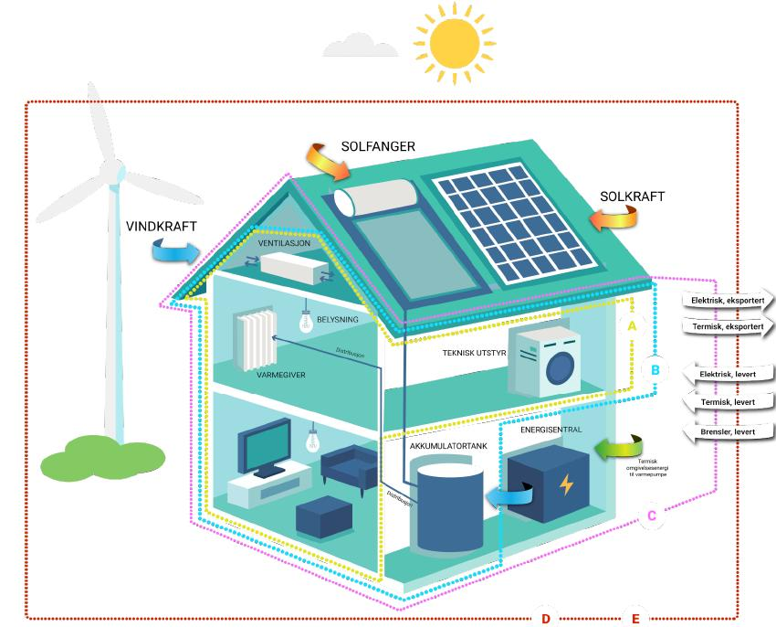

### Side 7

### Side 8

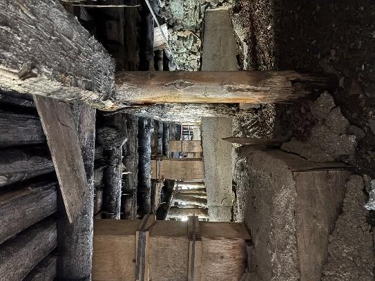

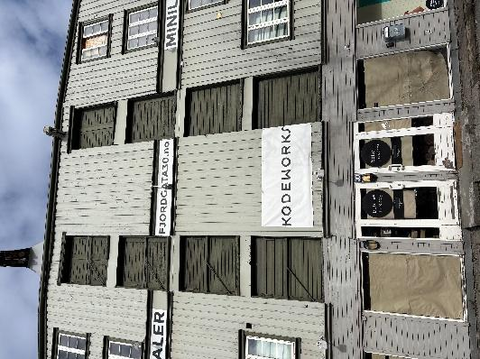

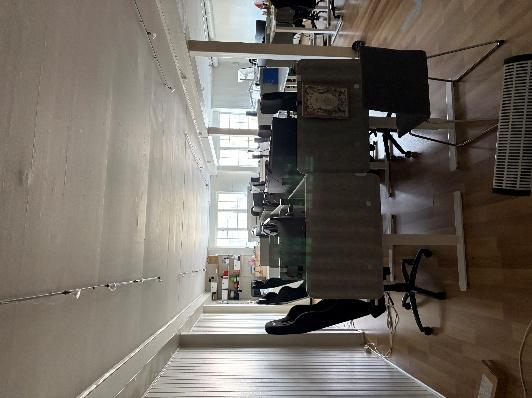

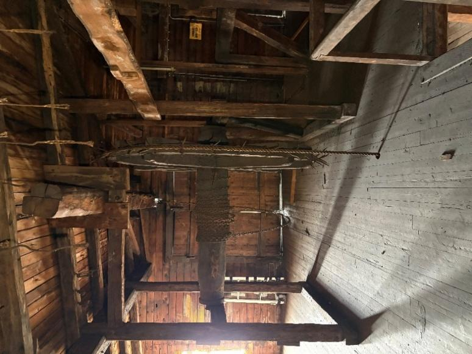

### Side 9

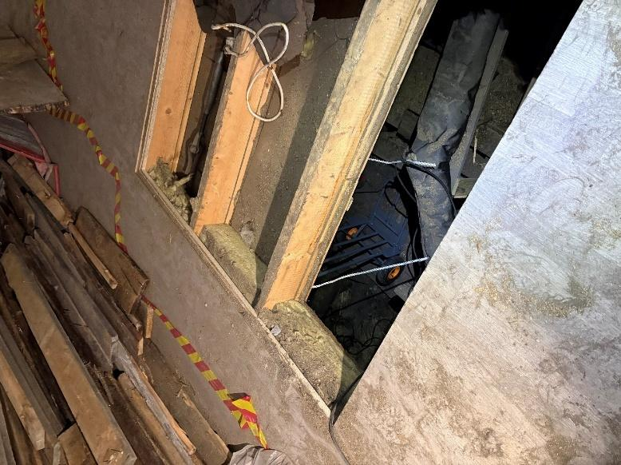

### Side 10

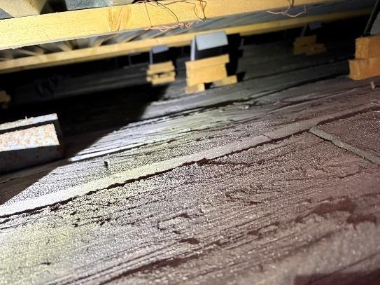

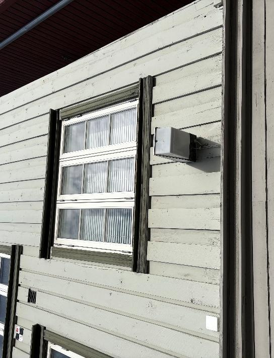

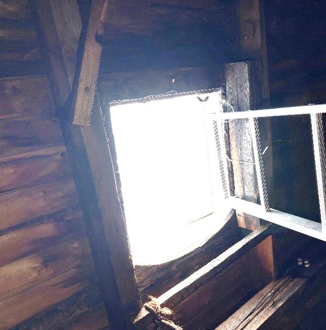

### Side 11

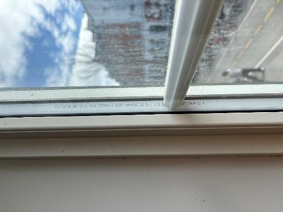

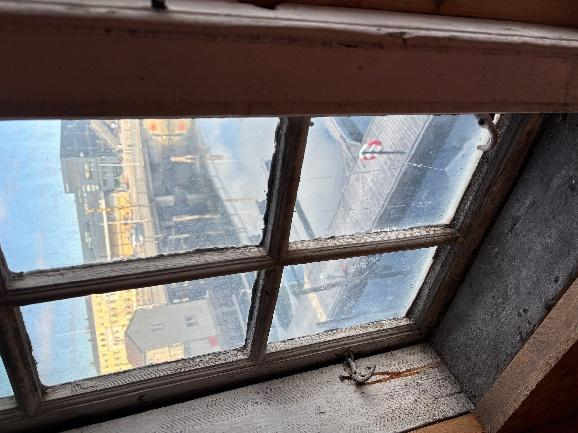

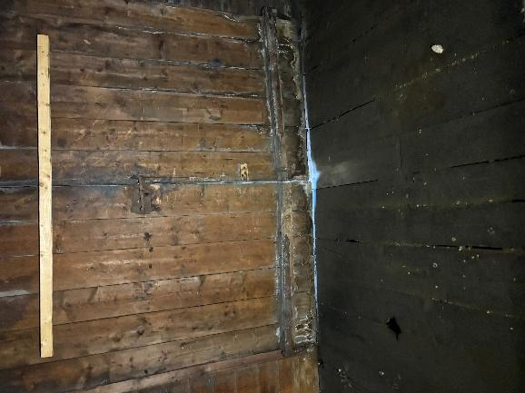

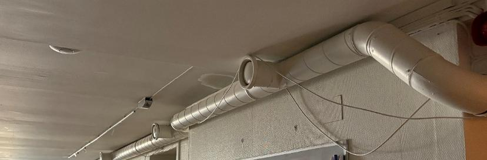

### Side 12

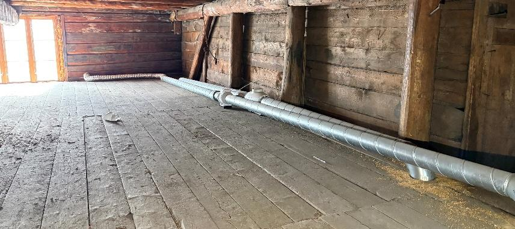

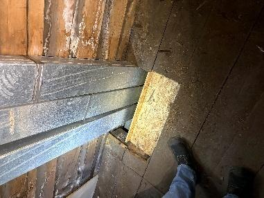

### Side 13

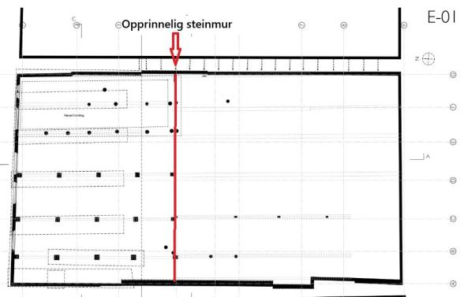

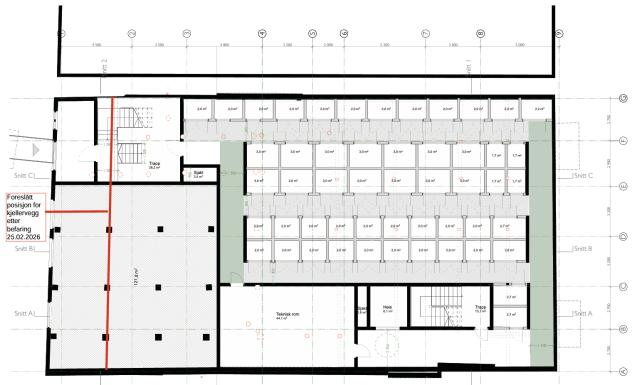

### Side 14

### Side 15

### Side 16

### Side 17

### Side 18

### Side 19

### Side 20

### Side 21

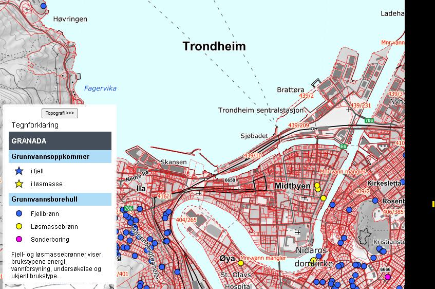

### Side 22

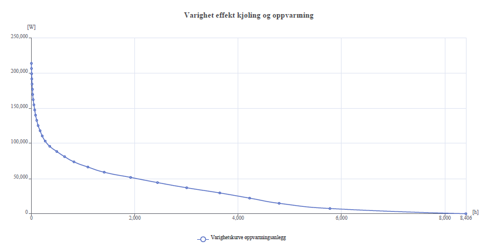

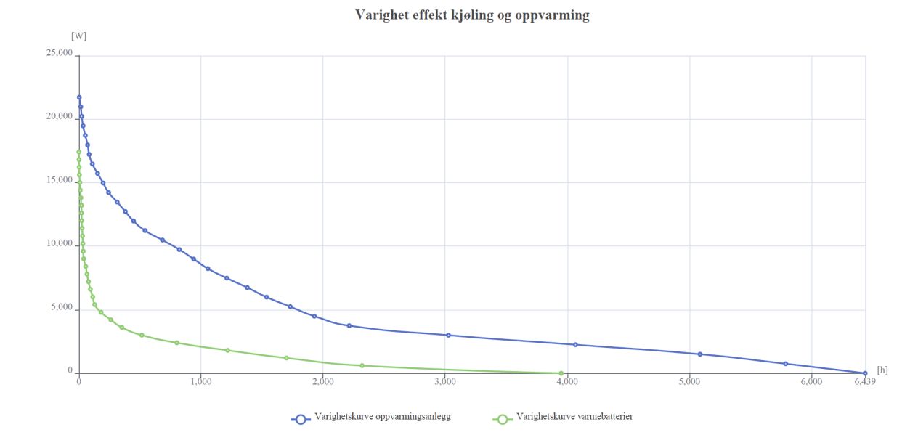

### Side 23

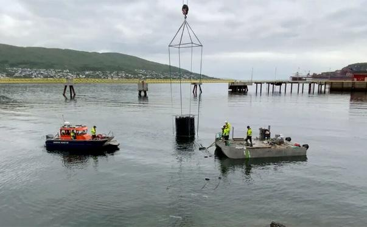

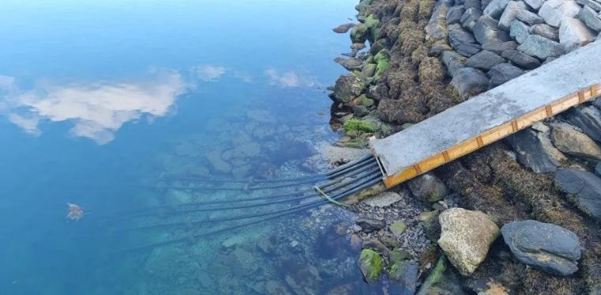

### Side 24

### Side 25

### Side 26

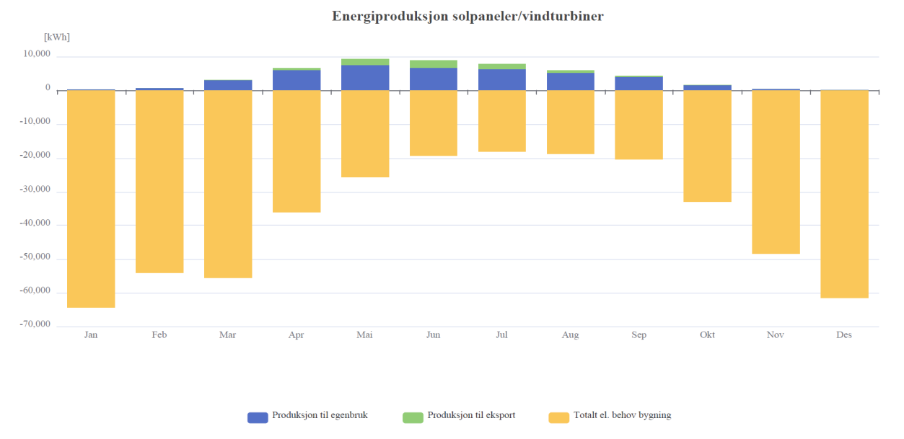

### Side 27

### Side 28

### Side 29

### Side 30

### Side 31

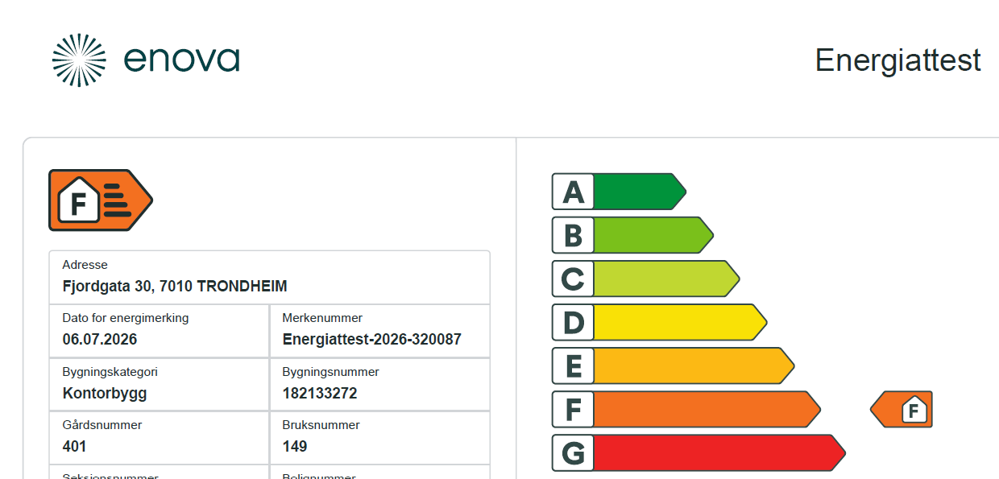

### Side 32

