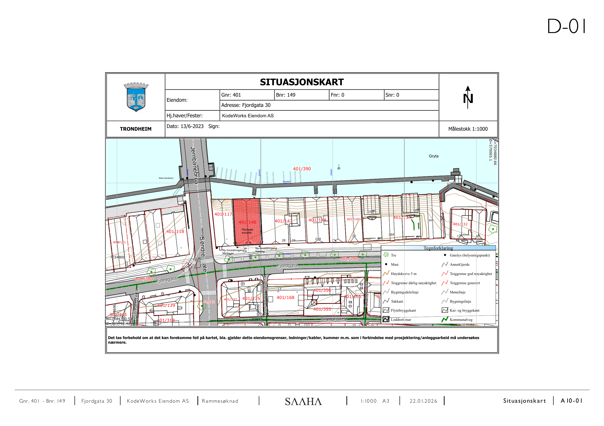

# D-01 Situasjonskart

Kilde: `D-01 Situasjonskart.pdf` – 1 sider.

## D-01 Situasjonskart

*Koordinater N=7034880.66. Hjemmelshaver/fester: KodeWorks Eiendom AS.*

## Felles opplysninger

| Felt | Verdi |
|---|---|
| Eiendom | Gnr. 401 / Bnr. 149, Fjordgata 30 |
| Tiltakshaver | KodeWorks Eiendom AS |
| Arkitekt | SAAHA AS |
| Søknadstype | Rammesøknad |
| Format | A3 |
| Høydegrunnlag | NN2000 |

*Hver side i original-PDF-en er rendret til PNG ved 150 DPI. Original-PDF-en ligger urørt i samme mappe.*
