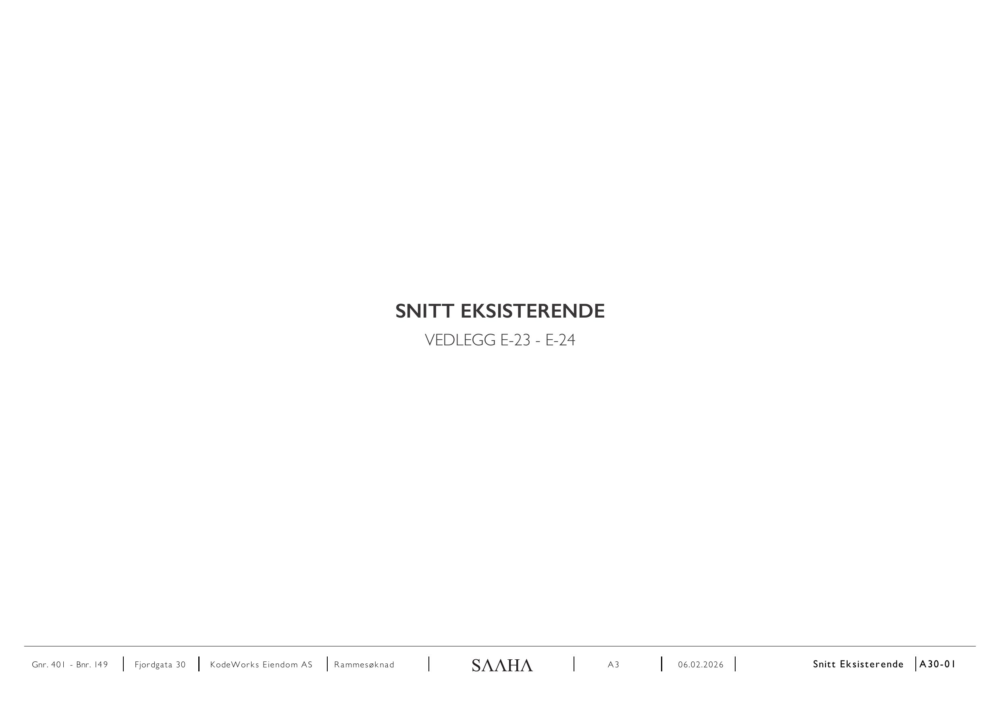
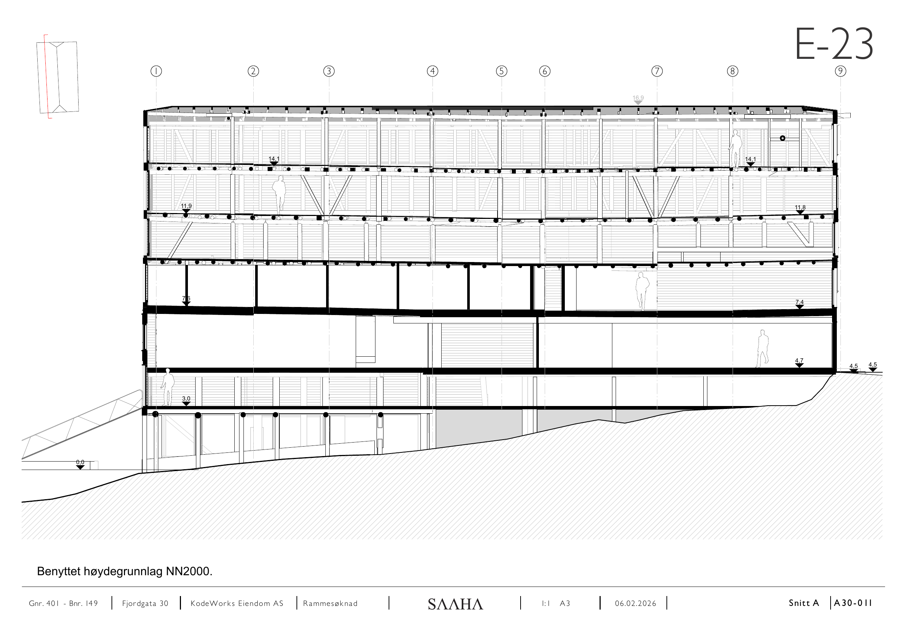
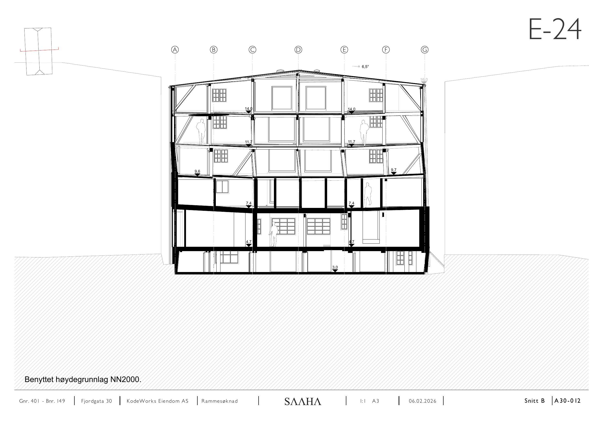

# E-23 – E-24 Snitt eksisterende

Kilde: `E-23 - E-24_ Snitt eksisterende.pdf` – 3 sider.

## Forside

*Snitt eksisterende, vedlegg E-23 – E-24.*

## E-23

*Lengdesnitt, akse 1–9. Kotehøyder 16,9 / 14,1 / 11,9 / 7,6 / 4,7 / 4,5 / 3,0 / 0,0.*

## E-24

*Tverrsnitt, akse A–G. Takvinkel 6,5°. Kotehøyder 16,0 / 14,0 / 11,7 / 9,7 / 7,4 / 4,7 / 3,0.*

## Felles opplysninger

| Felt | Verdi |
|---|---|
| Eiendom | Gnr. 401 / Bnr. 149, Fjordgata 30 |
| Tiltakshaver | KodeWorks Eiendom AS |
| Arkitekt | SAAHA AS |
| Søknadstype | Rammesøknad |
| Format | A3 |
| Høydegrunnlag | NN2000 |

*Hver side i original-PDF-en er rendret til PNG ved 150 DPI. Original-PDF-en ligger urørt i samme mappe.*
