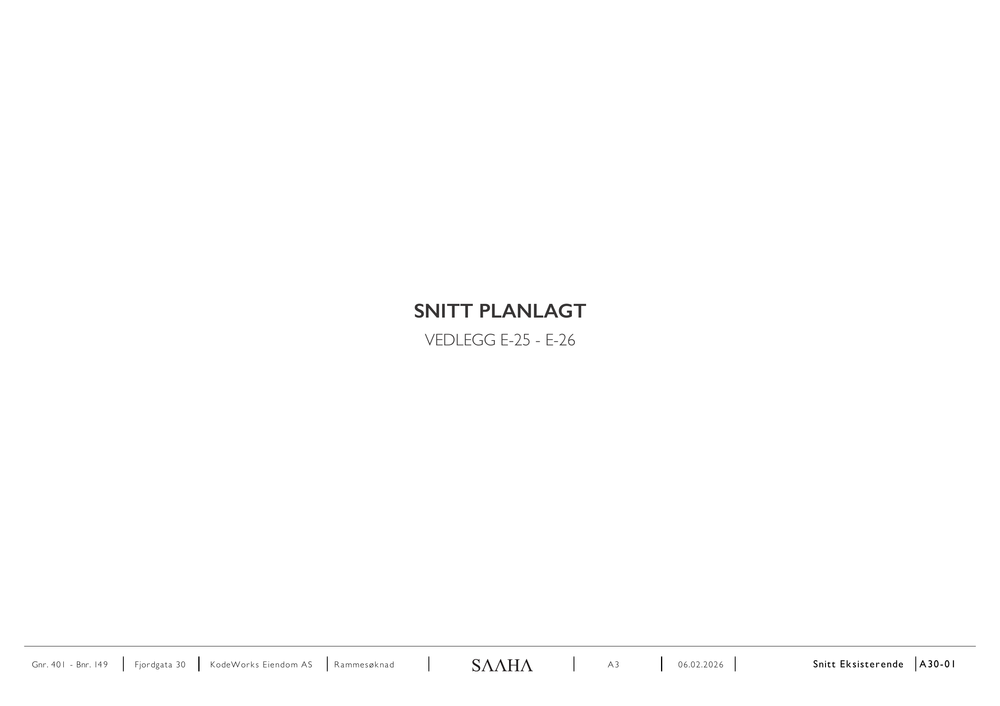
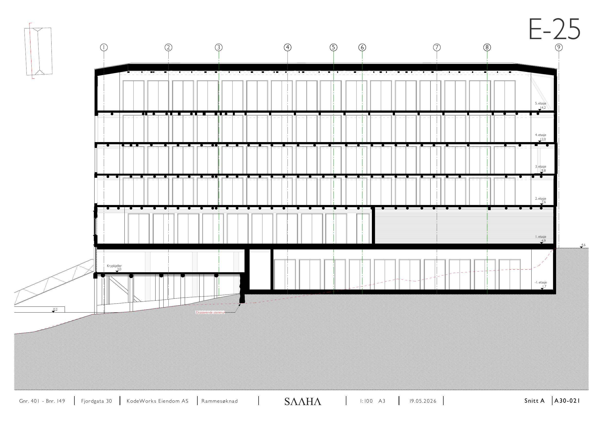
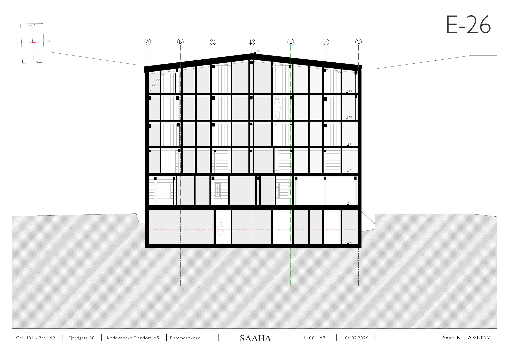

# E-25 – E-26 Snitt planlagt

Kilde: `E-25 - E-26_ Snitt planlagt.pdf` – 3 sider.

## Forside

*Snitt planlagt, vedlegg E-25 – E-26.*

## E-25

*Lengdesnitt, akse 1–9, med etasjeangivelse. 5. etasje 14,2 · 4. etasje 12,0 · 3. etasje 9,8 · 2. etasje 7,6 · 1. etasje 4,9 · krypkjeller 3,0 · −1. etasje 1,7.*

## E-26

*Tverrsnitt, akse A–G. Møne 17,5. Kotehøyder 14,2 / 12,0 / 9,8 / 7,6 / 4,9 / 1,7.*

## Felles opplysninger

| Felt | Verdi |
|---|---|
| Eiendom | Gnr. 401 / Bnr. 149, Fjordgata 30 |
| Tiltakshaver | KodeWorks Eiendom AS |
| Arkitekt | SAAHA AS |
| Søknadstype | Rammesøknad |
| Format | A3 |
| Høydegrunnlag | NN2000 |

*Hver side i original-PDF-en er rendret til PNG ved 150 DPI. Original-PDF-en ligger urørt i samme mappe.*
