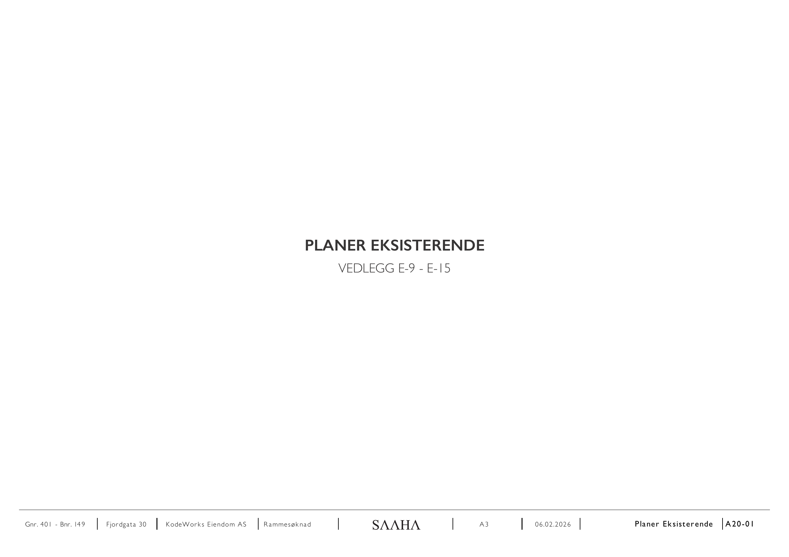
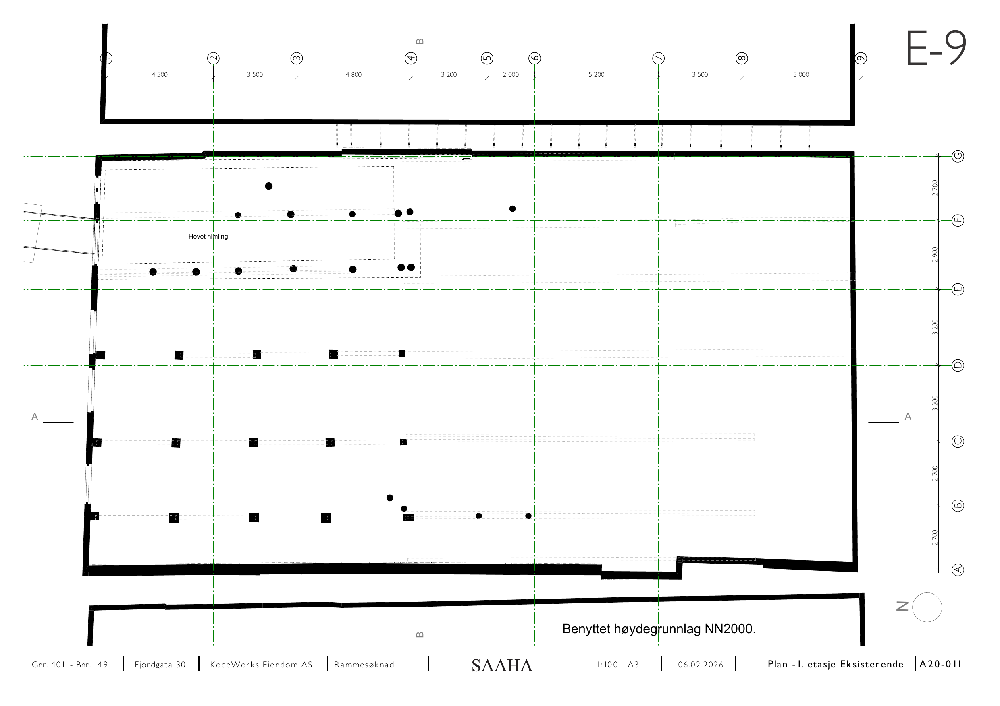
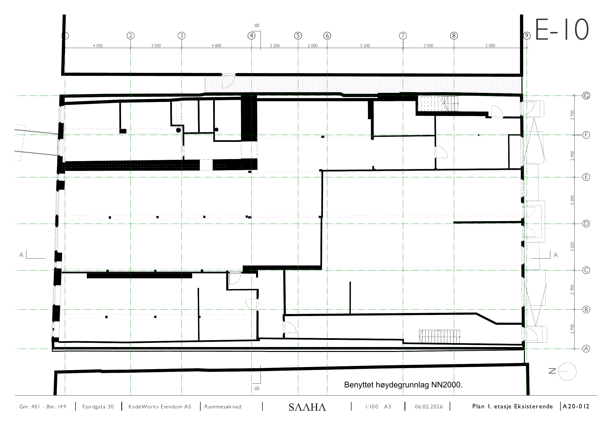
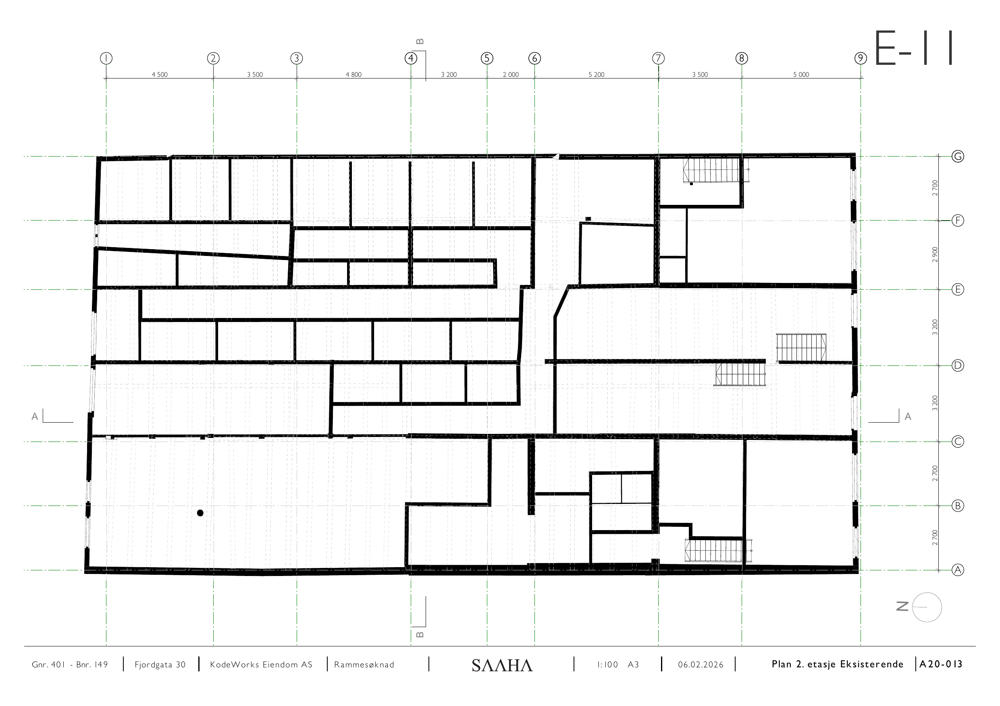
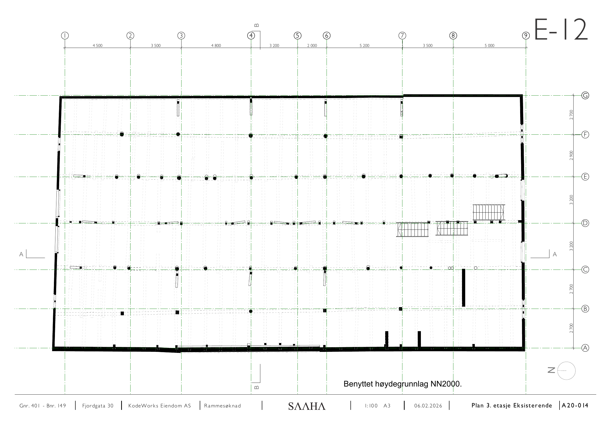
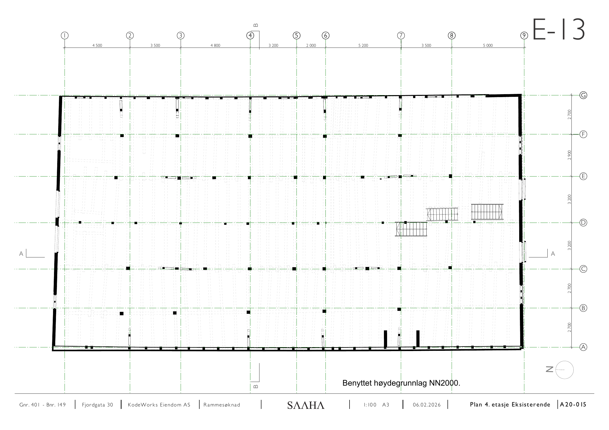
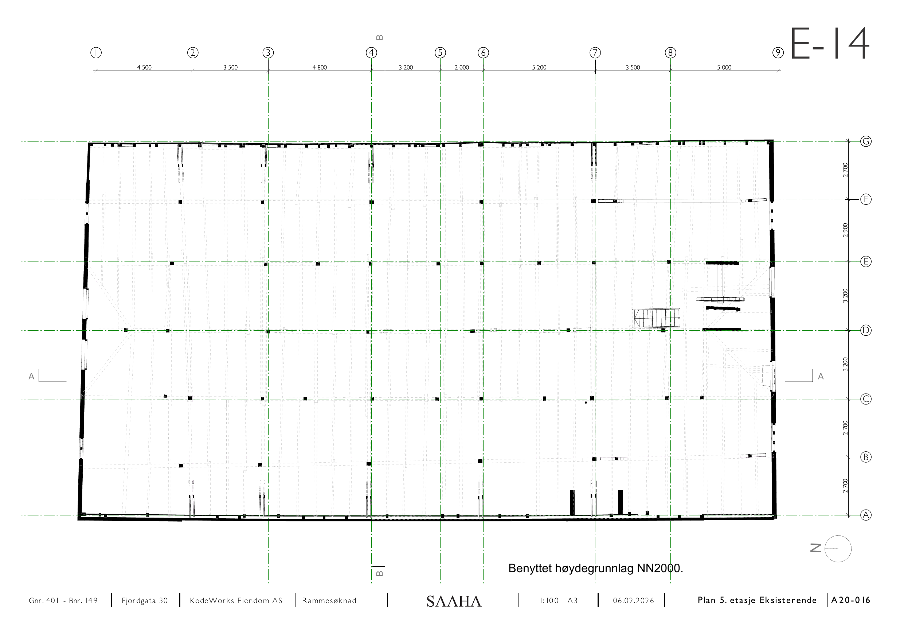
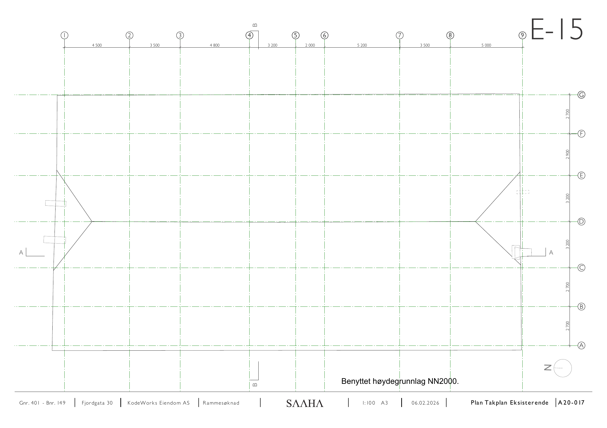

# E-9 – E-15 Planer eksisterende

Kilde: `E-9 - E-15_Planer-eksisterende.pdf` – 8 sider.

## Forside

*Planer eksisterende, vedlegg E-9 – E-15.*

## E-9

*Hevet himling markert.*

## E-10

## E-11

## E-12

## E-13

## E-14

## E-15

## Felles opplysninger

| Felt | Verdi |
|---|---|
| Eiendom | Gnr. 401 / Bnr. 149, Fjordgata 30 |
| Tiltakshaver | KodeWorks Eiendom AS |
| Arkitekt | SAAHA AS |
| Søknadstype | Rammesøknad |
| Format | A3 |
| Høydegrunnlag | NN2000 |

*Hver side i original-PDF-en er rendret til PNG ved 150 DPI. Original-PDF-en ligger urørt i samme mappe.*
