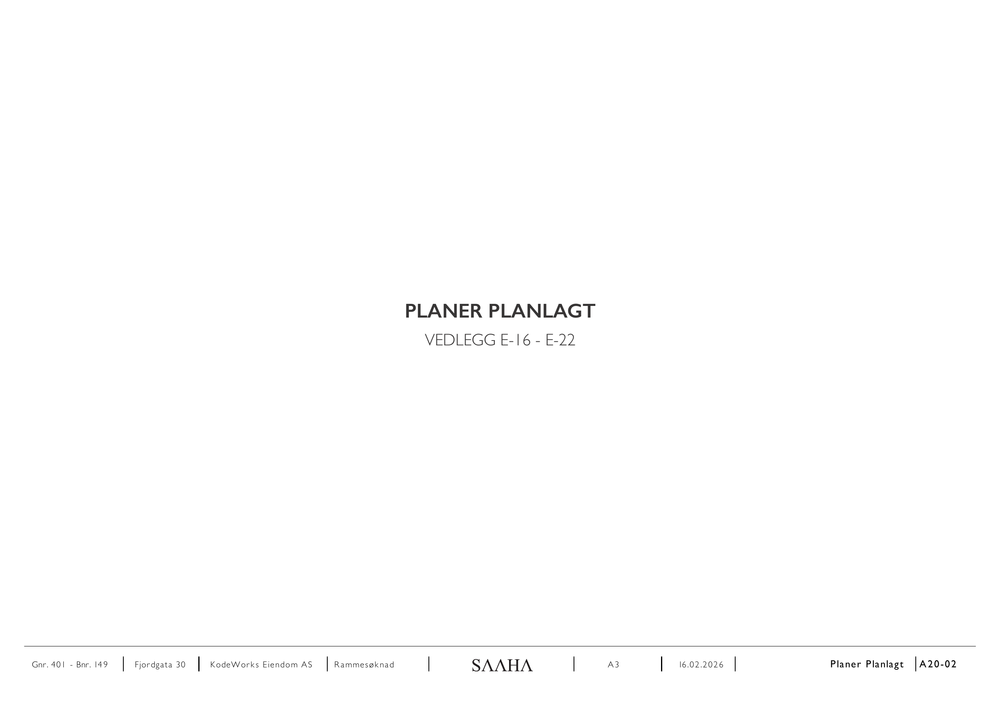
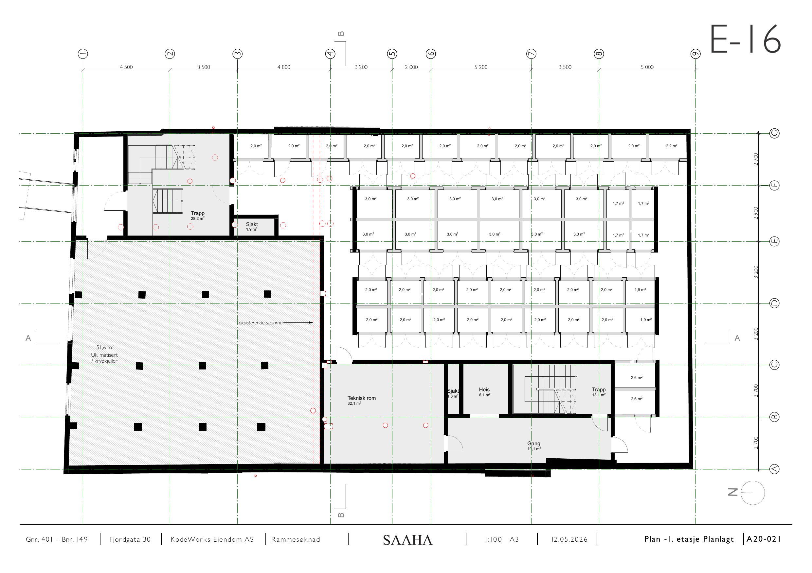
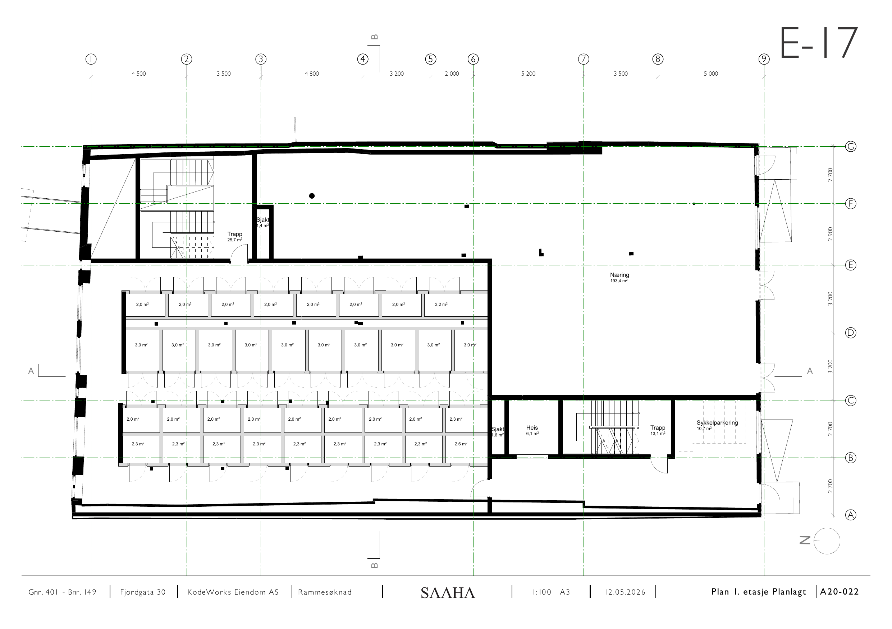
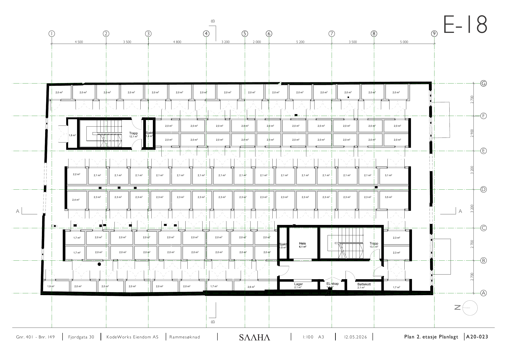
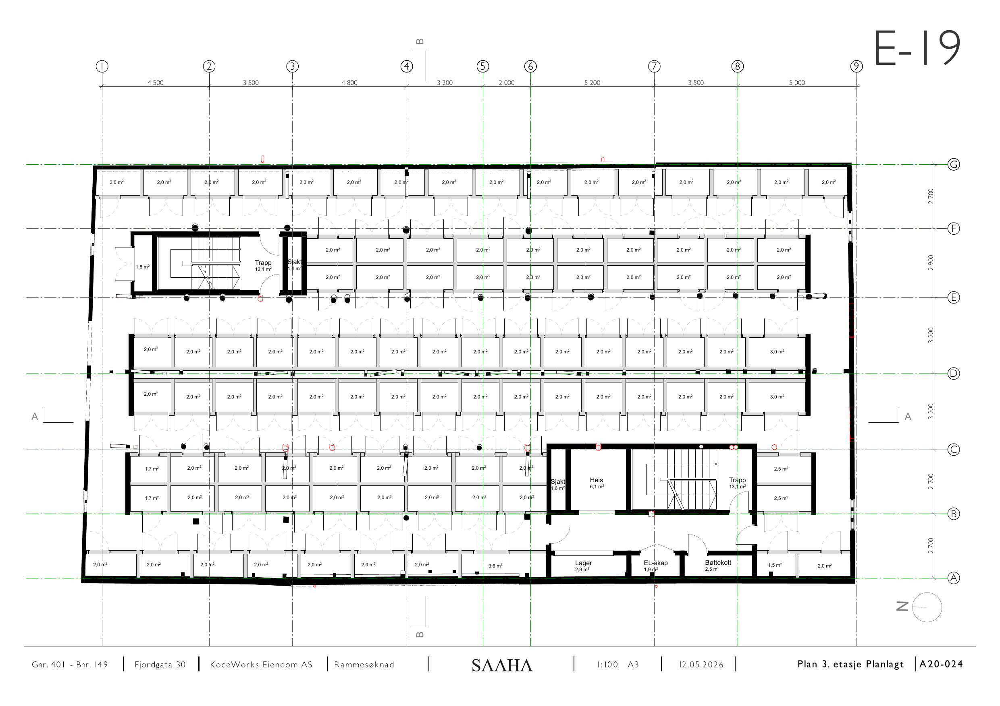
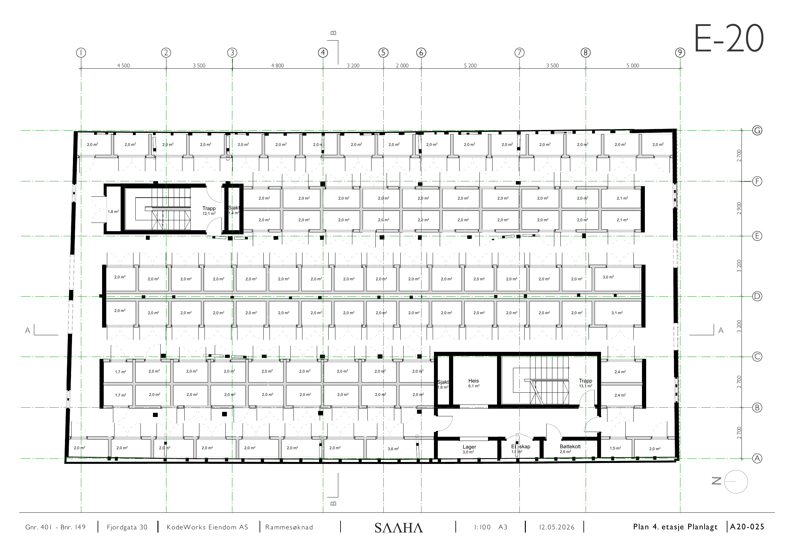
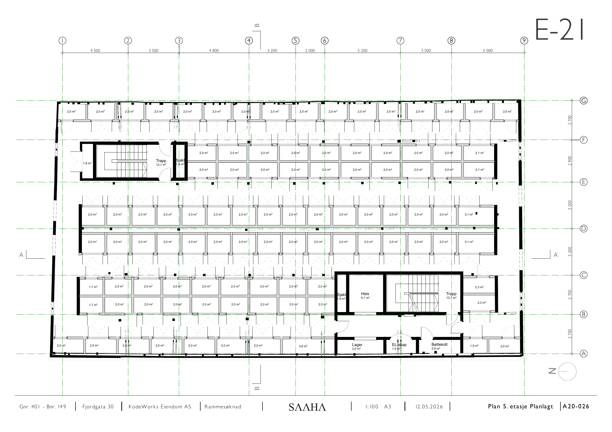
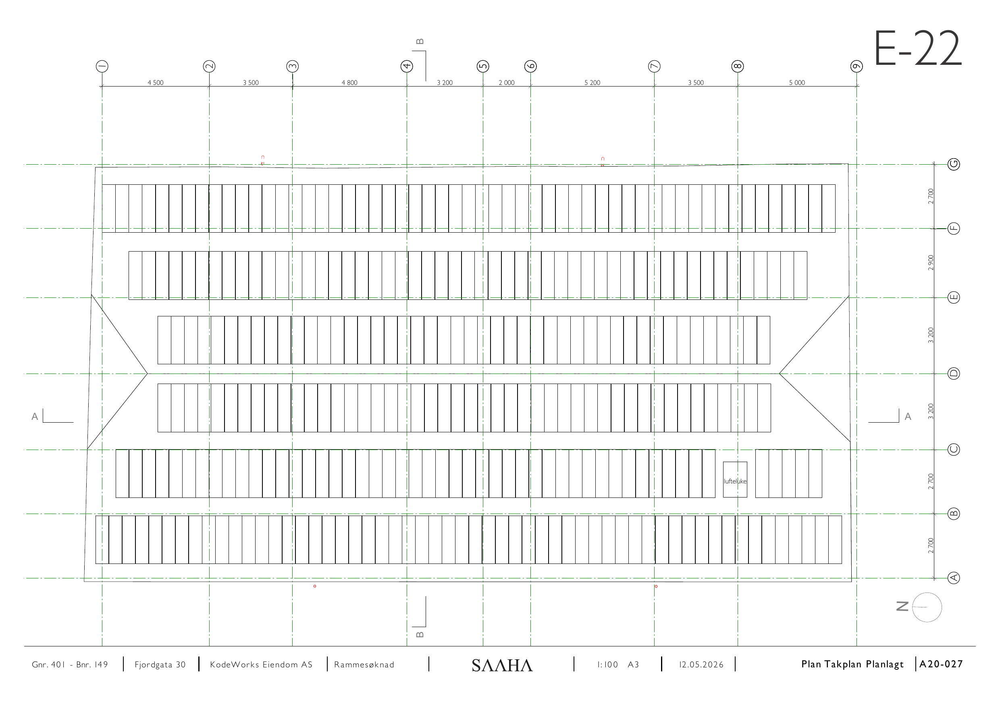

# E-16 – E-22 Planer planlagt (minilager)

Kilde: `E-16 - E-22_Planer-planlagt.pdf` – 8 sider.

## Forside

*Planer planlagt, vedlegg E-16 – E-22.*

## E-16

*Lagerceller à 2,0 m² og 2,2 m².*

## E-17

*Sjakt 1,4 m², trapp 25,7 m², næringsareal, lagerceller à 2,0 m².*

## E-18

*Lagerceller à 2,0 m².*

## E-19

*Lagerceller à 2,0 m².*

## E-20

*Lagerceller à 2,0 m².*

## E-21

*Lagerceller à 2,0 m².*

## E-22

*Lufteluke markert.*

## Felles opplysninger

| Felt | Verdi |
|---|---|
| Eiendom | Gnr. 401 / Bnr. 149, Fjordgata 30 |
| Tiltakshaver | KodeWorks Eiendom AS |
| Arkitekt | SAAHA AS |
| Søknadstype | Rammesøknad |
| Format | A3 |
| Høydegrunnlag | NN2000 |

*Hver side i original-PDF-en er rendret til PNG ved 150 DPI. Original-PDF-en ligger urørt i samme mappe.*
