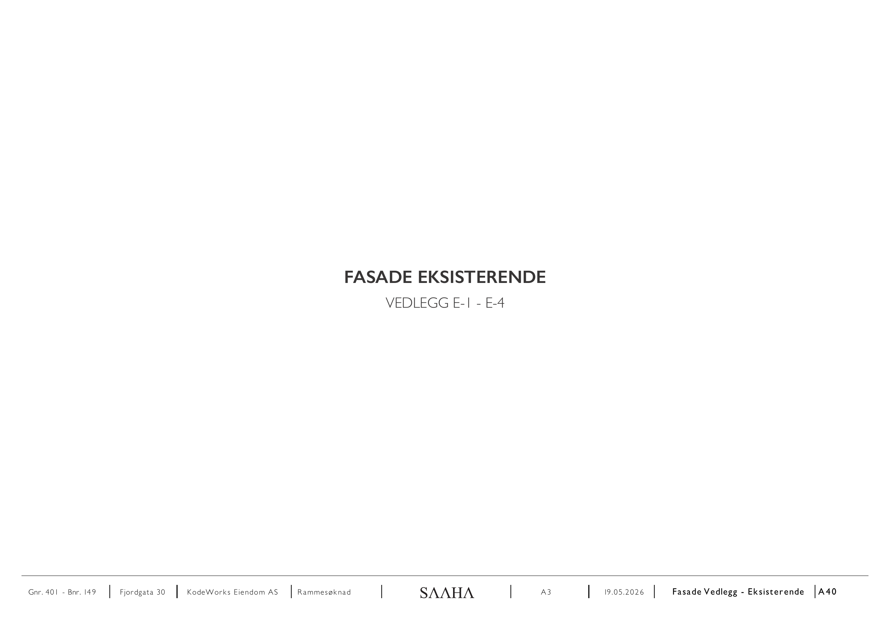
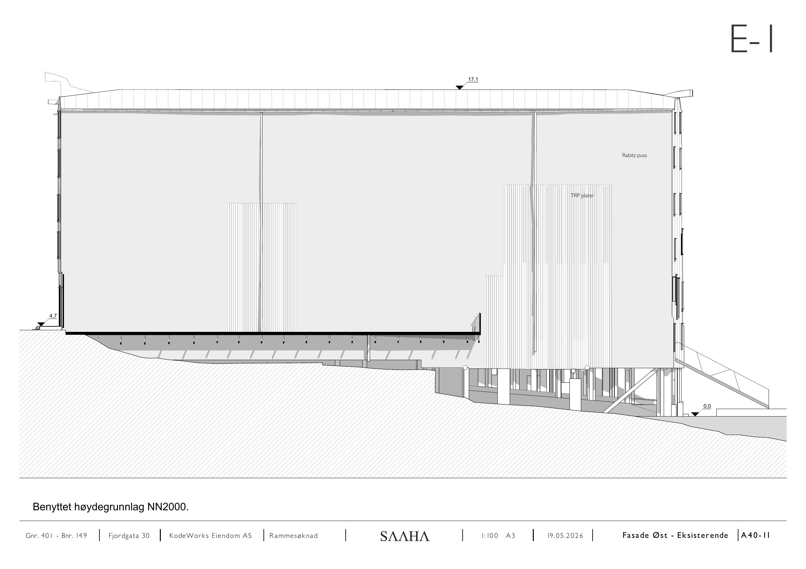
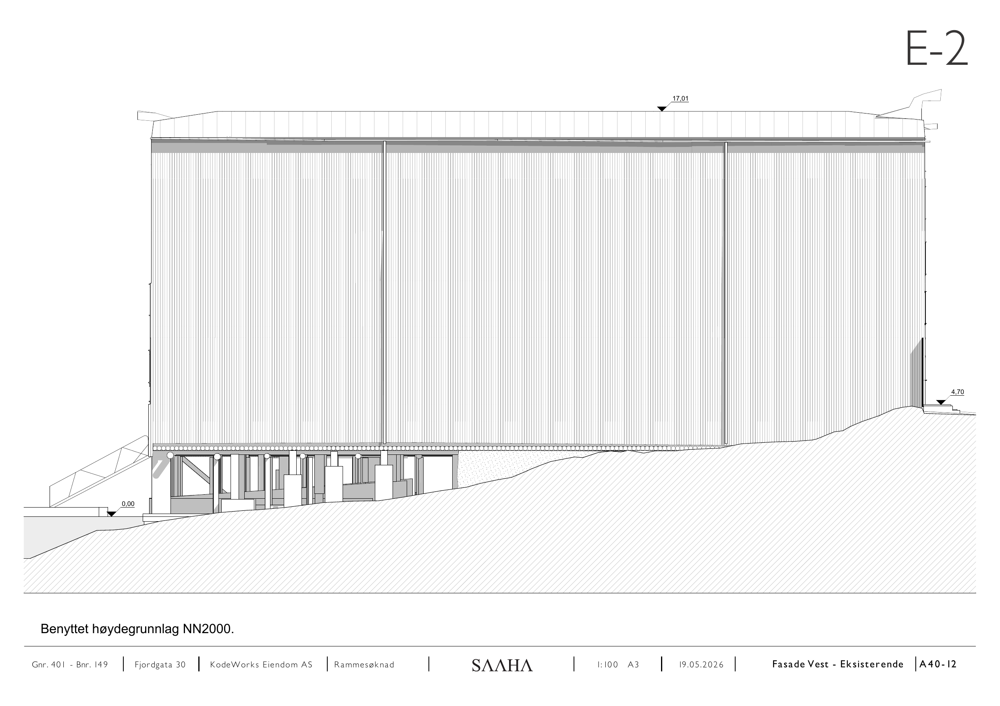
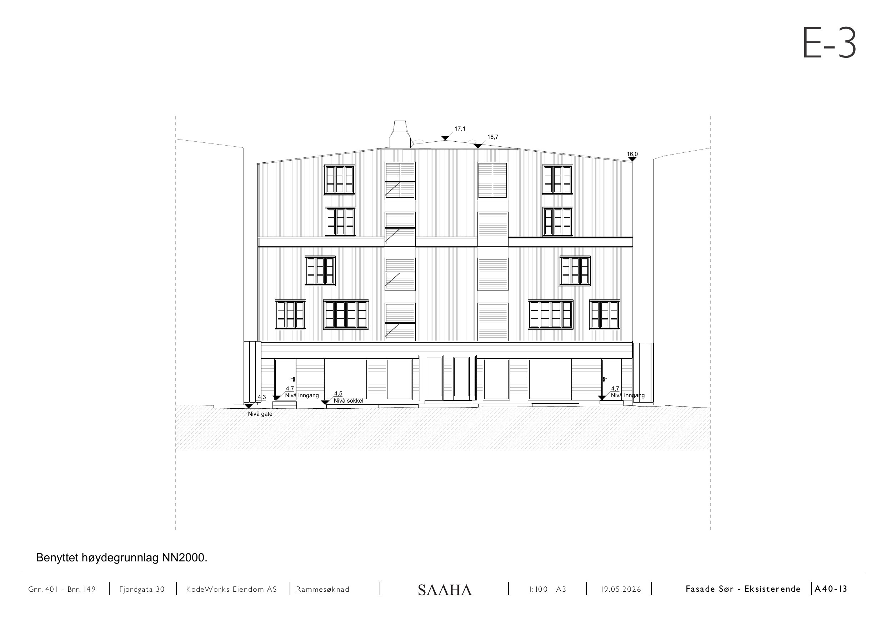
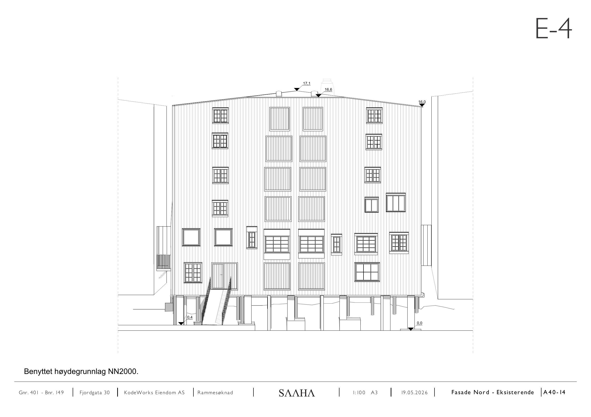

# E-1 – E-4 Fasade eksisterende

Kilde: `E-1 - E-4_ Fasade eksisterende.pdf` – 5 sider.

## Forside

*Fasade eksisterende, vedlegg E-1 – E-4.*

## E-1

*Rabitz-puss og TRP-plater. Kotehøyder 17,1 / 4,7 / 0,0.*

## E-2

*Kotehøyder 17,01 / 4,70 / 0,00.*

## E-3

*Kotehøyder 17,1 / 16,7 / 16,0 / 4,3. Nivå inngang 4,7 og 4,5, nivå sokkel, nivå gate.*

## E-4

*Kotehøyder 17,1 / 16,6 / 16,0 / 0,4 / 0,0.*

## Felles opplysninger

| Felt | Verdi |
|---|---|
| Eiendom | Gnr. 401 / Bnr. 149, Fjordgata 30 |
| Tiltakshaver | KodeWorks Eiendom AS |
| Arkitekt | SAAHA AS |
| Søknadstype | Rammesøknad |
| Format | A3 |
| Høydegrunnlag | NN2000 |

*Hver side i original-PDF-en er rendret til PNG ved 150 DPI. Original-PDF-en ligger urørt i samme mappe.*
