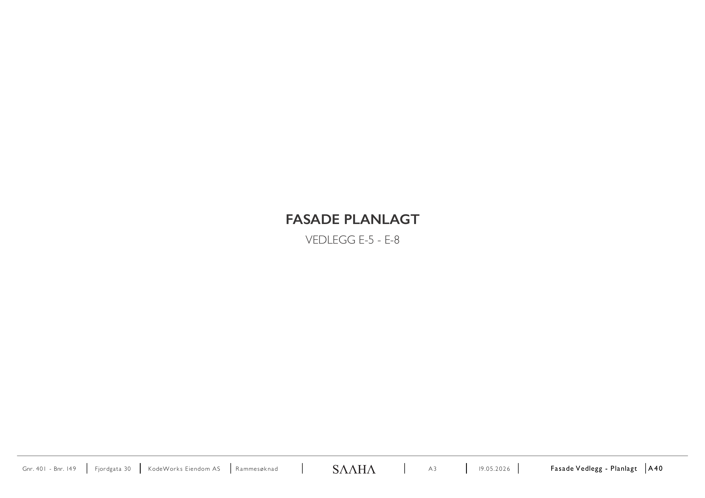
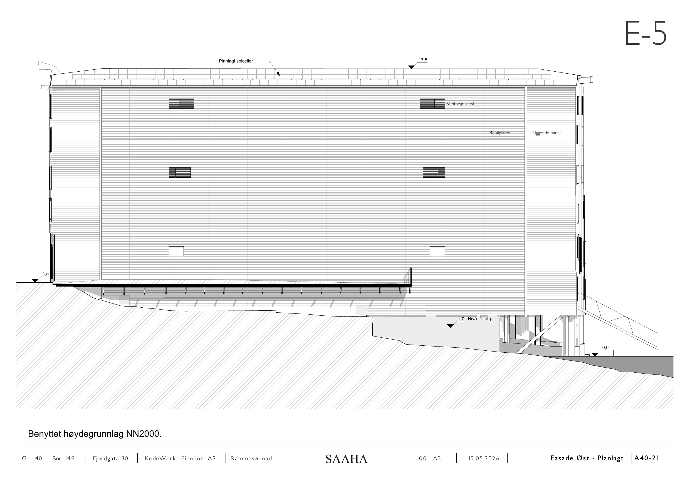
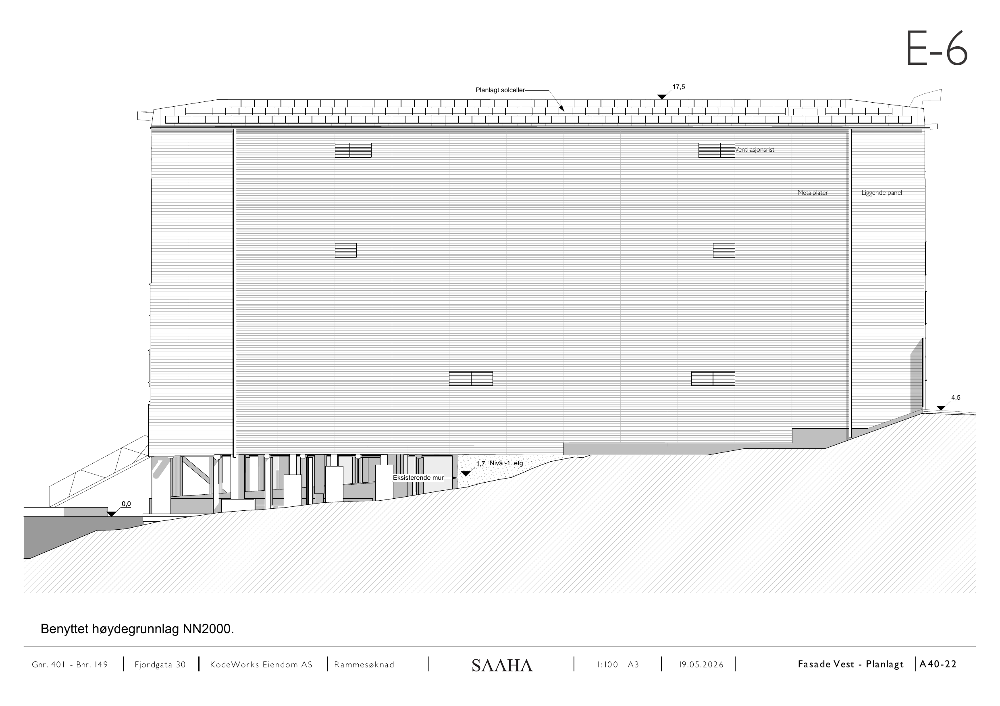
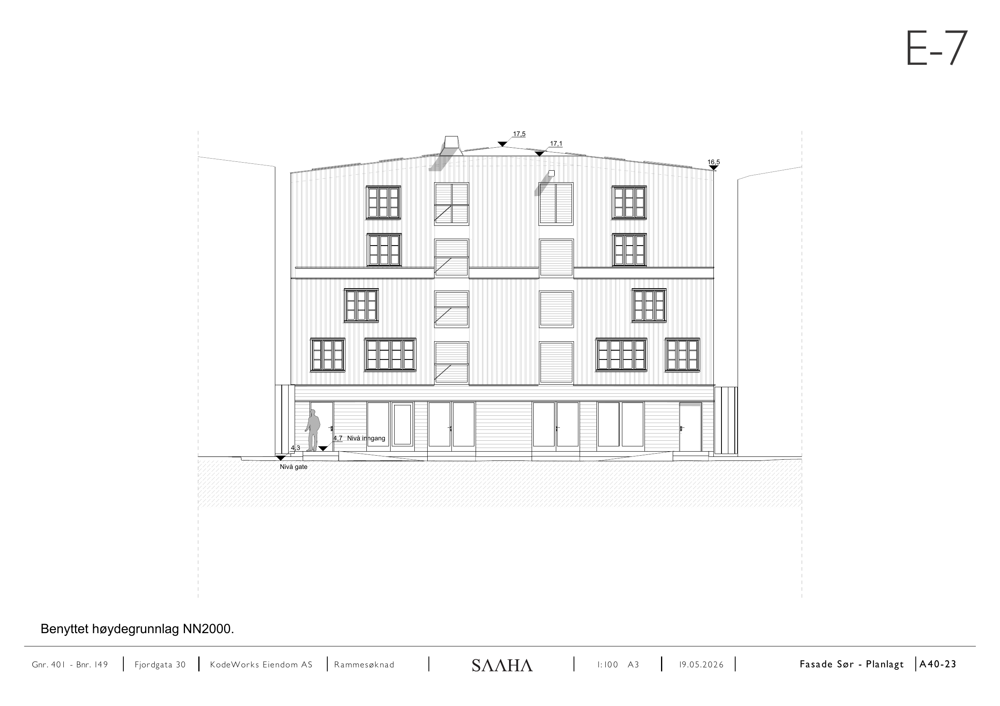
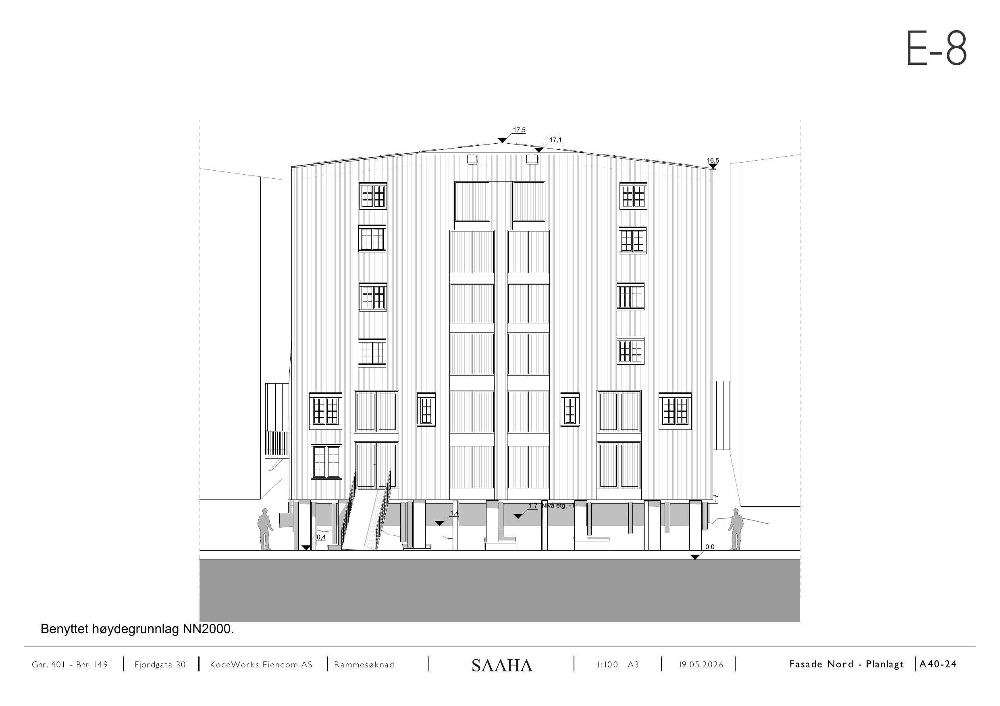

# E-5 – E-8 Fasade planlagt

Kilde: `E-5 - E-8_ Fasade planlagt.pdf` – 5 sider.

## Forside

*Fasade planlagt, vedlegg E-5 – E-8.*

## E-5

*Planlagt solceller, ventilasjonsrist, metallplater, liggende panel. Kotehøyder 17,5 / 4,5 / 1,7 (nivå −1. etg.) / 0,0.*

## E-6

*Som E-5, med eksisterende mur inntegnet.*

## E-7

*Kotehøyder 17,5 / 17,1 / 16,5 / 4,7 (nivå inngang) / 4,3 (nivå gate).*

## E-8

*Kotehøyder 17,5 / 17,1 / 16,5 / 1,7 (nivå etg. −1) / 1,4 / 0,4 / 0,0.*

## Felles opplysninger

| Felt | Verdi |
|---|---|
| Eiendom | Gnr. 401 / Bnr. 149, Fjordgata 30 |
| Tiltakshaver | KodeWorks Eiendom AS |
| Arkitekt | SAAHA AS |
| Søknadstype | Rammesøknad |
| Format | A3 |
| Høydegrunnlag | NN2000 |

*Hver side i original-PDF-en er rendret til PNG ved 150 DPI. Original-PDF-en ligger urørt i samme mappe.*
